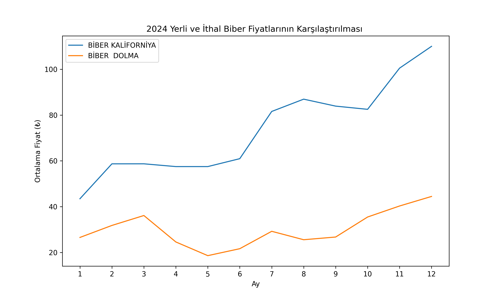

# İzmir Hal Fiyatları Araştırması ve Veri Analizi

## Proje Hakkında
Bu çalışma, İzmir Halinde satılan meyve ve sebze fiyatlarının 2022, 2023 ve 2024 yıllarına ait günlük verilerini analiz etmeyi amaçlamaktadır. Araştırmada, yıllar boyunca fiyat değişimlerinin yanı sıra sezon bazında analizler yapılmıştır. Çalışmanın ana amacı, fiyat değişimlerini anlamak, trendleri belirlemek ve gelecekteki fiyat hareketlerini tahmin edebilecek bir temel oluşturmaktır.

### Kullanılan Teknolojiler ve Araçlar
- **Python**: Veri analizi ve görselleştirme için kullanıldı.
- **SQL**: Veritabanı sorguları ve veri düzenleme işlemleri için kullanıldı. Tüm veri `db.sql` dosyasında saklanmıştır.
- **Matplotlib & Seaborn**: Grafik oluşturma ve görselleştirme.
- **Pandas**: Veri işleme ve analitik operasyonlar.

## Çalışmanın Ana Başlıkları

### 1. 2022, 2023 ve 2024 Yıllarındaki Karpuz Fiyat Değişim Grafiği
**Amaç**: Karpuz fiyatlarının yıllık bazda nasıl değiştiğini incelemek.

**Açıklama**: Bu analizde, üç yıl boyunca karpuz fiyatlarındaki değişimler günlük olarak incelenmiştir. Veriler, Python kullanılarak analiz edilmiş ve görselleştirilmiştir. Fiyat değişim grafiği, fiyatlardaki dalgalanmaları ve olası mevsimsel etkileri görselleştirmek için hazırlanmıştır.

**Çıktı**: 

---

### 2. 2024 Sezon Bazında Meyve Fiyatları
**Amaç**: 2024 yılında farklı sezonlarda satılan meyvelerin fiyatlarını analiz etmek.

**Açıklama**: 2024 yılına ait meyve fiyatları, ilkbahar, yaz, sonbahar ve kış olmak üzere sezon bazında gruplandırılmıştır. Her sezon için fiyat ortalamaları, maksimum ve minimum fiyatlar analiz edilmiştir. Bu çalışma, mevsimlerin fiyatlar üzerindeki etkisini anlamak ve tüketici alışkanlıklarını değerlendirmek için yapılmıştır.

**Çıktı**:

---

## Ek Açıklamalar
- Tüm analizler Python ile yapılmıştır ve görseller `.png` formatında saklanmıştır.
- SQL ile kullanılan veritabanı, verilerin düzenlenmesi ve analiz için hazır hale getirilmesinde önemli bir rol oynamıştır.
- Çalışmada kullanılan yöntemler ve araçlar, ilerleyen dönemlerde daha kapsamlı tahmin modelleri geliştirmek için temel oluşturmaktadır.

Bu araştırma, İzmir'deki hal fiyatlarına dair geniş bir perspektif sunmakta ve hem tüketiciler hem de üreticiler için faydalı bilgiler sağlamayı amaçlamaktadır.