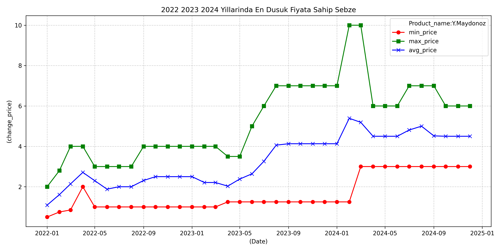
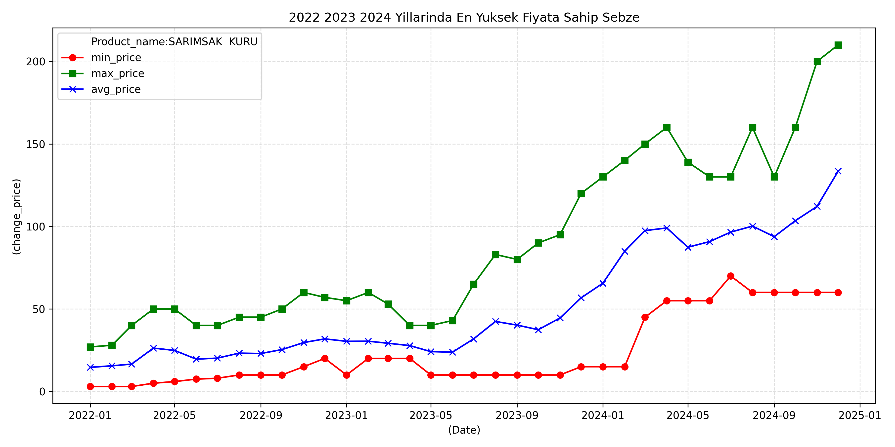
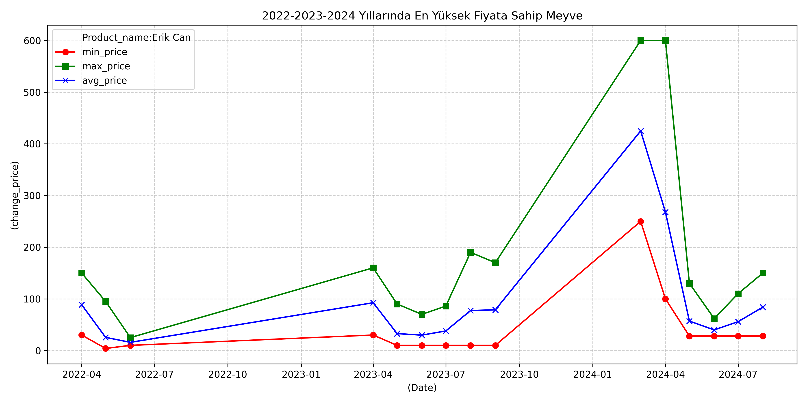
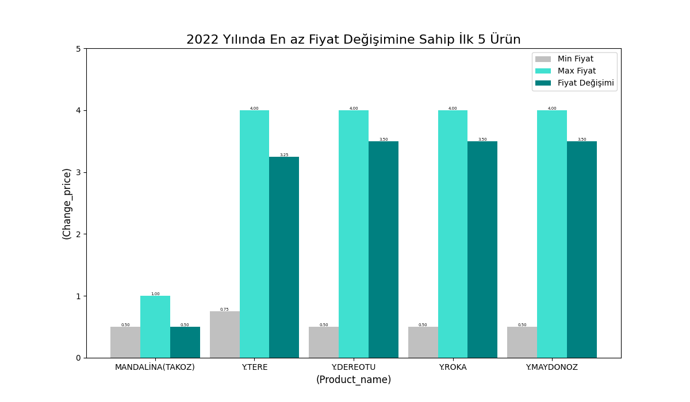

# 2022-2023-2024 Yılları En Düşük Fiyatlı Sebze Analizi: Maydanoz

## Grafik Detayları ve Analiz

Bu grafik, 2022-2024 yılları arasında en düşük fiyatlı sebze olan maydanozun fiyat değişimlerini göstermektedir. Grafikte üç farklı fiyat göstergesi bulunmaktadır:
- 🔴 Minimum Fiyat (min_price)
- 🟢 Maksimum Fiyat (max_price)
- 🔵 Ortalama Fiyat (avg_price)

### Yıllara Göre Fiyat Analizi:

#### 2022 Yılı:
  - Minimum Fiyat: 0.5 TL 
  - Maksimum Fiyat: 4.00 TL 
  - Ortalama Fiyat: 2.25 TL
- En yüksek fiyat dalgalanması Ocak-Mart,Ağustos-Eylül dönemlerinde görülmüş

#### 2023 Yılı:
  - Minimum Fiyat: 1.25 TL 
  - Maksimum Fiyat: 7.00 TL 
  - Ortalama Fiyat: 4.00 TL
- Mayıs ayından itibaren fiyatlar yükseliş trendine girmiş
- Yıllık Artış: 2022'ye göre ortalama fiyatta %60 artış (2.25 TL → 4 TL)

#### 2024 Yılı:
  - Minimum Fiyat: 1.25 TL- 3.00 TL (Tüm yıl boyunca sabit)
  - Maksimum Fiyat: 10.00 TL 
  - Ortalama Fiyat: 5.63 TL
- Şubat ayında keskin bir fiyat artışı yaşanmış
- Yıllık Artış: 2023'e göre ortalama fiyatta %41 artış (4 TL → 5.63 TL)
- Kümülatif Artış: 2022'den 2024'e ortalama fiyatta toplam %150 artış (2.25 TL → 5.63 TL)

### Önemli Gözlemler:

Fiyat Analizi ve Değişim Trendleri
Genel Fiyat Artış Trendi
2022’den 2024’e kadar fiyatlarda belirgin bir yükseliş gözlemlenmiştir. Minimum fiyat 6 kat artarak 0.5 TL’den 3 TL’ye çıkarken, maksimum fiyat yaklaşık 3 kat artarak 4 TL’den 10 TL’ye ulaşmıştır. Ortalama fiyat ise 2.5 katlık bir artış göstererek 2 TL’den 5 TL seviyesine yükselmiştir.

Mevsimsel Dalgalanmalar ve Fiyat İstikrarı
İlkbahar aylarında fiyat dalgalanmaları daha belirgin şekilde görülmüş, yaz aylarında ise fiyatların görece daha stabil bir seyir izlediği tespit edilmiştir. Kış aylarında ise fiyatların genel olarak artış eğiliminde olduğu gözlemlenmiştir. 2024 yılı itibarıyla minimum fiyatların daha stabil seyrettiği görülse de, maksimum fiyatlarda dalgalanmalar devam etmiş ve fiyat aralığındaki fark zamanla artmıştır.

Dikkat Çeken Önemli Değişimler
2024 Şubat ayında ani fiyat artışı yaşanmış ve bu dönem en yüksek fiyat seviyesine ulaşılmıştır.
2023 yılının ortalarında kademeli bir yükseliş trendi gözlemlenmiştir, bu süreçte fiyatlar istikrarlı bir şekilde artış göstermiştir.
2022 yılı, fiyatların daha stabil seyrettiği bir dönem olmuştur, fiyat dalgalanmalarının diğer yıllara kıyasla daha az olduğu görülmüştür.
📊 Öne Çıkan İstatistikler

En düşük fiyat: 0.5 TL (2022 başı)
En yüksek fiyat: 10 TL (2024 Ocak)
En büyük fiyat dalgalanması: 2024 yılı Ocak-Mart dönemi

Sonuç ve Değerlendirme
Bu grafik, en temel sebzelerden biri olan maydanozun bile son üç yılda önemli fiyat artışları yaşadığını ortaya koymaktadır. Özellikle 2024 yılı başında gözlemlenen sert fiyat artışı, temel gıda maddelerine erişimde zorlukların arttığını göstermektedir.

Fiyat istikrarı açısından minimum fiyatların 2024 yılında daha sabit seyretmesi, piyasada bir dengeleme çabasının olduğunu düşündürmektedir. Ancak, maksimum fiyatlardaki devam eden dalgalanmalar, piyasada belirsizliğin sürdüğüne işaret etmektedir.

Bununla birlikte, mevsimsel etkiler, özellikle ilkbahar ve kış aylarında fiyat dalgalanmalarının belirginleştiğini ortaya koymaktadır. Kış aylarında fiyatların genel olarak yükselmesi, üretim maliyetlerindeki artış ve arz-talep dengesizlikleriyle ilişkilendirilebilir. Yaz aylarında görece daha istikrarlı fiyat hareketleri ise, üretimin artması ve arzın daha güçlü olmasından kaynaklanıyor olabilir.

Genel olarak, 2022 yılında daha stabil seyreden fiyatların, 2023 ortalarından itibaren kademeli bir yükseliş trendine girdiği ve 2024’te zirve noktalarına ulaştığı görülmektedir. Bu durum, enflasyon, tarım politikaları, iklim koşulları ve tedarik zinciri gibi faktörlerin fiyatlar üzerindeki baskısının arttığını göstermektedir.

Özetle, maydanoz gibi temel bir sebzenin fiyatındaki bu keskin artışlar, genel tarımsal ürünler piyasasında yaşanan değişimlerin bir yansımasıdır. Önümüzdeki dönemlerde, fiyat dalgalanmalarının hangi seviyelerde dengeleneceği ve piyasa koşullarının nasıl şekilleneceği önemli bir soru olarak karşımıza çıkmaktadır.
---
---------------------------------------------------------------------------
# 2022-2023-2024 Yılları En Yüksek Fiyatlı Sebze Analizi: Sarımsak Kuru

## Grafik Detayları ve Analiz

Bu grafik, 2022-2024 yılları arasında en yüksek fiyatlı sebze olan kuru sarımsağın fiyat değişimlerini göstermektedir. Grafikte üç farklı fiyat göstergesi bulunmaktadır:
- 🔴 Minimum Fiyat (min_price)
- 🟢 Maksimum Fiyat (max_price)
- 🔵 Ortalama Fiyat (avg_price)

### Yıllara Göre Fiyat Analizi:

#### 2022 Yılı:
- Minimum Fiyat: 3 TL
- Maksimum Fiyat: 60 TL
- Ortalama Fiyat: 22.63 TL
- Fiyatlar yıl boyunca nispeten stabil seyretmiş
- En düşük fiyat dalgalanması bu yılda gözlemlenmiş

#### 2023 Yılı:
- Minimum Fiyat: 10 TL
- Maksimum Fiyat: 120 TL
- Ortalama Fiyat: 35 TL
- Yılın ikinci yarısından itibaren belirgin bir yükseliş trendi başlamış
- Yıllık Artış: 2022'ye göre ortalama fiyatta %54.7 artış (22.63 TL → 35 TL)

#### 2024 Yılı:
- Minimum Fiyat: 15 TL
- Maksimum Fiyat: 210 TL
- Ortalama Fiyat: 97.16 TL
- Eylül-Aralık döneminde çok keskin bir fiyat artışı yaşanmış
- Yıllık Artış: 2023'e göre ortalama fiyatta %177.6 artış (35 TL → 97.16 TL)
- Kümülatif Artış: 2022'den 2024'e ortalama fiyatta toplam %329 artış (22.63 TL → 97.16 TL)

### Önemli Gözlemler:

#### Fiyat Analizi ve Değişim Trendleri

##### Genel Fiyat Artış Trendi
2022'den 2024'e kadar fiyatlarda dramatik bir yükseliş gözlemlenmiştir. Minimum fiyat 5 kat artarak 3 TL'den 15 TL'ye çıkarken, maksimum fiyat 3.5 kat artarak 60 TL'den 210 TL'ye ulaşmıştır. Ortalama fiyat ise 4.29 katlık bir artış göstererek 22.63 TL'den 97.16 TL seviyesine yükselmiştir.

##### Mevsimsel Dalgalanmalar ve Fiyat İstikrarı
Yaz sonu ve sonbahar başlangıcında fiyat dalgalanmaları daha belirgin şekilde görülmüş, kış aylarında ise fiyatların görece daha stabil bir seyir izlediği tespit edilmiştir. 2024 yılında fiyat dalgalanmaları önceki yıllara göre çok daha şiddetli yaşanmış ve fiyat aralığındaki makas önemli ölçüde açılmıştır.

##### Dikkat Çeken Önemli Değişimler
- 2024 Eylül-Ekim döneminde rekor seviyede fiyat artışı yaşanmış
- 2023 yılının ikinci yarısında başlayan yükseliş trendi, 2024'te katlanarak devam etmiş
- 2022 yılı, fiyatların en stabil seyrettiği dönem olmuş

📊 Öne Çıkan İstatistikler:
- En düşük fiyat: 3 TL (2022 başı)
- En yüksek fiyat: 210 TL (2024 Ekim)
- En büyük fiyat dalgalanması: 2024 yılı Eylül-Ekim dönemi

### Sonuç ve Değerlendirme

Bu grafik, temel bir gıda maddesi olan kuru sarımsağın son üç yılda çok ciddi fiyat artışları yaşadığını ortaya koymaktadır. Özellikle 2024 yılının son döneminde gözlemlenen sert fiyat artışı, ürüne erişimde önemli zorluklar yaşandığını göstermektedir.

Fiyat istikrarı açısından 2022 yılında daha dengeli bir seyir izleyen fiyatlar, 2023'ün ikinci yarısından itibaren yükseliş trendine girmiş ve 2024'te bu trend hızlanarak devam etmiştir. Minimum ve maksimum fiyatlar arasındaki makasın giderek açılması, piyasadaki dengesizliğin ve belirsizliğin arttığına işaret etmektedir.

Mevsimsel etkiler, özellikle hasat sonrası dönemlerde fiyat dalgalanmalarının belirginleştiğini ortaya koymaktadır. 2024 yılındaki rekor fiyat artışları, üretim maliyetlerindeki artış, arz-talep dengesizlikleri ve muhtemel spekülatif hareketlerle ilişkilendirilebilir.

Genel olarak, 2022 yılında daha stabil seyreden fiyatların, 2023 ortalarından itibaren kademeli bir yükseliş trendine girdiği ve 2024'te zirve noktalarına ulaştığı görülmektedir. Bu durum, enflasyon, tarım politikaları, iklim koşulları ve tedarik zinciri gibi faktörlerin fiyatlar üzerindeki baskısının arttığını göstermektedir.

Özetle, kuru sarımsak fiyatlarındaki bu dramatik artışlar, tarım ürünleri piyasasında yaşanan ciddi sorunların bir göstergesidir. Önümüzdeki dönemde fiyatların nasıl seyredeceği ve piyasa dengesinin nasıl sağlanacağı önemli bir soru işareti olarak karşımıza çıkmaktadır.
---------------------------------------------------------------------------
2022-2023-2024 Yılları En Yüksek Fiyatlı Meyve Analizi: Erik Can 

Grafik Detayları ve Analiz
Bu grafik, 2022-2024 yılları arasında en yüksek fiyatlı meyve olan can eriğinin fiyat değişimlerini göstermektedir. Grafikte üç farklı fiyat göstergesi bulunmaktadır:
🔴 Minimum Fiyat (min_price)
🟢 Maksimum Fiyat (max_price)
🔵 Ortalama Fiyat (avg_price)

Yıllara Göre Fiyat Analizi:

2022 Yılı:

Minimum Fiyat: 4 TL

Maksimum Fiyat: 150 TL

Ortalama Fiyat: 47 TL

Nisan ayında en yüksek fiyatlar görülmüş

Yaz aylarında fiyatlar düşüş göstermiş

2023 Yılı:

Minimum Fiyat: 10 TL

Maksimum Fiyat: 190 TL

Ortalama Fiyat: 51 TL

Nisan ve Ekim aylarında belirgin fiyat artışları yaşanmış

Yıl içinde dalgalı bir seyir izlemiş

Yıllık Artış: Ortalama fiyat %8,5 artmış

2024 Yılı:

Minimum Fiyat: 28 TL

Maksimum Fiyat: 600 TL

Ortalama Fiyat: 114.80 TL

Mart-Nisan döneminde rekor fiyat artışı

Mayıs ayından itibaren keskin düşüş başlamış

Yıllık Artış: Ortalama fiyat %125 artmış

Önemli Gözlemler:

Fiyat Analizi ve Değişim Trendleri

Son üç yılda fiyatlar önemli ölçüde artış göstermiştir. 2022 yılında görece daha dengeli olan fiyatlar, 2023’te dalgalanmaya başlamış, 2024 yılında ise aşırı bir yükseliş yaşanmıştır. Ortalama fiyat, 2023 yılında bir önceki yıla göre %8,5 artarken, 2024 yılında bu artış %125 gibi olağanüstü bir seviyeye ulaşmıştır. Bu durum, piyasada dengesizliğin arttığını ve fiyatların spekülatif etkilerle de şekillenebileceğini göstermektedir.

Mevsimsel Dalgalanmalar ve Fiyat İstikrarı

Her yıl benzer şekilde, ilkbahar aylarında fiyatlar zirve yapmış, yaz aylarında ise düşüş gözlemlenmiştir. 2024 yılında bu dalgalanmalar çok daha belirgin hale gelmiş ve fiyatlar rekor seviyelere ulaşmıştır. Bu durum, üretim ve arz-talep dengesizlikleri ile doğrudan ilişkilendirilebilir. Özellikle Mart-Nisan döneminde fiyatların sert şekilde yükselmesi ve Mayıs ayından itibaren hızlı bir düşüş göstermesi, piyasadaki istikrarsızlığın arttığını ortaya koymaktadır.

Dikkat Çeken Önemli Değişimler

2024 Mart-Nisan döneminde tarihi zirve: 600 TL

2024 Mayıs ayında keskin düşüş: 600 TL'den 150 TL'ye

2023'te iki farklı fiyat zirvesi: Nisan ve Ekim aylarında

2022'de daha stabil fiyat seyri

Bu değişimler, can eriği piyasasının son yıllarda giderek daha volatil bir hale geldiğini göstermektedir. 2023 yılında Nisan ve Ekim aylarında yaşanan fiyat artışları, ürünün yıl içindeki arz-talep dalgalanmalarına bağlı olduğunu gösterirken, 2024 yılındaki aşırı yükseliş piyasa koşullarında ciddi bir değişimin yaşandığına işaret etmektedir. Özellikle üretim maliyetlerindeki artış,enflasyon, hava koşullarının etkileri ve piyasa dinamikleri gibi faktörler fiyatları büyük ölçüde etkilemiş olabilir.

📊 Öne Çıkan İstatistikler:

En düşük fiyat: 4 TL (2022)

En yüksek fiyat: 600 TL (2024 Mart-Nisan)

En büyük fiyat dalgalanması: 2024 Mart-Mayıs arası (450 TL fark)

Sonuç ve Değerlendirme

Can eriği fiyatları, son üç yılda önemli değişimler göstermiştir. En dikkat çekici gelişme, 2024 yılının ilk çeyreğinde yaşanan rekor fiyat artışıdır. Bu dönemde fiyatlar, önceki yıllara göre çok daha yüksek seviyelere ulaşmıştır.

Mevsimsel faktörler, can eriği fiyatlarını önemli ölçüde etkilemektedir. Her yıl ilkbahar aylarında fiyatların yükselmesi ve yaz aylarında düşmesi, ürünün mevsimsel karakterini göstermektedir. Ancak 2024 yılında bu mevsimsel dalgalanmalar çok daha şiddetli yaşanmıştır.

2022 yılında görece daha stabil seyreden fiyatlar, 2023'te dalgalı bir seyir izlemiş, 2024'te ise çok daha volatil bir yapıya bürünmüştür. Minimum ve maksimum fiyatlar arasındaki makasın özellikle 2024'te çok açılması, piyasadaki dengesizliğin bir göstergesidir.

Fiyatlardaki bu dramatik artış ve dalgalanmalar, birçok faktörle ilişkilendirilebilir:

Üretim maliyetlerindeki artış

İklim koşullarının etkisi

Arz-talep dengesizlikleri

Piyasa spekülatörleri

Genel ekonomik koşullar

Özetle, can eriği piyasası özellikle 2024 yılında büyük bir volatilite sergilemiştir. Fiyatların bu kadar yüksek seviyelere çıkması ve sonrasında keskin düşüşler yaşanması, piyasadaki arz-talep dengesizliğinin ve spekülatif hareketlerin etkisini göstermektedir.  Enflasyonist baskılar, tarımsal girdi maliyetlerindeki artış ve küresel ekonomik gelişmeler, fiyatların bu denli değişken olmasının temel nedenleri arasında sayılabilir. Önümüzdeki dönemde fiyatların nasıl seyredeceği, üretim ve ticaret politikaları ile doğrudan bağlantılı olacaktır. Piyasa istikrarının sağlanması, sürdürülebilir fiyat mekanizmalarının oluşturulması ve spekülasyonun önlenmesi açısından önemli bir gereklilik olarak öne çıkmaktadır.

---------------------------------------------------------------------------
2022 Yılında En Az Fiyat Değişimine Sahip 5 Ürünün Analizi

Bu analiz, 2022 yılında fiyat dalgalanması en az olan beş tarım ürününe odaklanmaktadır. Fiyat değişimleri incelendiğinde, özellikle Mandalina (Takoz) ve yeşillik grubu ürünlerinin piyasada oldukça stabil bir seyir izlediği görülmektedir.

İncelenen Ürünler ve Fiyat Değerleri

Mandalina (Takoz)
Minimum Fiyat: 0.50 TL
Orta Değer: 1.00 TL
Maksimum Fiyat: 0.50 TL
Yıl boyunca en düşük fiyat değişimine sahip ürün olarak öne çıkmaktadır.

Yeşillik Grubu (Tere, Dereotu, Roka, Maydanoz)
Minimum Fiyat: 0.50 - 0.75 TL
Orta Değer: 4.00 TL
Maksimum Fiyat: 3.25 - 3.50 TL
Benzer fiyat değişim paternleri göstererek istikrarlı bir görünüm sergilemiştir.
Öne Çıkan Bulgular
🔹 Mandalina (Takoz), en stabil fiyat seyrine sahip ürün olarak dikkat çekmektedir.
Bu ürünün fiyat aralığının 0.50 TL ile 1.00 TL arasında sınırlı kalması, tüketiciler için öngörülebilir bir fiyatlandırma sunduğunu göstermektedir. Bu istikrarın temel sebepleri arasında, mandalinanın belirli bir hasat dönemine sahip olması ve piyasada düzenli bir arz-talep dengesi bulunması sayılabilir.

🔹 Yeşillik Grubu Ürünleri (Tere, Dereotu, Roka, Maydanoz), benzer fiyat dalgalanmaları sergilemiştir.
Bu ürünlerin fiyatlarının 3.25 TL ile 4.00 TL arasında değişmesi, aralarındaki fiyat rekabetinin ve piyasa koşullarının birbirine çok yakın olduğunu göstermektedir. Fiyat istikrarını sağlayan olası faktörler şunlardır:

Bu ürünlerin benzer tedarik zincirlerine sahip olması,
Aynı veya yakın üretim bölgelerinden temin edilmeleri,
Mevsimsel değişimlerden benzer şekilde etkilenmeleri,
Piyasada birbirine bağlı fiyatlandırma stratejilerinin uygulanması.
🔹 Fiyat Dalgalanmalarının Sınırlı Olması ve Ekonomik Faktörler

Arz-talep dengesi korunmuş, spekülatif fiyat dalgalanmaları gözlenmemiştir.
Mevsimsel etkiler, özellikle yeşillik grubu ürünlerinde fiyat değişimlerini sınırlamıştır. Yıl boyunca düzenli olarak üretilip tüketilebildikleri için keskin fiyat artışları yaşanmamıştır.
2022 yılı genelinde yüksek enflasyon etkili olmasına rağmen, bu ürünlerin fiyatları diğer tarım ürünlerine kıyasla daha stabil kalmıştır.
Sonuç ve Değerlendirme
2022 yılında en az fiyat değişimi gösteren bu beş ürün, piyasa dalgalanmalarına karşı daha dayanıklı bir fiyat seyri izlemiştir. Özellikle maksimum ve minimum fiyatlar arasındaki farkın dar olması, bu ürünlerin piyasada spekülatif fiyat artışlarından korunabildiğini göstermektedir.

Bu durum, tarım politikalarının ve pazar düzenlemelerinin etkili bir şekilde uygulanmasının bir sonucu olabilir. Fiyat istikrarının korunması, hem üreticiler hem de tüketiciler için büyük bir avantaj sağlamaktadır. Üreticiler için öngörülebilir ve sürdürülebilir bir gelir modeli sunarken, tüketiciler için de ani fiyat artışlarından korunmuş bir alışveriş ortamı oluşturmaktadır.

Genel olarak, bu veriler 2022 yılında belirli tarım ürünlerinde fiyat istikrarının sağlandığını göstermektedir.
---------------------------------------------------------------------------
