 

# 📌 İçindekiler 

- [2022-2023-2024 Yılları En Düşük Fiyatli Sebze:](#2022-2023-2024-yılları-en-düşük-fiyatli-sebze)
- [2022-2023-2024 Yılları En Yüksek Fiyatlı Sebze](#2022-2023-2024-yillari-en-yuksek-fiyatli-sebze)
- [2022-2023-2024 Yılları En Yüksek Fiyata Sahip Meyve](#2022-2023-2024-yılları-en-yüksek-fiyata-sahip-meyve)
- [2022 Yilinda En Az Fiyat Degisimi Gösteren 5 Ürün:](#2022-yilinda-en-az-fiyat-degisimi-gösteren-5-ürün)
 - [2022 Yılı İlkbahar Mevsiminde En Yüksek Fiyat Değişimi Gösteren 5 Ürün](#2022-yılı-ilkbahar-mevsiminde-en-yüksek-fiyat-değişimi-gösteren-5-ürün)

- [2022 YILI KIŞ MEVSİMİNDE EN YÜKSEK FİYAT DEĞİŞİMİ GÖSTEREN 5 ÜRÜN](#2022-yili-kis-mevsiminde-en-yuksek-fiyat-degisimi-gosteren-5-urun)
- [2022 YILI SONBAHAR MEVSİMİNDE EN YÜKSEK FİYAT DEĞİŞİMİ GÖSTEREN 5 ÜRÜN](#2022-yili-sonbahar-mevsiminde-en-yuksek-fiyat-degisimi-gosteren-5-urun)
- [2022 YILINDA YAZ MEVSİMİNDE EN YÜKSEK FİYAT DEĞİŞİMİ GÖSTEREN 5 ÜRÜN](#2022-yilinda-yaz-mevsiminde-en-yuksek-fiyat-degisimi-gosteren-5-urun)
- [2022 YILI EN DÜŞÜK FİYATA SAHİP ÜRÜN VE FİYAT DEĞİŞİMİ](#2022-yili-en-dusuk-fiyata-sahip-urun-ve-fiyat-degisimi)
- [2022 YILI EN YÜKSEK FİYATA SAHİP ÜRÜN VE FİYAT DEĞİŞİMİ](#2022-yili-en-yuksek-fiyata-sahip-urun-ve-fiyat-degisimi)
- [2022 YILI EN YÜKSEK FİYAT DEĞİŞİMİ GÖSTEREN 5 ÜRÜN](#2022-yili-en-yuksek-fiyat-degisimi-gosteren-5-urun)
- [2022 YILINA AİT MEYVE KATEGORİSİNDEKİ EN YÜKSEK FİYATA SAHİP ÜRÜN VE FİYAT DEĞİŞİMİ](#2022-yilina-ait-meyve-kategorisindeki-en-yuksek-fiyata-sahip-urun-ve-fiyat-degisimi)
- [2022 YILINA AİT SEBZE KATEGORİSİNDEKİ EN YÜKSEK FİYATA SAHİP ÜRÜN VE FİYAT DEĞİŞİMİ](#2022-yilina-ait-sebze-kategorisindeki-en-yuksek-fiyata-sahip-urun-ve-fiyat-degisimi)
- [2023 YILI EN AZ FİYAT DEĞİŞİMİ GÖSTEREN 5 ÜRÜN](#2023-yili-en-az-fiyat-degisimi-gosteren-5-urun)
- [2023 YILI EN YÜKSEK FİYAT DEĞİŞİMİ GÖSTEREN 5 ÜRÜN](#2023-yili-en-yuksek-fiyat-degisimi-gosteren-5-urun)
- [2023 YILINDA EN AZ FİYAT DEĞİŞİMİ GÖSTEREN ÜRÜN VE FİYAT DEĞİŞİMİ](#2023-yilinda-en-az-fiyat-degisimi-gosteren-urun-ve-fiyat-degisimi)
- [2023 YILINDA EN YÜKSEK FİYATLI ÜRÜN VE FİYAT DEĞİŞİMİ](#2023-yilinda-en-yuksek-fiyatli-urun-ve-fiyat-degisimi)
- [2023 YILI İLKBAHAR MEVSİMİNDE EN YÜKSEK FİYAT DEĞİŞİMİ GÖSTEREN 5 ÜRÜN](#2023-yili-ilkbahar-mevsiminde-en-yuksek-fiyat-degisimi-gosteren-5-urun)
- [2023 YILI KIŞ MEVSİMİNDE EN YÜKSEK FİYAT DEĞİŞİMİ GÖSTEREN 5 ÜRÜN](#2023-yili-kis-mevsiminde-en-yuksek-fiyat-degisimi-gosteren-5-urun)
- [2023 YILI SONBAHAR MEVSİMİNDE EN YÜKSEK FİYAT DEĞİŞİMİ GÖSTEREN 5 ÜRÜN](#2023-yili-sonbahar-mevsiminde-en-yuksek-fiyat-degisimi-gosteren-5-urun)
- [2023 YILINDA YAZ MEVSİMİNDE EN YÜKSEK FİYAT DEĞİŞİMİ GÖSTEREN 5 ÜRÜN](#2023-yilinda-yaz-mevsiminde-en-yuksek-fiyat-degisimi-gosteren-5-urun)
- [2023 YILI MEYVE KATEGORİSİNDEKİ EN YÜKSEK FİYATA SAHİP ÜRÜN VE FİYAT DEĞİŞİMİ](#2023-yili-meyve-kategorisindeki-en-yuksek-fiyata-sahip-urun-ve-fiyat-degisimi)
- [2023 SEBZE KATEGORİSİNDE EN YÜKSEK FİYATA SAHİP ÜRÜN VE FİYAT DEĞİŞİMİ](#2023-sebze-kategorisinde-en-yuksek-fiyata-sahip-urun-ve-fiyat-degisimi)
- [2024 YILI EN YÜKSEK FİYAT DEĞİŞİMİ GÖSTEREN 5 ÜRÜN](#2024-yili-en-yuksek-fiyat-degisimi-gosteren-5-urun)
- [2024 YILI EN AZ FİYAT DEĞİŞİMİ GÖSTEREN 5 ÜRÜN](#2024-yili-en-az-fiyat-degisimi-gosteren-5-urun)
- [2024 YILI EN AZ FİYATA SAHİP ÜRÜN VE FİYAT DEĞİŞİMİ](#2024-yili-en-az-fiyata-sahip-urun-ve-fiyat-degisimi)
- [2024 YILI EN YÜKSEK FİYATA SAHİP ÜRÜN VE FİYAT DEĞİŞİMİ](#2024-yili-en-yuksek-fiyata-sahip-urun-ve-fiyat-degisimi)
- [2024 YILI İLKBAHAR MEVSİMİ EN YÜKSEK FİYAT DEĞİŞİMİ GÖSTEREN 5 ÜRÜN](#2024-yili-ilkbahar-mevsimi-en-yuksek-fiyat-degisimi-gosteren-5-urun)
- [2024 YILI KIŞ MEVSİMİ EN YÜKSEK FİYAT DEĞİŞİMİ GÖSTEREN 5 ÜRÜN](#2024-yili-kis-mevsimi-en-yuksek-fiyat-degisimi-gosteren-5-urun)
- [2024 YILI SONBAHAR MEVSİMİ EN YÜKSEK FİYAT DEĞİŞİMİ GÖSTEREN 5 ÜRÜN](#2024-yili-sonbahar-mevsimi-en-yuksek-fiyat-degisimi-gosteren-5-urun)
- [2024 YILI YAZ MEVSİMİ EN YÜKSEK FİYAT DEĞİŞİMİ GÖSTEREN 5 ÜRÜN](#2024-yili-yaz-mevsimi-en-yuksek-fiyat-degisimi-gosteren-5-urun)
- [2024 YILI SEZONLUK MEYVE FİYATLARI](#2024-yili-sezonluk-meyve-fiyatlari)
- [2024 YILI SEZONLUK SEBZE FİYATLARI](#2024-yili-sezonluk-sebze-fiyatlari)
- [2024 YILI MEYVE KATEGORİSİ EN YÜKSEK FİYATA SAHİP ÜRÜN VE FİYAT DEĞİŞİMİ](#2024-yili-meyve-kategorisi-en-yuksek-fiyata-sahip-urun-ve-fiyat-degisimi)
- [2024 YILI SEBZE KATEGORİSİ EN YÜKSEK FİYATA SAHİP ÜRÜN VE FİYAT DEĞİŞİMİ](#2024-yili-sebze-kategorisi-en-yuksek-fiyata-sahip-urun-ve-fiyat-degisimi)
- [2024 YILI YERLİ VE İTHAL BİBER FİYAT KARŞILAŞTIRMASI](#2024-yili-yerli-ve-ithal-biber-fiyat-karsilastirmasi)
- [2024 YILI YERLİ VE İTHAL ELMA FİYAT KARŞILAŞTIRMASI](#2024-yili-yerli-ve-ithal-elma-fiyat-karsilastirmasi)
- [2024 YILI YERLİ VE İTHAL KİVİ FİYAT KARŞILAŞTIRMASI](#2024-yili-yerli-ve-ithal-kivi-fiyat-karsilastirmasi)
- [2024 YILI YERLİ VE İTHAL MUZ FİYAT KARŞILAŞTIRMASI](#2024-yili-yerli-ve-ithal-muz-fiyat-karsilastirmasi)
- [2024 YILI YERLİ VE İTHAL SARIMSAK FİYAT KARŞILAŞTIRMASI](#2024-yili-yerli-ve-ithal-sarimsak-fiyat-karsilastirmasi)
- [FİYATI BİR ÖNCEKİ SATIŞ FİYATINA GÖRE %100 ÜZERİNDE ARTAN MEYVE TÜRLERİ VE FİYAT DEĞİŞİMLERİ](#fiyati-bir-onceki-satis-fiyatina-gore-100-uzerinde-artan-meyve-turleri-ve-fiyat-degisimleri)

- [FİYATI BİR ÖNCEKİ SATIŞ FİYATINA GÖRE %100 ÜZERİNDE ARTAN MEYVE TÜRLERİ VE FİYAT DEĞİŞİMLERİ](#fiyati-bir-onceki-satis-fiyatina-gore-100-uzerinde-artan-meyve-turleri-ve-fiyat-degisimleri)
- [FİYATI BİR ÖNCEKİ SATIŞ FİYATINA GÖRE %100 ÜZERİNDE ARTAN SEBZE TÜRLERİ VE FİYAT DEĞİŞİMLERİ](#fiyati-bir-onceki-satis-fiyatina-gore-100-uzerinde-artan-sebze-turleri-ve-fiyat-degisimleri)
- [2024 YILI SEZONLUK FİYAT ARTAN MEYVE VE SEBZELERİN KARŞILAŞTIRMASI](#2024-yili-sezonluk-fiyat-artan-meyve-ve-sebzelerin-karsilastirmasi)
- [2025 YILINA AİT TAHMİNLER](#2025-yilina-ait-tahminler)
- [MEYVE TÜRLERİ FİYAT DEĞİŞİMİ İNCELEMESİ](#meyve-turleri-fiyat-degisimi-incelemesi)
- [SEBZE TÜRLERİ FİYAT DEĞİŞİMİ İNCELEMESİ](#sebze-turleri-fiyat-degisimi-incelemesi)
- [2024 YILI FİYAT DEĞİŞİMİ İLE İLGİLİ İSTATİSTİKSEL ANALİZLER](#2024-yili-fiyat-degisimi-ile-ilgili-istatistiksel-analizler)

## 2022-2023-2024 Yılları En Düşük Fiyatli Sebze:

Bu grafik, 2022-2024 yılları arasında en düşük fiyatlı sebze olan maydanozun fiyat değişimlerini göstermektedir. Grafikte üç farklı fiyat göstergesi bulunmaktadır. 2022 Yılı Minimum Fiyat: 0.5 TL, Maksimum Fiyat: 4.00 TL, Ortalama Fiyat: 2.25 TL olarak görülüyor.En yüksek fiyat dalgalanması Ocak-Mart,Ağustos-Eylül dönemlerinde görülmüş.2023 Yılı Minimum Fiyat: 1.25 TL, Maksimum Fiyat: 7.00 TL, Ortalama Fiyat: 4.00 TL olarak görülüyor. Mayıs ayından itibaren fiyatlar yükseliş trendine girmiş,2022'ye göre ortalama fiyatta %60 artış (2.25 TL → 4 TL) göstermiştir. 2024 Yılı
 Minimum Fiyatı 1.25 TL- 3.00 TL (Tüm yıl boyunca sabit), Maksimum Fiyatı 10.00 TL, Ortalama Fiyatı 5.63 TL olmuş ve Şubat ayında keskin bir fiyat artışı yaşanmıştır. Yıllık Artış 2023'e göre ortalama fiyatta %41 artış (4 TL → 5.63 TL),Kümülatif Artış olarak da 2022'den 2024'e ortalama fiyatta toplam %150 artış (2.25 TL → 5.63 TL) göstermiştir.

Genel Fiyat Artış Trendi 2022'den 2024'e kadar fiyatlarda belirgin bir yükseliş gözlemlenmiştir. Minimum fiyat 6 kat artarak 0.5 TL'den 3 TL'ye çıkarken, maksimum fiyat yaklaşık 3 kat artarak 4 TL'den 10 TL'ye ulaşmıştır. Ortalama fiyat ise 2.5 katlık bir artış göstererek 2 TL'den 5 TL seviyesine yükselmiştir. Mevsimsel Dalgalanmalar ve Fiyat İstikrarı İlkbahar aylarında fiyat dalgalanmaları daha belirgin şekilde görülmüş, yaz aylarında ise fiyatların görece daha stabil bir seyir izlemiştir. Kış aylarında ise fiyatların genel olarak artış eğiliminde olduğu gözlemlenmiştir. 2024 yılı itibarıyla minimum fiyatların daha stabil seyrettiği görülse de, maksimum fiyatlarda dalgalanmalar devam etmiş ve fiyat aralığındaki fark zamanla artmıştır. 

📊 Öne Çıkan İstatistikler:
- En düşük fiyat: 0.5 TL (2022 başı)
- En yüksek fiyat: 10 TL (2024 Ocak)
- En büyük fiyat dalgalanması: 2024 yılı Ocak-Mart dönemi

Bu grafik, en temel sebzelerden biri olan maydanozun bile son üç yılda önemli fiyat artışları yaşadığını ortaya koymaktadır. Özellikle 2024 yılı başında gözlemlenen sert fiyat artışı, temel gıda maddelerine erişimde zorlukların arttığını göstermektedir.Fiyat istikrarı açısından minimum fiyatların 2024 yılında daha sabit seyretmesi, piyasada bir dengeleme çabasının olduğunu düşündürmektedir. Ancak, maksimum fiyatlardaki devam eden dalgalanmalar, piyasada belirsizliğin sürdüğüne işaret etmektedir.Bununla birlikte, mevsimsel etkiler, özellikle ilkbahar ve kış aylarında fiyat dalgalanmalarının belirginleştiğini ortaya koymaktadır. Kış aylarında fiyatların genel olarak yükselmesi, üretim maliyetlerindeki artış ve arz-talep dengesizlikleriyle ilişkilendirilebilir. Yaz aylarında görece daha istikrarlı fiyat hareketleri ise, üretimin artması ve arzın daha güçlü olmasından kaynaklanıyor olabilir.Genel olarak, 2022 yılında daha stabil seyreden fiyatların, 2023 ortalarından itibaren kademeli bir yükseliş trendine girdiği ve 2024'te zirve noktalarına ulaştığı görülmektedir. Bu durum, enflasyon, tarım politikaları, iklim koşulları ve tedarik zinciri gibi faktörlerin fiyatlar üzerindeki baskısının arttığını göstermektedir.Özetle, maydanoz gibi temel bir sebzenin fiyatındaki bu keskin artışlar, genel tarımsal ürünler piyasasında yaşanan değişimlerin bir yansımasıdır. Önümüzdeki dönemlerde, fiyat dalgalanmalarının hangi seviyelerde dengeleneceği ve piyasa koşullarının nasıl şekilleneceği önemli bir soru olarak karşımıza çıkmaktadır.

------------------------------------------------------------------------

## 2022-2023-2024 Yillari En Yuksek Fiyatli Sebze 

 Yıllara Göre Fiyat Analizi:

 2022 Yılı:
- Minimum Fiyat: 3 TL
- Maksimum Fiyat: 60 TL
- Ortalama Fiyat: 22.63 TL
- Fiyatlar yıl boyunca nispeten stabil seyretmiş
- En düşük fiyat dalgalanması bu yılda gözlemlenmiş

 2023 Yılı:
- Minimum Fiyat: 10 TL
- Maksimum Fiyat: 120 TL
- Ortalama Fiyat: 35 TL
- Yılın ikinci yarısından itibaren belirgin bir yükseliş trendi başlamış
- Yıllık Artış: 2022'ye göre ortalama fiyatta %54.7 artış (22.63 TL → 35 TL)

 2024 Yılı:
- Minimum Fiyat: 15 TL
- Maksimum Fiyat: 210 TL
- Ortalama Fiyat: 97.16 TL
- Eylül-Aralık döneminde çok keskin bir fiyat artışı yaşanmış
- Yıllık Artış: 2023'e göre ortalama fiyatta %177.6 artış (35 TL → 97.16 TL)
- Kümülatif Artış: 2022'den 2024'e ortalama fiyatta toplam %329 artış (22.63 TL → 97.16 TL)

2022'den 2024'e kadar fiyatlarda dramatik bir yükseliş gözlemlenmiştir. Minimum fiyat 5 kat artarak 3 TL'den 15 TL'ye çıkarken, maksimum fiyat 3.5 kat artarak 60 TL'den 210 TL'ye ulaşmıştır. Ortalama fiyat ise 4.29 katlık bir artış göstererek 22.63 TL'den 97.16 TL seviyesine yükselmiştir.

 Mevsimsel Dalgalanmalar ve Fiyat İstikrarını incelediğimizde Yaz sonu ve sonbahar başlangıcında fiyat dalgalanmaları daha belirgin şekilde görülmüş, kış aylarında ise fiyatların görece daha stabil bir seyir izlediği tespit edilmiştir. 2024 yılında fiyat dalgalanmaları önceki yıllara göre çok daha şiddetli yaşanmış ve fiyat aralığındaki makas önemli ölçüde açılmıştır. Dikkat Çeken kısımlar 2024 Eylül-Ekim döneminde rekor seviyede fiyat artışı yaşanmış, 2023 yılının ikinci yarısında başlayan yükseliş trendi, 2024'te katlanarak devam etmiş, 2022 yılı, fiyatların en stabil seyrettiği dönem olmuştur.

📊 Öne Çıkan İstatistikler:
- En düşük fiyat: 3 TL (2022 başı)
- En yüksek fiyat: 210 TL (2024 Ekim)
- En büyük fiyat dalgalanması: 2024 yılı Eylül-Ekim dönemi

 Sonuç ve Değerlendirme

Bu grafik, temel bir gıda maddesi olan kuru sarımsağın son üç yılda çok ciddi fiyat artışları yaşadığını ortaya koymaktadır. Özellikle 2024 yılının son döneminde gözlemlenen sert fiyat artışı, ürüne erişimde önemli zorluklar yaşandığını göstermektedir. Fiyat istikrarı açısından 2022 yılında daha dengeli bir seyir izleyen fiyatlar, 2023'ün ikinci yarısından itibaren yükseliş trendine girmiş ve 2024'te bu trend hızlanarak devam etmiştir. Minimum ve maksimum fiyatlar arasındaki makasın giderek açılması, piyasadaki dengesizliğin ve belirsizliğin arttığına işaret etmektedir.

Mevsimsel etkiler, özellikle hasat sonrası dönemlerde fiyat dalgalanmalarının belirginleştiğini ortaya koymaktadır. 2024 yılındaki rekor fiyat artışları, üretim maliyetlerindeki artış, arz-talep dengesizlikleri ve muhtemel spekülatif hareketlerle ilişkilendirilebilir. Genel olarak, 2022 yılında daha stabil seyreden fiyatların, 2023 ortalarından itibaren kademeli bir yükseliş trendine girdiği ve 2024'te zirve noktalarına ulaştığı görülmektedir. Bu durum, enflasyon, tarım politikaları, iklim koşulları ve tedarik zinciri gibi faktörlerin fiyatlar üzerindeki baskısının arttığını göstermektedir. Özetle, kuru sarımsak fiyatlarındaki bu dramatik artışlar, tarım ürünleri piyasasında yaşanan ciddi sorunların bir göstergesidir. Önümüzdeki dönemde fiyatların nasıl seyredeceği ve piyasa dengesinin nasıl sağlanacağı önemli bir soru işareti olarak karşımıza çıkmaktadır.

---------------------------------------------------------------------------

## 2022-2023-2024 Yılları En Yüksek Fiyata Sahip Meyve

Yıllara Göre Fiyat Analizi:
2022 Yılı:
- Minimum Fiyat: 4 TL
- Maksimum Fiyat: 150 TL
- Ortalama Fiyat: 47 TL
- Nisan ayında en yüksek fiyatlar görülmüş
- Yaz aylarında fiyatlar düşüş göstermiş

2023 Yılı:
- Minimum Fiyat: 10 TL
- Maksimum Fiyat: 190 TL
- Ortalama Fiyat: 51 TL
- Nisan ve Ekim aylarında belirgin fiyat artışları yaşanmış
- Yıl içinde dalgalı bir seyir izlemiş
- Yıllık Artış: Ortalama fiyat %8,5 artmış

2024 Yılı:
- Minimum Fiyat: 28 TL
- Maksimum Fiyat: 600 TL
- Ortalama Fiyat: 114.80 TL
- Mart-Nisan döneminde rekor fiyat artışı
- Mayıs ayından itibaren keskin düşüş başlamış
- Yıllık Artış: Ortalama fiyat %125 artmış

📊 Öne Çıkan İstatistikler:
- En düşük fiyat: 4 TL (2022)
- En yüksek fiyat: 600 TL (2024 Mart-Nisan)
- En büyük fiyat dalgalanması: 2024 Mart-Mayıs arası (450 TL fark)

Son üç yılda fiyatlar önemli ölçüde artış göstermiştir. 2022 yılında görece daha dengeli olan fiyatlar, 2023'te dalgalanmaya başlamış, 2024 yılında ise aşırı bir yükseliş yaşanmıştır. Ortalama fiyat, 2023 yılında bir önceki yıla göre %8,5 artarken, 2024 yılında bu artış %125 gibi olağanüstü bir seviyeye ulaşmıştır. Her yıl benzer şekilde, ilkbahar aylarında fiyatlar zirve yapmış, yaz aylarında ise düşüş gözlemlenmiştir. 2024 yılında bu dalgalanmalar çok daha belirgin hale gelmiş ve fiyatlar rekor seviyelere ulaşmıştır. Bu durum, üretim ve arz-talep dengesizlikleri ile doğrudan ilişkilendirilebilir. Özellikle Mart-Nisan döneminde fiyatların sert şekilde yükselmesi ve Mayıs ayından itibaren hızlı bir düşüş göstermesi, piyasadaki istikrarsızlığın arttığını ortaya koymaktadır.2024 yılının Mart-Nisan döneminde fiyatlar tarihi zirve olan 600 TL seviyesine ulaşmış, ancak Mayıs ayında keskin bir düşüşle 150 TL'ye gerilemiştir. 2023 yılında ise fiyatlar Nisan ve Ekim aylarında iki farklı zirve noktası yaşamıştır. 2022 yılında ise fiyatlar daha stabil bir seyir izlemiştir.

Bu değişimler, can eriği piyasasının son yıllarda giderek daha dalgalı bir hale geldiğini göstermektedir. 2023 yılında Nisan ve Ekim aylarında yaşanan fiyat artışları, ürünün yıl içindeki arz-talep dalgalanmalarına bağlı olduğunu gösterirken, 2024 yılındaki aşırı yükseliş piyasa koşullarında ciddi bir değişimin yaşandığına işaret etmektedir. Özellikle üretim maliyetlerindeki artış,enflasyon, hava koşullarının etkileri ve piyasa dinamikleri gibi faktörler fiyatları büyük ölçüde etkilemiş olabilir.

---------------------------------------------------------------------------

## 2022 Yilinda En Az Fiyat Degisimi Gösteren 5 Ürün:

Bu analiz, 2022 yılında fiyat dalgalanması en az olan beş tarım ürününe odaklanmaktadır. Fiyat değişimleri incelendiğinde, özellikle Mandalina (Takoz) ve yeşillik grubu ürünlerinin piyasada oldukça stabil bir seyir izlediği görülmektedir.

İncelenen Ürünler ve Fiyat Değerleri

Mandalina (Takoz)
Minimum Fiyat: 0.50 TL
Orta Değer: 1.00 TL
Maksimum Fiyat: 0.50 TL
Yıl boyunca en düşük fiyat değişimine sahip ürün olarak öne çıkmaktadır.

Yeşillik Grubu (Tere, Dereotu, Roka, Maydanoz)
Minimum Fiyat: 0.50 - 0.75 TL
Orta Değer: 4.00 TL
Maksimum Fiyat: 3.25 - 3.50 TL
Benzer fiyat değişim paternleri göstererek istikrarlı bir görünüm sergilemişlerdir..

- Mandalina (Takoz), en stabil fiyat seyrine sahip ürün olarak dikkat çekmektedir.
Bu ürünün fiyat aralığının 0.50 TL ile 1.00 TL arasında sınırlı kalması, tüketiciler için öngörülebilir bir fiyatlandırma sunduğunu göstermektedir. Bu istikrarın temel sebepleri arasında, mandalinanın belirli bir hasat dönemine sahip olması ve piyasada düzenli bir arz-talep dengesi bulunması sayılabilir.

- Yeşillik Grubu Ürünleri (Tere, Dereotu, Roka, Maydanoz), benzer fiyat dalgalanmaları sergilemiştir.
Bu ürünlerin fiyatlarının 3.25 TL ile 4.00 TL arasında değişmesi, aralarındaki fiyat rekabetinin ve piyasa koşullarının birbirine çok yakın olduğunu göstermektedir. Mevsimsel etkiler, özellikle yeşillik grubu ürünlerinde fiyat değişimlerini sınırlamıştır. Yıl boyunca düzenli olarak üretilip tüketilebildikleri için keskin fiyat artışları yaşanmamıştır. Fiyat istikrarını sağlayan olası faktörler şunlardır
Bu ürünlerin benzer tedarik zincirlerine sahip olması,Aynı veya yakın üretim bölgelerinden temin edilmeleri,
Mevsimsel değişimlerden benzer şekilde etkilenmeleri,Piyasada birbirine bağlı fiyatlandırma stratejilerinin uygulanması.

2022 yılında en az fiyat değişimi gösteren bu beş ürün, piyasa dalgalanmalarına karşı daha dayanıklı bir fiyat seyri izlemiştir. Özellikle maksimum ve minimum fiyatlar arasındaki farkın dar olması, bu ürünlerin piyasada spekülatif fiyat artışlarından korunabildiğini göstermektedir. Bu durum, tarım politikalarının ve pazar düzenlemelerinin etkili bir şekilde uygulanmasının bir sonucu olabilir. Fiyat istikrarının korunması, hem üreticiler hem de tüketiciler için büyük bir avantaj sağlamaktadır. Üreticiler için öngörülebilir ve sürdürülebilir bir gelir modeli sunarken, tüketiciler için de ani fiyat artışlarından korunmuş bir alışveriş ortamı oluşturmaktadır.Genel olarak, bu veriler 2022 yılında belirli tarım ürünlerinde fiyat istikrarının sağlandığını göstermektedir.

---------------------------------------------------------------------------

## 2022 Yılı İlkbahar Mevsiminde En Yüksek Fiyat Değişimi Gösteren 5 Ürün

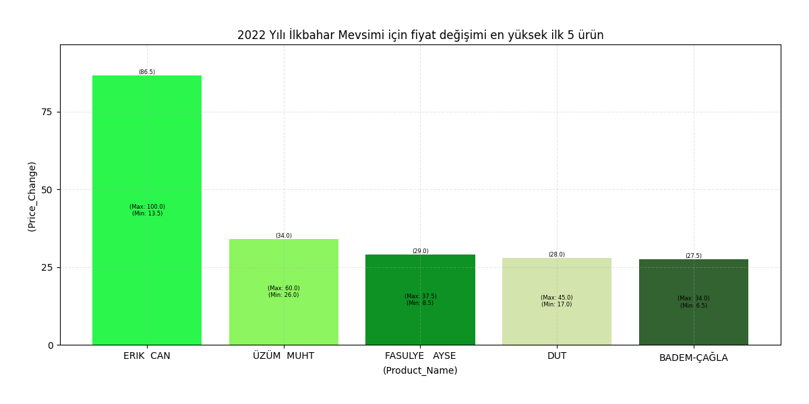

Grafik, 2022 yılı ilkbahar mevsiminde en yüksek fiyat değişimine sahip ilk beş ürünü göstermektedir. En fazla dalgalanma Erik Can'da görülmüş olup, fiyatı 86.5 birimlik değişim göstermiştir. Maksimum fiyatı 100 TL, minimum fiyatı ise 13.5 TL olarak kaydedilmiştir. Üzüm Muht, 34 birimlik değişimle ikinci sırada yer alırken, fiyat aralığı 26 TL - 60 TL arasında değişmiştir. Üçüncü sıradaki Fasulye Ayşe, 29 birimlik fiyat değişimiyle listede yer almakta olup, fiyatı 8.5TL - 37.5 TL aralığında dalgalanmıştır. Dut, 28 birimlik değişimle dördüncü sırada bulunurken, fiyatları 17 TL-45 TL arasında değişmiştir. Son olarak, Badem-Çağla, 27.5 birimlik değişimle ilk beş ürün arasında yer almış, fiyatı 6.5 TL - 34 TL arasında değişmiştir. Erik Can, açık ara en yüksek fiyat dalgalanmasına sahip ürün olurken, diğer ürünlerin fiyat değişimleri birbirine daha yakın seviyelerde gerçekleşmiştir. Genel olarak, bu ürünlerdeki fiyat oynaklığının yüksek olması, mevsimsel etkiler ve arz-talep dengesiyle doğrudan ilişkilidir.Bu analiz, meyve ve sebze fiyatlarındaki dalgalanmaların enflasyon, mevsimsel etkiler ve arz-talep dengesi gibi ekonomik faktörlerle doğrudan ilişkili olduğunu göstermektedir. Özellikle mevsimsel değişimler, belirli ürünlerin fiyatlarında ani artış ve azalışlara yol açarken, arz-talep dengesi de bu dalgalanmaları daha da belirgin hale getirmektedir. En fazla fiyat değişimi gösteren ürünler, ekonomik dalgalanmalara karşı daha hassas olup, fiyat değişimleri üreticiler için maliyet hesaplamalarında ve tüketiciler için bütçe planlamalarında önemli bir rol oynamaktadır. 

---------------------------------------------------------------------------

 ## 2022 YILI KIS MEVSIMINDE EN YUKSEK FIYAT DEGISIMI GÖSTEREN 5 ÜRÜN:

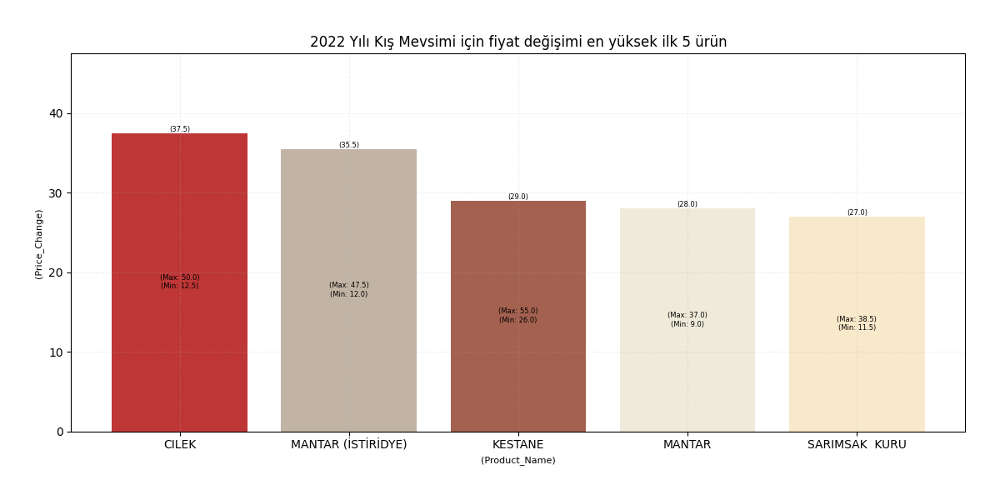

Grafik, 2022 yılı kış mevsiminde en yüksek fiyat değişimine sahip ilk beş ürünü göstermektedir. Listenin başında yer alan çilek, 37.5 TL'lik fiyat değişimiyle en fazla dalgalanma gösteren ürün olmuştur. Maksimum fiyatı 50 TL, minimum fiyatı ise 12.5 TL olarak kaydedilmiştir. Özellikle kış aylarında üretimi zorlaşan ve ithalata bağımlı hale gelen çilek, piyasadaki değişimlere karşı daha hassas bir yapıya sahiptir.
 ikinci sırasında yer alan istiridye mantarı, 35.5 TL'lik fiyat değişimi göstermiş olup, fiyat aralığı 12.0 TL - 47.5 TL arasında dalgalanmıştır. Mantar üretimi,İklim koşullarına duyarlı olduğundan, belirli iklim ve sıcaklık koşullarına bağlı olduğu için özellikle kış aylarında fiyatlarında belirgin artışlar gözlemlenebilir. 
Üçüncü sırada yer alan kestane, 29.0 TL'lik bir fiyat değişimi göstermiş ve fiyatı 26.0 TL - 55.0 TL aralığında değişmiştir. Kestane, genellikle kış aylarında tüketimi artan bir ürün olduğu için, talebin yükseldiği dönemlerde fiyatında keskin dalgalanmalar yaşanabilmektedir. Ayrıca, kestanenin hasat dönemi kısa sürdüğünden, stok durumu ve ithalat gerekliliği fiyat değişikliklerinde önemli rol oynayabilir.
Dördüncü sırada bulunan mantar, 28.0 TL'lik bir fiyat değişimi göstererek, en düşük 9.0 TL, en yüksek 37.0 TL seviyelerine ulaşmıştır. Mantar, taze tüketilen ve raf ömrü kısa olan bir ürün olduğu için, arz-talep dengesizliğinden doğrudan etkilenmektedir. Mevsimsel değişikliklerin yanı sıra, üretim koşullarındaki farklılıklar da mantarın fiyat oynaklığını artıran faktörler arasında yer almaktadır.
Son olarak, sarımsak kuru 27.0 TL'lik bir fiyat değişimi ile listede beşinci sırada yer almıştır. Fiyat aralığı 11.5 TL - 38.5 TL arasında değişmiştir. Sarımsağın fiyat değişimi, üretim bölgesindeki hasat miktarına, stok durumuna ve ithalat politikalarına bağlı olarak farklılık gösterebilmektedir. Özellikle kış aylarında sarımsağa olan talebin artması ve arzın sınırlı olması, fiyat dalgalanmalarını artırabilmektedir.

Genel olarak bakıldığında, kış mevsiminde fiyat değişimi en yüksek olan bu beş ürün, mevsimsel etkiler, arz-talep dengesizlikleri ve ekonomik faktörlerden doğrudan etkilenmiştir. Çilek ve istiridye mantarı gibi hassas ürünler, sıcaklık ve üretim koşullarına bağlı olarak fiyatlarında ani değişimler gösterirken, kestane ve sarımsak gibi ürünlerde tüketim alışkanlıkları fiyat oynaklığının belirleyicisi olmuştur.

-------------------------------------------------------------------------

## 2022 YILI SONBAHAR MEVSIMINDE EN YUKSEK FIYAT DEGISIMI GÖSTEREN 5 ÜRÜN:

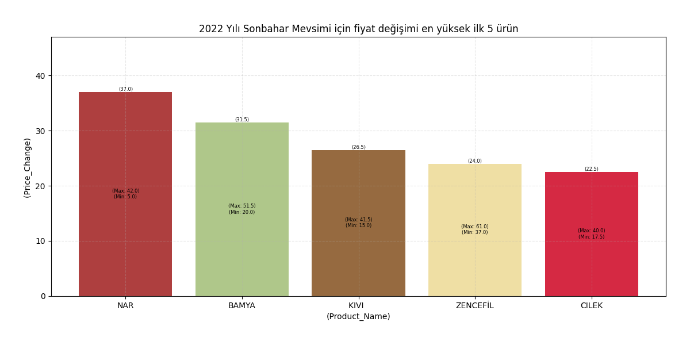

Grafik, 2022 yılı sonbahar mevsiminde fiyat değişimi en yüksek olan ilk beş ürünü göstermektedir. Listenin başında yer alan nar, 37.0 TL'lik fiyat değişimiyle en fazla dalgalanan ürün olmuştur. Maksimum fiyatı 42.0 TL, minimum fiyatı ise 5.0 TL olarak belirlenmiştir.Narın minimum ve maksimum fiyatları arasındaki büyük fark, bu ürünün fiyat istikrarının oldukça düşük olduğunu göstermektedir. Ayrıca, sezon başlangıcında düşük fiyatlarla piyasaya sunulup, talebin artmasıyla fiyatların yükselmesi sonucu ortaya çıkmış olabilir.

İkinci sırada bulunan bamya, 31.5 TL'lik bir fiyat değişimi göstermiştir. Fiyat aralığı 20.0 TL - 51.5 TL arasında değişmiştir. Bamya, nispeten az üretilen ve mevsimsel olarak belirli dönemlerde daha fazla talep gören bir sebzedir. Özellikle sonbahar aylarında pazara arz edilen miktarın değişken olması ve hava koşullarının üretimi etkilemesi, fiyat dalgalanmalarına neden olmuştur.

Üçüncü sırada yer alan kivi, 26.5 TL'lik bir fiyat değişimi göstererek, 15 TL - 41.5 TL arasında dalgalanmıştır. Kivi, hasat dönemi geldiğinde piyasaya sürülen ve genellikle belirli aylarda daha yoğun satılan bir meyvedir. Stok durumu, ithalat politikaları ve tüketici talebi gibi faktörler kivinin fiyat değişiminde belirleyici olmuştur.

Dördüncü sırada bulunan zencefil, 24.0 TL'lik bir fiyat değişimi göstermiştir. Fiyat aralığı 37 TL - 61 TL arasında değişmiştir.Zencefil, listedeki en yüksek maksimum fiyata sahip ürün olarak öne çıkmaktadır. Zencefilin fiyat dalgalanmaları, büyük ölçüde ithalata bağımlı bir ürün olması nedeniyle küresel piyasalardaki değişimlerden etkilenmektedir. 

Beşinci sırada yer alan çilek, 22.5 TL'lik fiyat değişimiyle listede kendine yer bulmuştur. Fiyat aralığı 17.5 TL - 40 TL olarak belirlenmiştir. Çilek, seralarda yetiştirilebilse de mevsimsel üretim dalgalanmalarına oldukça duyarlıdır.

Genel olarak bakıldığında, sonbahar mevsiminde fiyat değişimi en yüksek olan bu beş ürün, mevsimsel etkiler, küresel ticaret faktörlerinden doğrudan etkilenmiştir. Nar ve bamya gibi yerel olarak üretilen ürünlerde fiyat dalgalanmaları daha çok mevsimsel arz ile ilgiliyken, zencefil gibi ithal ürünlerde uluslararası fiyat değişimleri etkili olmuştur. Yerel üretimin artırılması ve ithalata bağımlılığın azaltılması, piyasadaki oynaklığın azaltılmasına yardımcı olabilir.

--------------------------------------------------------------------------

## 2022 YILINDA YAZ MEVSIMINDE EN YUKSEK FIYAT DEGISIMI GÖSTEREN 5 ÜRÜN:

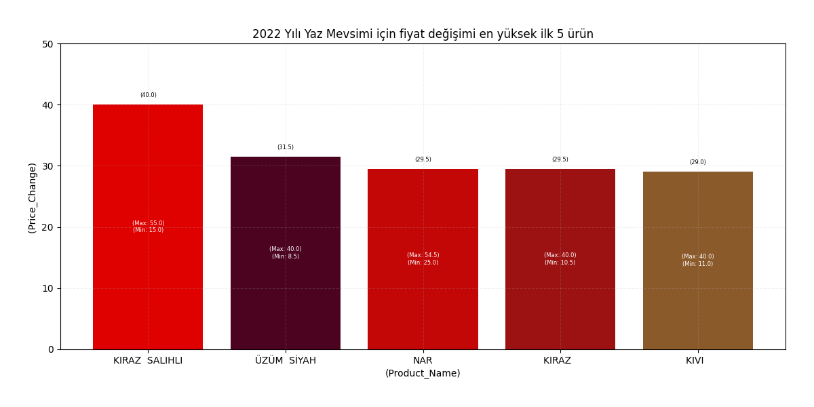

2022 yılı yaz mevsimindeki en yüksek fiyat değişimi gösteren ilk beş ürün şu şekilde sıralanmıştır.Kiraz salihli, üzüm siyah, Nar, Kiraz ve kivi olmuştur.

Kiraz Salihli: 40 TL'lik fiyat değişimi ile listenin başında yer alıyor. Fiyatlar 15 TL ile 55 TL arasında dalgalanmış. Bu büyük fark, ürünün fiyat istikrarının düşük olduğunu ve talep arttıkça fiyatların hızla yükseldiğini gösteriyor. Kirazın sezon başlangıcında düşük fiyatlarla piyasaya sunulup, talep arttıkça fiyatların yükselmesi olasılığına işaret edebilir.

Üzüm Siyah: 31,5 TL'lik fiyat değişimi ile ikinci sırada. Fiyatlar 8,5 TL ile 40 TL arasında değişmiş. Üzüm, yaz mevsiminin karakteristik meyvelerinden biri olup, hasat döneminin başlangıcı ve sonunda arz farklılıkları bu dalgalanmanın temel nedenidir. Üretim miktarındaki mevsimsel dalgalanmalar, fiyatlarda önemli değişimlere yol açmıştır.

Nar: 29,5 TL'lik fiyat değişimi ile üçüncü sırada yer alıyor. Fiyat aralığı 25 TL ile 54,5 TL arasında dalgalanmış. Nar en yüksek başlangıç fiyatına sahip olmuştur.

Kiraz: 29,5 TL'lik fiyat değişimi gösteren kiraz, yaz meyveleri arasında en yüksek fiyat dalgalanması gösteren ürünlerden biridir. Fiyatlar 10,5 TL ile 40 TL arasında değişmiş. 

Kivi: 29 TL'lik fiyat değişimiyle listede yer bulan kivi, genellikle yaz mevsiminde depodan çıkarılarak piyasaya sunulur. Fiyatlar 11 TL ile 40 TL arasında değişmiş. Kivi fiyatlarındaki dalgalanma, stok durumu ve ithalat politikalarındaki değişikliklerden etkilenmiş olabilir.

Grafikte her bir ürün için gösterilen minimum ve maksimum değerler, fiyat aralıklarının ne kadar geniş olduğunu net bir şekilde ortaya koyuyor. Bu, yaz mevsiminde meyve fiyatlarının dinamik bir yapıya sahip olduğunu gösteriyor. Özellikle Kiraz Salihli'nin diğer ürünlere göre belirgin şekilde yüksek fiyat değişimi göstermesi, bu ürünün fiyat istikrarı açısından en hassas ürün olduğunu vurguluyor.Nar, başlangıç fiyatı olarak 25 TL ile en yüksek fiyata sahipken, Üzüm Siyah ise 8.5 TL ile en düşük fiyata sahip. Bu durum, ürünlerin piyasaya giriş fiyatlarının oldukça farklı olduğunu gösteriyor. Diğer yandan, Nar, Kiraz ve Kivi'nin fiyat değişimleri birbirine oldukça yakın seviyelerde kalıyor, 29-29.5 TL arasında değişiyor. Bu da yaz meyvelerinin fiyatlarının zaman zaman paralel bir şekilde hareket ettiğini işaret ediyor. Fiyat istikrarı açısından ürünler arasında belirgin farklar olduğu da dikkat çekiyor. Ayrıca Kiraz, üzüm ve nar gibi yaz meyvelerinin fiyatlarındaki dalgalanma, meyvelerin olgunlaşma süreci ve hasat dönemiyle doğrudan bağlantılı olarak değişebilir. Bu meyvelerin fiyatları, mevsimsel döngüler ve olgunlaşma süreçlerine bağlı olarak dalgalanır. Kivi fiyatları ise daha çok ithalat ve stok durumları gibi faktörlerden etkilenir, çünkü kivi yerli üretim açısından yaz meyvelerine göre daha az yaygındır ve yıl boyunca ithalatla karşılanır. Bu meyvelerin fiyatları, genel olarak hasat dönemi boyunca değişiklik gösterir ve her birinin yetişme koşulları ve türlerine göre farklılıklar ortaya çıkar.

---------------------------------------------------------------------------

## 2022 YILI EN DÜŞÜK FIYATA SAHIP ÜRÜN VE FIYAT DEGISIMI:

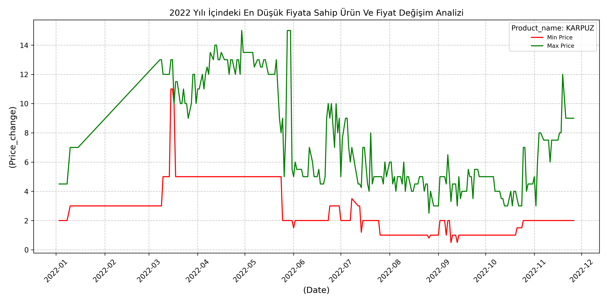

2022 yılında karpuz fiyatlarının değişimini gösteren bu grafik, dikkat çekici bir fiyat dinamiği ortaya koymaktadır. Yılın ilk çeyreğinde karpuz fiyatları kademeli bir artış eğilimi göstermiştir. Ocak ayında 4-5 TL seviyesinde olan maksimum fiyatlar, Mart ayında 12-13 TL seviyelerine kadar yükselmiştir. Bu artışın temel sebebi, kış aylarında karpuz üretiminin sınırlı olması ve sera üretimi maliyetlerinin yüksek olmasıdır.
Nisan ayında fiyatlarda ani bir yükseliş gözlemlenmiştir. Minimum fiyatlar 5 TL civarında seyrederken, maksimum fiyatlar 15 TL'ye kadar çıkmıştır. Bu keskin artışın arkasında, mevsim geçişi ve piyasadaki arz-talep dengesizliği yatmaktadır.Yaz aylarına gelindiğinde, özellikle Haziran ayında belirgin fiyat dalgalanmaları yaşanmıştır. Karpuzun ana hasat dönemi olması sebebiyle piyasaya bol miktarda ürün girmesi fiyatların düşmesini sağlamıştır. Temmuz ayından itibaren fiyatlar daha stabil bir seyir izlemeye başlamış, minimum fiyatlar 1-2 TL bandında, maksimum fiyatlar ise 4-8 TL aralığında dalgalanmıştır.Yılın son çeyreğinde fiyatlar nispeten daha dar bir bantta hareket etmiş ve piyasanın dengeli bir yapıya kavuştuğunu göstermiştir. Kasım ve Aralık aylarında maksimum fiyatlarda görülen küçük artışlar, muhtemelen kış mevsimine girilmesiyle birlikte arz miktarının azalmasından kaynaklanmıştır.Genel olarak değerlendirildiğinde, 2022 yılı boyunca karpuz, Türkiye'de en ekonomik meyvelerden biri olma özelliğini korumuştur. Fiyat değişimlerinin büyük ölçüde mevsimsel faktörler, üretim koşulları ve pazar dinamiklerinden etkilendiği açıkça görülmektedir. Yaz aylarında artan üretim hacmi, fiyatların tüketici lehine dengelenmesini sağlamış ve karpuzun her gelir düzeyinden tüketicinin ulaşabileceği bir ürün olarak kalmasına yardımcı olmuştur.Özellikle sezon başlangıcı ve bitişlerinde görülen fiyat artışları, ürünün mevsimsel özelliklerinin tipik bir göstergesidir. Aralık ayında maksimum fiyatların 12 TL seviyesine kadar çıkması, yıl sonu itibarıyla talep ve arz dengesindeki değişimi yansıtmaktadır. Bu veriler, karpuz fiyatlarının yıl içerisindeki değişimini ve piyasa dinamiklerini net bir şekilde ortaya koymaktadır.

----------------------------------------------------------------------------------

## 2022 YILI EN YUKSEK FIYATA SAHIP ÜRÜN VE FIYAT DEGISIMI:

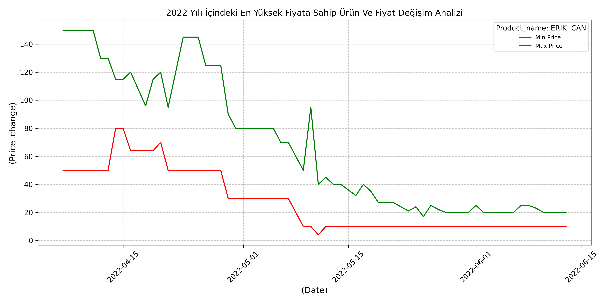

Grafik 2022 Yılı İçindeki En Yüksek Fiyata Sahip Can Eriği fiyatlarının 2022 yılı içerisindeki değişimini gösteriyor. Nisan-Haziran dönemini kapsamaktadır. Fiyat hareketlerine bakıldığında, Can Eriği'nin pazara ilk çıktığı Nisan ayı başında maksimum fiyat yaklaşık 150 TL, minimum fiyat ise 50 TL civarında seyretmiştir. Bu dönem, ürün arzının kısıtlı olduğu ve talebin yüksek olduğu bir zaman dilimine denk gelmektedir. Nisan ayı ortalarında fiyatlarda belirgin bir dalgalanma görülmekte ve maksimum fiyat 120-140 TL aralığında değişkenlik göstermektedir. Bu dönemde minimum fiyat da 80 TL'ye kadar yükselmiştir.Mayıs ayının başlarında dikkat çekici bir değişim yaşanmış, hem maksimum hem de minimum fiyatlarda keskin bir düşüş gözlemlenmiştir. Mayıs ortalarından sonra fiyatlar daha stabil bir seyre girmiş, maksimum fiyat 20-30 TL bandına, minimum fiyat ise 10 TL civarına gerilemiştir.Haziran ortasında ise fiyatlar daha stabil hale gelmiş; maksimum fiyat 20 TL, minimum fiyat ise 10 TL seviyesinde sabitlenmiştir. Genel olarak bakıldığında, Can Eriği fiyatları sezon boyunca düşüş eğilimi göstermiştir. Hasat döneminin başlangıcında yüksek seyreden fiyatlar daha sonra kademeli olarak azalmıştır. Bununla birlikte, maksimum ve minimum fiyat arasındaki farkın zamanla daraldığı gözlemlenmektedir. Sezon başında 100 TL'ye kadar çıkan fiyat farkı, Haziran ayında yaklaşık 10 TL'ye düşerek piyasanın dengeye ulaştığını göstermektedir. Özellikle Mayıs ayındaki keskin düşüş, ürünün piyasaya bol miktarda sürülmesiyle açıklanabilir. Grafiğin son bölümünde fiyatların düşük ve istikrarlı bir seyir izlemesi, ürünün mevsiminde olduğunu ve piyasada dengeli bir arz-talep ilişkisinin kurulduğunu göstermektedir.

-----------------------------------------------------------------------------------

## 2022 YILI EN YUKSEK FIYAT DEGISIM GÖSTEREN 5 ÜRÜN:

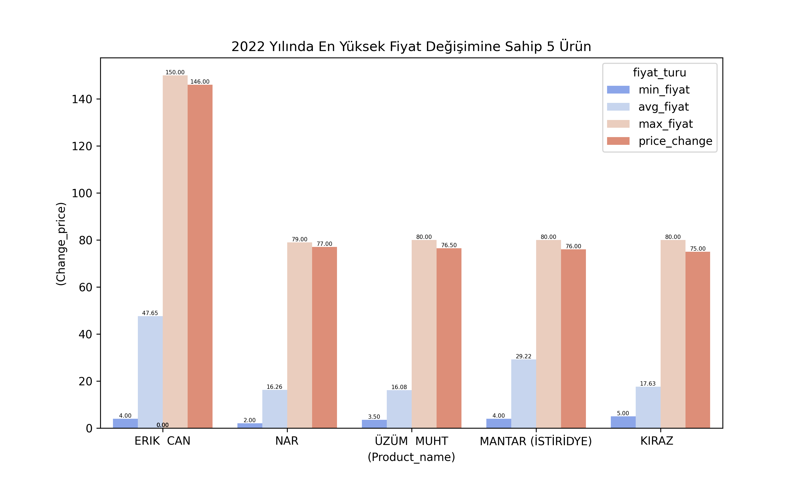

Bu grafik, 2022 yılında fiyat dalgalanması en yüksek olan beş ürününe odaklanmaktadır. Fiyat değişimleri incelendiğinde,

Erik Can:
Fiyat değişimi: 146 TL
Minimum fiyat: 4 TL
Maksimum fiyat: 150 TL
Ortalama fiyat: 47.65 TL

Nar:
Fiyat değişimi: 77 TL
Minimum fiyat: 2 TL
Maksimum fiyat: 79 TL
Ortalama fiyat: 16.26 TL

Üzüm Muht:
Fiyat değişimi: 76.50 TL
Minimum fiyat: 3.50 TL
Maksimum fiyat: 80 TL
Ortalama fiyat: 16.08 TL

Mantar (İstiridye):
Fiyat değişimi: 76 TL
Minimum fiyat: 4 TL
Maksimum fiyat: 80 TL
Ortalama fiyat: 29.22 TL

Kiraz:
Fiyat değişimi: 75 TL
Minimum fiyat: 5 TL
Maksimum fiyat: 80 TL
Ortalama fiyat: 17.63 TL

2022 yılında en yüksek fiyat değişimine sahip 5 ürünün analizi incelendiğinde, Erik Can'ın diğer ürünlere göre çok daha yüksek bir fiyat değişimi gösterdiği dikkat çekmektedir. Minimum 4 TL'den maksimum 150 TL'ye ulaşan fiyat aralığına sahiptir. Ortalama fiyatı ise 47.65 TL olup, diğer ürünlerin ortalamalarının oldukça üzerindedir. 
Diğer dört ürün olan Nar, Üzüm Muht, Mantar (İstiridye) ve Kiraz ise fiyat değişimleri açısından birbirine oldukça yakın seyretmekte ve 75-77 TL aralığında değişim göstermektedir. Maksimum fiyatları da 79-80 TL civarında olup, bu benzerlik söz konusu ürünlerin piyasa dinamiklerinin ve fiyatlandırma mekanizmalarının ortak faktörlerden etkilendiğine işaret etmektedir.Minimum fiyatlar açısından bakıldığında, tüm ürünlerin 2-5 TL aralığında olduğu görülmektedir. Maksimum fiyatlarda ise Erik Can 150 TL ile dikkat çekerken, diğer ürünler 79-80 TL bandında kalmaktadır.Ortalama fiyat değerlendirmesi yapıldığında, Erik Can 47.65 TL ile en yüksek ortalama fiyata sahipken, onu 29.22 TL ile Mantar (İstiridye) takip etmektedir. Diğer ürünlerin ortalama fiyatları ise 16-18 TL bandında seyretmektedir. Bu farklılık, ürünlerin yıl içindeki bulunabilirlik süreleri ve talep yoğunluklarıyla doğrudan ilişkili olabilir.Genel olarak bakıldığında, Erik Can dışındaki diğer ürünlerin daha dengeli bir fiyat değişim aralığında olması ise bu ürünlerin piyasalarının daha istikrarlı olduğunu düşündürmektedir. Bu veriler, 2022 yılında meyve ve sebze piyasasındaki fiyat dinamiklerinin hakkında net bir şekilde bilgi vermektedir.

------------------------------------------------------------------------

## 2022 YILINA AIT MEYVE KATEGORISINDEKI EN YUKSEK FIYATA SAHIP ÜRÜN VE FIYAT DEGISIMI:

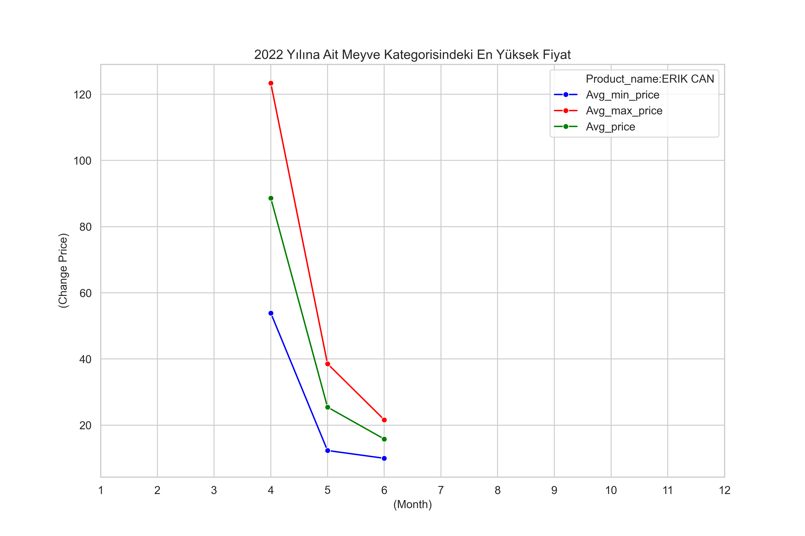

2022 yılına ait erik can ürününün fiyat değişim grafiğini incelediğimizde, ürünün yalnızca Nisan, Mayıs ve Haziran aylarında piyasada bulunduğunu görmekteyiz. Bu durum ürünün mevsimsel özelliğini açıkça ortaya koymaktadır. Nisan ayında piyasaya ilk çıktığında en yüksek fiyat seviyelerine ulaşmış olup, maksimum fiyat yaklaşık 120 TL, ortalama fiyat 90 TL ve minimum fiyat 55 TL civarında seyretmiştir. Mayıs ayına gelindiğinde fiyatlarda keskin bir düşüş yaşanmış ve ortalama fiyat 25 TL seviyelerine gerilemiştir. Haziran ayında ise bu düşüş devam ederek ortalama fiyat 15 TL civarına kadar inmiştir. Maksimum ve minimum fiyatlar arasındaki fark, yani fiyat aralığı, Nisan ayında en yüksek seviyedeyken sonraki aylarda belirgin bir daralma göstermiştir. Bu veriler ışığında, can eriği meyvesinin piyasaya ilk çıktığı dönemde yüksek fiyatlarla satıldığını, ancak mevsim ilerledikçe fiyatların önemli ölçüde düştüğünü söyleyebiliriz.

---------------------------------------------------------------------------------------------------

## 2022 YILINA AIT SEBZE KATEGORISINDEKI EN YUKSEK FIYATA SAHIP ÜRÜN VE FIYAT DEGISIMI:

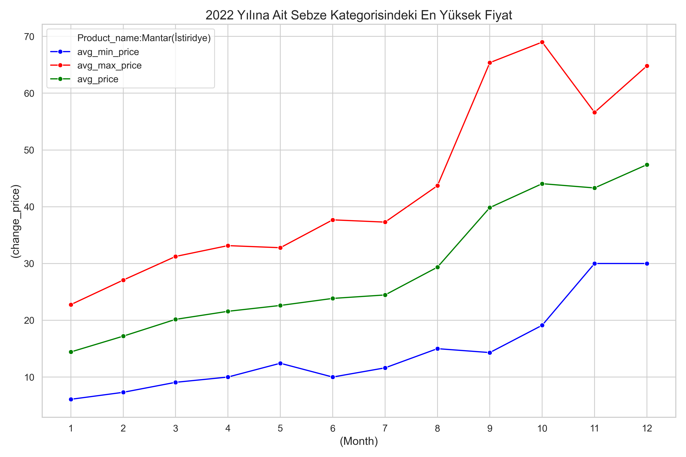

2022 yılına ait mantar (istiridye) fiyatlarını gösteren bu grafik, Türkiye'deki sebze kategorisindeki fiyat değişimlerini çarpıcı bir şekilde ortaya koymaktadır. Yılın başında görece düşük seyreden fiyatlar, özellikle minimum fiyatların 5-10 TL, maksimum fiyatların ise 20-25 TL bandında olduğu görülmektedir. Ancak yılın ilerleyen aylarında, özellikle yaz sonundan itibaren fiyatlarda dikkat çekici bir artış trendi başlamıştır. Bu artış, özellikle 8. aydan sonra fazla bir hal almış ve 10. ayda zirve noktasına ulaşmıştır. Maksimum fiyatlar 70 TL seviyesini görürken, minimum fiyatlar 30 TL civarında seyretmiştir.
İlginç bir şekilde, 11. ayda fiyatlarda geçici bir düşüş yaşanmış, ancak yılın son ayında tekrar yükseliş trendine girilmiştir. Ortalama fiyatların yıl boyunca istikrarlı bir artış göstermesi, genel enflasyonist baskının yanı sıra, mantarın üretim ve tedarik zincirindeki zorlukların da bir göstergesi olabilir. Minimum ve maksimum fiyatlar arasındaki makasın özellikle yılın son çeyreğinde açılması, piyasadaki fiyat istikrarsızlığına işaret etmektedir.Bu fiyat hareketleri, muhtemelen mevsimsel faktörler, üretim maliyetlerindeki artış, enerji fiyatlarındaki yükseliş ve genel ekonomik koşulların bir yansıması olarak değerlendirilebilir. Özellikle sonbahar aylarındaki keskin fiyat artışları, mantar üretiminin bu dönemdeki zorluklarını ve piyasa dinamiklerini açıkça ortaya koymaktadır. Yılın sonuna doğru görülen fiyat dalgalanmaları ise piyasanın dengelenme çabasını göstermektedir.

---------------------------------------------------------------------------------------------------

## 2023 YILI EN AZ FIYAT DEGISIMI GÖSTEREN 5 ÜRÜN:

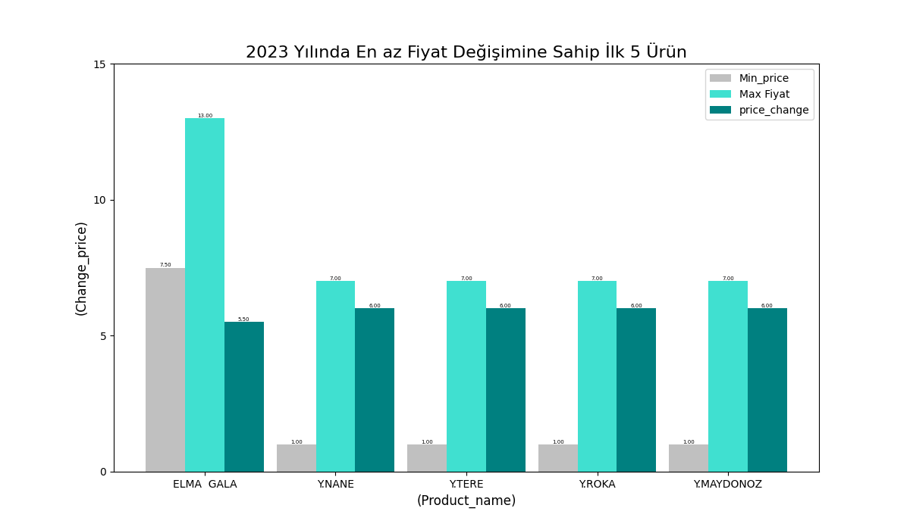

 Bu grafik 2023 yılında en az fiyat değişimine sahip ilk beş ürünü ve fiyat hareketlerini göstermektedir. Grafiği incelediğimizde,Elma (Gala),Nane, Tere, Roka ve Yeşil Maydonoz ürünlerini görmekteyiz. Bu ürünlerden ELMA GALA, minimum 7.50 TL, maksimum 13 TL ve ortalama 5.50 TL fiyat seviyelerinde işlem görürken; YNANE, YTIRE, YROKA ve YMAYDONOZ için minimum 1 TL, maksimum 7 TL  ve ortalama 6 TL olarak kaydedilmiştir. Elma (Gala)'nın diğer en az fiyat değişimi gösteren ürünlere göre daha farklı fiyat değişimi olduğunu görmekteyiz. Bu ürünün maksimum fiyatının 13 TL ile diğer ürünlerin maksimum değerlerinin neredeyse iki katı olması, fiyat dalgalanmasının oldukça yüksek olduğunu göstermektedir. Ayrıca, minimum fiyatının 7.50 TL gibi yüksek bir seviyede olması, genel olarak daha yüksek bir fiyat bandında işlem gördüğünü ortaya koymaktadır.Diğer dört ürünün fiyat hareketlerindeki benzerlik, piyasa dinamikleri açı sından önemli ipuçları sunmaktadır. Bu ürünlerin tümünde minimum fiyatın 1 TL seviyesinde olması, belirli dönemlerde önemli fiyat düşüşleri yaşandığını gösterirken, maksimum fiyatın 7 TL ile sınırlı kalması, fiyat artışlarının belirli bir seviyede durduğunu göstermektedir. Bu benzerlik, fiyat belirleme mekanizmalarının benzer faktörlerden etkilendiğini düşündürmektedir.
Bu veriler ışığında, 2023 yılında gıda ürünlerinin fiyat hareketlerinde ELMA GALA dışındaki ürünlerde bir istikrar olduğu, ancak ELMA GALA'nın daha değişken bir fiyat yapısına sahip olduğu açıkça görülmektedir.
 YNANE, YTIRE, YROKA ve YMAYDONOZ ürünlerinde minimum fiyatın 1 TL seviyesinde olması, bu ürünlerin belirli dönemlerde oldukça uygun fiyatlarla tüketiciye sunulduğunu göstermektedir. Bu durum, büyük olasılıkla mevsimsel bolluk, arz fazlası gibi faktörlerden kaynaklanmaktadır.

 --------------------------------------------------------------------------------------------------

## 2023 YILI EN YUKSEK FIYAT DEGISIMI GÖSTEREN 5 ÜRÜN:

 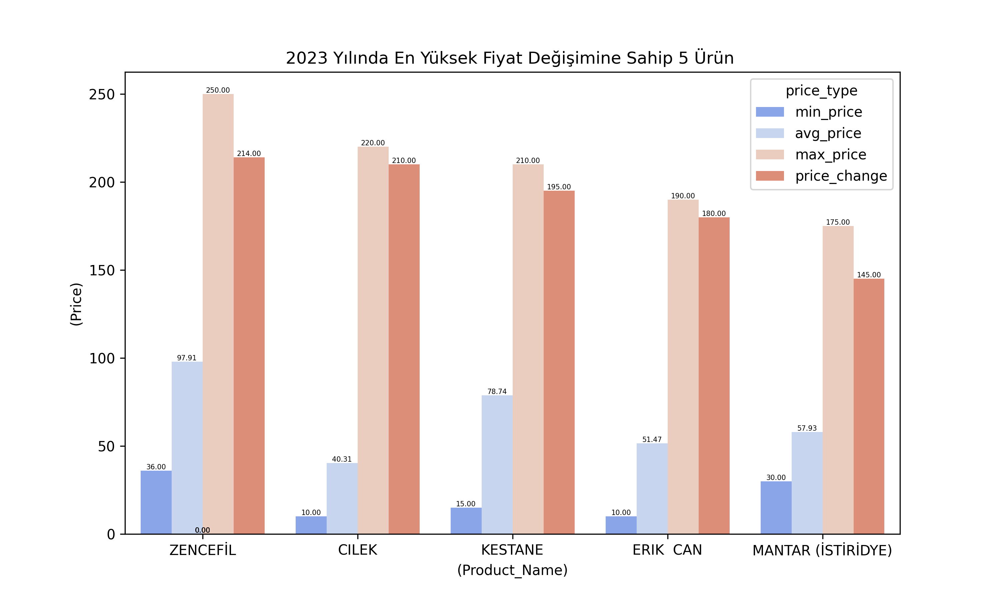
 

 Grafik 2023 yılında en yüksek fiyat değişimine sahip beş ürünü göstermektedir. 2023 yılında en yüksek fiyat değişimine sahip ürünler zencefil, çilek, kestane, erik can ve istiridye mantarı olmuştur. Minimum fiyatlar incelendiğinde çilek ve erik can 10 TL ile en düşük başlangıç fiyatına sahipken, zencefil 36 TL, istiridye mantarı 30 TL ve kestane 15 TL'den satışa sunulmuştur. Maksimum fiyatlarda ise zencefil 250 TL ile en yüksek seviyeye ulaşırken, çilek 220 TL, kestane 210 TL, erik can 190 TL ve istiridye mantarı 175 TL ile sıralanmıştır. Ortalama fiyatlara bakıldığında ise zencefil 97.91 TL ile en yüksek değere sahip olurken, bunu kestane 78.74 TL, istiridye mantarı 57.93 TL, erik can 51.47 TL ve çilek 40.31 TL ile takip etmiştir. 
Sonuç olarak,2023 yılında en yüksek fiyat değişimine sahip ürünler sırasıyla zencefil (214 TL), çilek (210 TL), kestane (195 TL), erik can (180 TL) ve istiridye mantarı (145 TL) olmuştur.Zencefil, yıl içinde 36 TL'den başlayarak 250 TL'ye kadar yükselmiş ve 214 TL'lik rekor bir fiyat değişimi göstermiştir. Ortalama 97.91 TL seviyesinde satılmıştır. Çilek ise mevsimsel yapısı gereği 10 TL'den başlayıp 220 TL'ye kadar yükselerek 210 TL'lik bir değişim göstermiştir. Hasat dönemleri ve arz-talep dengesi bu büyük fiyat farkının temel sebepleri arasında yer almaktadır. Benzer şekilde kestane  15 TL'den 210 TL'ye kadar çıkmış ve 195 TL'lik bir değişim sergilemiştir. Can eriği 10 TL'den 190 TL'ye ulaşarak 180 TL'lik bir dalgalanma yaşarken, istiridye mantarı 30 TL'den 175 TL'ye çıkarak 145 TL'lik bir değişime uğramıştır. Grafikte dikkat çeken bir diğer önemli nokta, tüm ürünlerin ortalama fiyatlarının minimum fiyatlara daha yakın seyretmesidir. Bu durum, yıl içinde fiyatların genellikle düşük seviyelerde seyrettiğini ancak belirli dönemlerde keskin yükselişler yaşandığını göstermektedir. Tüm bu veriler, gıda ürünlerindeki fiyat dalgalanmalarının boyutunu gözler önüne sererken, özellikle temel gıda ürünlerinde fiyat istikrarının sağlanmasının ne kadar önemli olduğunu ve bu dalgalanmaların mevsimsellik, iklim koşulları, üretim maliyetleri ve pazar dinamiklerinin fiyatlar üzerindeki güçlü etkisini yansıtırken, tüketicilerin de alım gücünü  önemli ölçüde etkileyecektir.

--------------------------------------------------------------------------------------------------

## 2023 YILINDA EN AZ FIYAT DEGISIMI GÖSTEREN ÜRÜN VE FIYAT DEGISIMI:

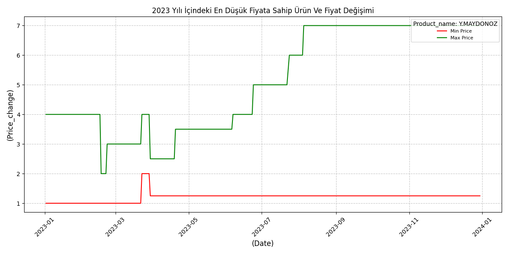

2023 yılı Y.MAYDONOZ ürününün fiyat değişimlerini incelediğimizde, yılın ilk aylarında minimum fiyat yaklaşık 1 TL seviyelerinde seyrederken, maksimum fiyat ise 4 TL civarında seyrediyor. Mart ayı sonlarında maksimum fiyat keskin bir düşüş yaşayarak 2.5 TL'ye gerilemiş. Minimum fiyat ise maksimum fiyatla orantılı olarak Mart sonunda kısa süreliğine 2 TL'ye yükselmiş. Yaz aylarına gelindiğinde, Haziran'dan itibaren maksimum fiyat kademeli olarak artış gösteriyor, Temmuz ayına gelindiğinde ise maksimum fiyat önce 5 TL'ye, ardından 6 TL'ye yükselmiş. Ağustos ayında ise bu artış devam ederek 7 TL seviyesine ulaşmıştır. Bu dönemde minimum fiyat yaz boyunca 1.2-1.3 TL civarında sabit kalmış,sonbahar ve kış aylarında ise maksimum fiyat 7 TL seviyesinde stabildir. Bu dönem, fiyat aralığının en geniş olduğu zaman dilimi olarak dikkat çekmiştir. Yıl genelinde en büyük fiyat artışı yaz aylarında gerçekleşmiştir, minimum fiyat ise yıl boyunca  stabil gözükmektedir. Maksimum ve minimum fiyat arasındaki fark, yılın ikinci yarısında giderek açılmaktadır. İlkbahar aylarında ise fiyat dalgalanmaları daha sık görülmüştür.Bu fiyat değişimleri, mevsimsel üretim koşulları, arz-talep dengesi ve piyasa dinamiklerinden etkilenmiş gibi görünüyor. Sonuç olarak, 2023 yılı Y.MAYDONOZ ürününün fiyat değişimleri Yılın ilk çeyreğinde fiyatlar daha dalgalı bir seyir izlerken, yaz aylarında maksimum fiyat belirgin bir şekilde artmış ve 7 TL seviyelerine ulaşmıştır. Yaz boyunca minimum fiyat sabit kalırken, maksimum fiyatın artışıyla yılın ikinci yarısında fiyat aralığı daha da genişlemiştir. Bu süreçte, minimum fiyat genel olarak istikrarlı olmuş ve yılın büyük kısmında 1.2-1.5 TL civarında seyretmiştir. Yılın sonunda ise maksimum fiyat 7 TL seviyesinde stabil kalmıştır.

--------------------------------------------------------------------------------------------------

## 2023 YILINDA EN YUKSEK FIYATLI ÜRÜN VE FIYAT DEGISIMI:

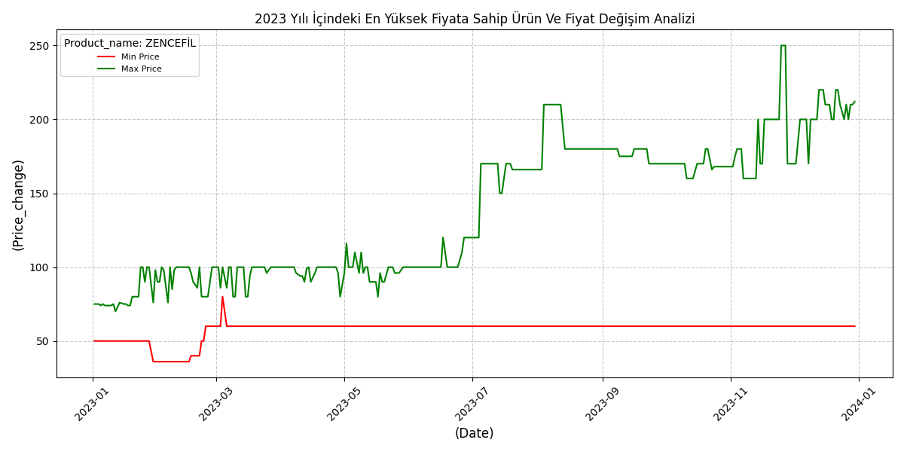

2023 yılı en yüksek fiyatlı ürün değişim grafiği incelendiğinde zencefil karşımıza çıkmakta, zencefil  yılın farklı dönemlerinde önemli fiyat hareketleri ve piyasa dinamikleri gözlemlenmektedir. Yıl boyunca zencefil fiyatlarındaki değişimin çok fazla olduğu görülmektedir. Yılın ilk çeyreğinde maksimum fiyat 75-80 TL civarında seyrederken, minimum fiyat 50 TL seviyesinde sabit kalmıştır.İkinci çeyrekte maksimum fiyat 90-100 TL bandında dalgalanmış, Mayıs ayında kısa süreli olarak 120 TL'ye kadar yükselmiştir. Yılın dönüm noktası olan üçüncü çeyrekte, özellikle Temmuz ayında dramatik bir artış yaşanmış ve maksimum fiyat 150 TL'den 210 TL'ye kadar yükselmiştir. Ağustos-Eylül döneminde fiyatlar 170-180 TL bandında dalgalanma göstermiştir. Son çeyrekte ise volatilite artmış, Kasım ayında ani bir yükselişle 250 TL seviyesine ulaşılmış, Aralık ayında 200-220 TL bandında dalgalanmalar görülmüştür. Dikkat çeken en önemli nokta, minimum fiyatın yıl boyunca 60 TL civarında sabit kalmasına rağmen, maksimum fiyatın üç katından fazla artış göstermesidir. Bu durum, minimum fiyatta olası bir taban fiyat veya regülasyon etkisini gösterirken, maksimum fiyattaki artışlar piyasadaki arz-talep dengesizliğine işaret etmektedir. Yıl boyunca güçlü bir yükseliş trendi gözlemlenmiş olup, özellikle Temmuz başı, Ağustos ortası ve Kasım ayında üç belirgin artış dalgası yaşanmıştır. 2024 yılına girerken fiyatlar 200 TL üzerinde seyretmeye devam etmiş ve yüksek volatilite sürmüştür.Bu veriler, 2023 yılında zencefil piyasasında önemli bir fiyat şoku yaşandığını ve piyasa dinamiklerinin değiştiğini göstermektedir.Fiyat dağılımı sağa çarpık (sağa yatık) bir görünüm sergilemekte Trend bileşeni pozitif yönlü Ortalama fiyatların yıl içinde belirgin bir yukarı trend göstermesi, dağılımın normal dağılımdan sapmasına işaret ediyor
Bu istatistiksel göstergeler, piyasada Artan belirsizlik,Fiyat istikrarsızlığı,Yapısal değişimler,Tahmin zorluğu gibi durumların varlığına işaret etmektedir.

--------------------------------------------------------------------------------------------------

## 2023 YILI ILKBAHAR MEVSIMINDE EN YUKSEK FIYAT DEGISIMI GÖSTEREN 5 ÜRÜN:

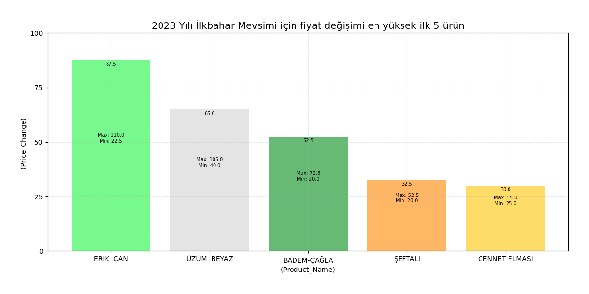

2023 yılı İlkbahar mevsiminde fiyat değişimi en yüksek ilk 5 ürün incelendiğinde, en dikkat çekici artışın Can Eriği ürününde gerçekleştiği görülmektedir. Erik fiyatları 22.5 TL'den 110.0 TL'ye yükselerek %87.5'lik bir değişim göstermiştir. Bunu %65'lik artışla Beyaz Üzüm takip etmiş, fiyatı 40.0 TL'den 105.0 TL'ye yükselmiştir. Üçüncü sırada yer alan Badem-Çağla'nın fiyatı %52.5'lik bir değişimle 20.0 TL'den 72.5 TL'ye çıkmıştır. Şeftali dördüncü sırada %32.5'lik bir artışla 20.0 TL'den 52.5 TL'ye yükselirken, listede son sırada yer alan Cennet Elması'nın fiyatı ise %30'luk bir değişimle 25.0 TL'den 55.0 TL'ye ulaşmıştır. 

Tüm ürünlerin meyve kategorisinde olması ve ilk üç üründeki fiyat değişiminin %50'nin üzerinde gerçekleşmesi dikkat çekicidir. Maksimum fiyatlar açısından Can eriği ve Beyaz üzüm öne çıkmaktadır.Minimum fiyatlar ise genellikle 20-25 TL aralığında seyretmiştir.
En geniş fiyat aralığı Can eriğin de, En dar fiyat aralığı Cennet Elması'nda görülmektedir.Üzüm Beyaz hariç diğer ürünlerin başlangıç fiyatları birbirine yakın (20-25 TL aralığında)Üzüm Beyaz'ın başlangıç fiyatı (40 TL) diğerlerinden belirgin şekilde yüksek görülüyor. Bu grafik ve yaptığımız gözlemler 2023 yılındaki ilkbahar mevsiminde en yüksek fiyat değişimine sahip 5 ürünün hangileri olduğunu ve bu beş ürünün meyve kategorisinde bulunduğunu gösterir ayrıca fiyat değişim dinamiklerini ve pazar,market,hal de bulunan ürünlerin fiyat hareketlerinin yapısını daha iyi anlamamıza yardımcı olmaktadır.

--------------------------------------------------------------------------------------------------

## 2023 YILI KIS MEVSIMINDE EN YUKSEK FIYAT DEGISIMI GÖSTEREN 5 ÜRÜN:

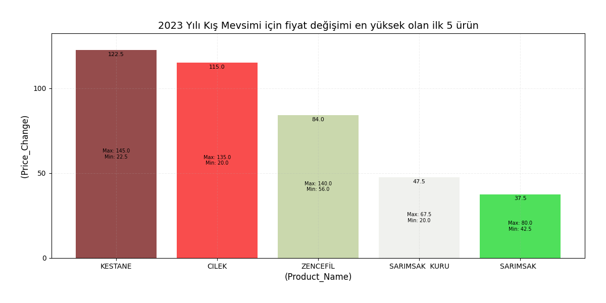

2023 yılı kış mevsiminde fiyat değişimlerini incelediğimizde, en dikkat çekici artışın kestanede olduğunu görüyoruz. Kestane fiyatları 22.5 TL'den 145.0 TL'ye yükselerek %122.5'lik bir artış göstermiş. Hemen ardından çilek geliyor; minimum 20.0 TL'den maksimum 135.0 TL'ye ulaşarak %115'lik bir artış kaydetmiş. Üçüncü sırada yer alan zencefil, 56 TL'den 140 TL'ye yükselerek %84'lük bir artış göstermiş. Dördüncü ve beşinci sırada iki farklı sarımsak çeşidi bulunuyor: Kuru sarımsak 20 TL'den 67.5 TL'ye çıkarak %47.5'lik bir artış gösterirken, normal sarımsak 42.5 TL'den 80 TL'ye yükselerek %37.5'lik bir artış kaydetmiş. 
Bu verilerde, Fiyat değişim aralığı oldukça geniş gözükmektedir. En düşük %37.5 ile en yüksek %122.5 arasında değişiyor.Minimum fiyatlar 20 TL ile 56 TL arasında değişirken, maksimum fiyatlar 67.5 TL ile 145 TL arasında değişiyor.En çarpıcı fiyat artışları kestane ve çilekte görülmüş olup, her iki ürün de %100'ün üzerinde artış göstermiştir ayrıca bu iki ürünün kış mevsiminde bulunması zor olan ürünler olması dikkat çekiyor  Zencefil ise 56 TL ile başlangıç fiyatı en yüksek ürün olarak görülüyor.İlk 5 ürün içinde iki farklı sarımsak çeşidinin (kuru ve normal) yer alması, sarımsağın her formunun önemli fiyat değişimleri yaşadığını gösteriyor.
Listede yer alan ürünlerin çoğu mevsimsel özellik gösteriyor, bu da kış dönemindeki fiyat dalgalanmalarının temel nedeni olarak değerlendirilebilir.

--------------------------------------------------------------------------------------------------

## 2023 YILI SONBAHAR MEVSIMINDE EN YUKSEK FIYAT DEGISTIMI GOSTEREN 5 URUN:

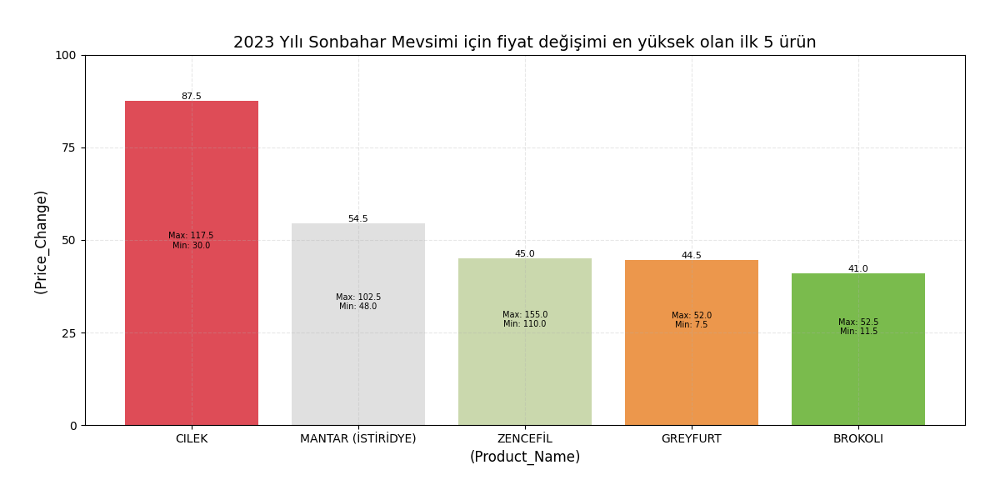

2023 yılı sonbahar mevsiminde fiyat değişimi en yüksek olan ilk 5 ürünü gösteren grafiği incelediğimizde, en dikkat çekici artışın çilekte olduğunu görüyoruz. Çilek 87.5 TL'lik bir fiyat değişimi ile listenin başında yer alıyor ve minimum 30.0, maksimum 117.5 değerleri arasında değişim gösteriyor. İkinci sırada mantar (istiridye) bulunuyor ve 54.5'lik bir fiyat değişimi ile dikkat çekiyor minimum 48.0, maksimum 102.5 fiyatlar arasında değişim gösteriyor. Üçüncü sırada yer alan zencefil 45'lik bir değişim gösterirken, minimum 110.0 ve maksimum 155.0 fiyatlar arasında seyrediyor. Dördüncü sırada greyfurt 44.5 TL bir fiyat değişimi ile yer alıyor minimum 7.5, maksimum 52.0 fiyatlar arasında değişim gösteriyor. Son olarak brokoli 41 TL'lik bir fiyat değişimi ile beşinci sırada bulunuyor ve fiyatları minimum 11.5 TL, maksimum 52.5 TL arasında değişiyor. 

İlk iki ürün (çilek ve mantar) 50 TL'nin üzerinde fiyat değişimi gösterirken son üç ürün birbirine yakın oranlarda (41-45 TL arası) değişim göstermiş.En Çarpıcı Artış Çilek fiyatlarındaki 87.5 TL'lik artış, diğer ürünlere kıyasla oldukça yüksek ve dikkat çekici. Bu artış oranı, ikinci sıradaki mantarın neredeyse iki katı benzer şekilde Zencefil en yüksek minimum fiyata sahip (110.0 TL),Greyfurt en düşük minimum fiyata sahip (7.5 TL),Bu iki ürün arasında yaklaşık 15 katlık bir fiyat farkı bulunuyor. İlk beş üründen üçü (çilek, mantar ve brokoli) sebze-meyve kategorisinde
Zencefil gibi ithal bir ürünün de listede yer alması dikkat çekiyor.
Sonbahar mevsiminde olunmasına rağmen çileğin listede olması ve en yüksek artışı göstermesi,sonbahar meyvesi olan greyfurtun bile yüksek fiyat artışı göstermesi mevsimselliğin fiyatları dengelemede yetersiz kaldığını gösteriyor.

---------------------------------------------------------------------------------------------------

## 2023 YILINDA YAZ MEVSIMINDE EN YUKSEK FIYAT DEGISTIMI GOSTEREN 5 URUN:

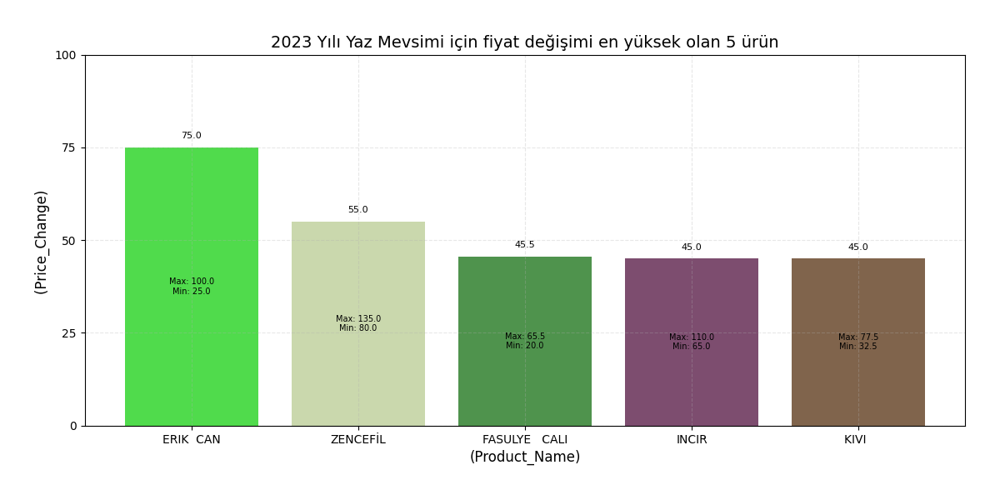

2023 yılı yaz mevsiminde en yüksek fiyat değişimine sahip ilk 5 ürünü incelediğimizde, Erik Can'ın 75 TL'lik fiyat değişimi ile listenin başında yer aldığını görüyoruz. Erik Can'ın minimum fiyatı 25 TL, maksimum fiyatı ise 100 TL olarak kaydedilmiştir. İkinci sırada yer alan Zencefil 55 TL'lik bir fiyat değişimi göstermiş olup, fiyatları 80 TL ile 135 TL arasında dalgalanmıştır. Üçüncü sırada bulunan Fasulye Çalı 45.5 TL'lik bir değişim sergilemiş ve fiyatları 20 TL'den başlayıp 65.5 TL'ye kadar yükselmiştir. Dördüncü sırada bulunan İncir 45 TL'lik bir fiyat değişimi göstermiş, minimum 65 TL'den başlayıp maksimum 110 TL'ye ulaşmıştır. Son olarak Kivi 45 TL'lik bir fiyat değişimi ile beşinci sırada yer almış ve fiyatları 32.5 TL ile 77.5 TL arasında seyretmiştir.İncir'in minimum fiyatının (65 TL) diğer ürünlere göre oldukça yüksek olmasıdır. Ayrıca Zencefil'in hem minimum hem de maksimum fiyatlarının diğer ürünlere kıyasla daha yüksek bir bantta seyretmesi, bu ürünün genel olarak daha pahalı bir ürün olduğunu göstermektedir.Erik Can, 75 TL'lik değişimle en yüksek fiyat dalgalanmasını gösterirken, bunu 55 TL'lik değişimle Zencefil takip etmiştir. Fasulye Çalı, İncir ve Kivi ise 45-45.5 TL arasında birbirine yakın değişimler sergilemiştir. Fiyat seviyeleri açısından bakıldığında, Zencefil 80-135 TL bandıyla en yüksek fiyat aralığında seyrederken, İncir 65 TL'lik başlangıç fiyatıyla ikinci sırada yer almıştır. Erik Can ise 25-100 TL arasındaki fiyat hareketiyle en geniş fiyat aralığına sahip ürün olmuştur. Mevsimsellik açısından dikkat çekici noktalar da bulunmaktadır; Erik Can ve İncir gibi mevsimsel ürünlerde yüksek fiyat dalgalanmaları gözlemlenirken, normalde kış meyvesi olan Kivi'nin listede yer alması şaşırtıcı olmuştur. İthal bir ürün olan Zencefil'in fiyatlarının sürekli yüksek seviyelerde seyretmesi, yerli ve ithal ürünler arasındaki belirgin fiyat farklarını ortaya koymaktadır. Yaz mevsiminde bile ürün fiyatlarında ciddi dalgalanmaların yaşanması ve temel gıda ürünlerinde görülen yüksek fiyat oynaklığı, piyasadaki istikrarsızlığın önemli göstergeleri olarak karşımıza çıkmaktadır.

--------------------------------------------------------------------------------------------------

## 2023 YILI MEYVE KATEGORISINDEKI EN YUKSEK FIYATA SAHIP URUN VE FIYAT DEGISTIMI:

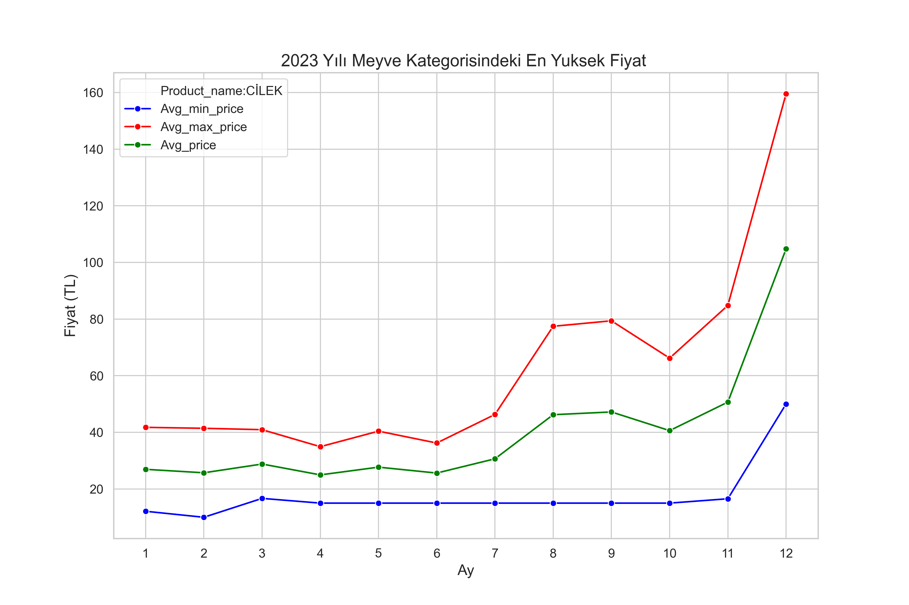

2023 yılı meyve kategorisindeki en yüksek fiyata sahip ürünü gösteren grafiği incelediğimizde çilek karşımıza çıkıyor. yılın ilk yarısı fiyatlar stabil seyretmiş minimum fiyatlar 15-20 TL bandında, maksimum fiyatlar 35-40 TL bandında, ortalama fiyatlar ise 25-30 TL aralığında seyretmiştir.
ancak yaz aylarına girilmesiyle birlikte, özellikle temmuz ayından itibaren fiyatlarda belirgin bir artış görülmüş. bu dönemde maksimum fiyat 80 TL seviyelerine ulaşırken, ortalama fiyat 45-50 TL bandına yükselmiştir.
Yılın son çeyreği ekim-aralık  aylarında ise en fazla fiyat artışı yaşanmış,aralık ayında maksimum fiyat 160 TL gibi rekor bir seviyeye ulaşmıştır. Bu dönemde minimum fiyat bile 50 TL'ye yükselmiş, ortalama fiyat 100 TL yi aşmış olarak görülüyor. Çilek fiyatları özellikle yaz sonundan itibaren artış göstermiş ve genel olarak yükselen bir trend göstermektedir. Fiyat dağılımı sağa çarpık (sağa yatık) bir görünüm sergiliyor.Temmuz ayında İlk belirgin fiyat artışının başlangıcı olarak kabul edebiliriz,Ekim ayında İkinci büyük fiyat artışı dalgası oluşmuş.Aralık ayında ise En yüksek fiyat artışı ve en geniş fiyat aralığı görülmüştür.Yıl başı (Ocak) ile yıl sonu (Aralık) arasında:
Maksimum fiyatta yaklaşık %300 artış (40 TL'den 160 TL'ye),Minimum fiyatta yaklaşık %233 artış (15 TL'den 50 TL'ye),Ortalama fiyatta yaklaşık %300 artış (25 TL'den 100 TL'ye) görülüyor.

---------------------------------------------------------------------------------------------------

## 2023 SEBZE KATEGORISINDE EN YUKSEK FIYATA SAHIP URUN VE FIYAT DEGISTIMI:

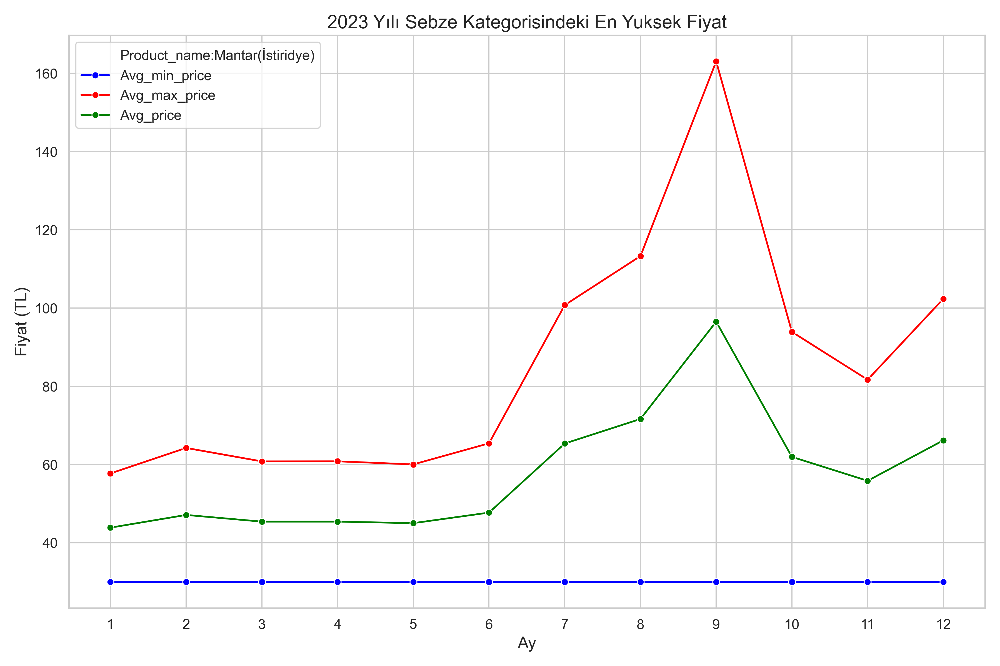

2023 yılı sebze kategorisindeki en yüksek fiyata sahip ürünü incelediğimizde Mantar (İstiridye) karşımıza çıkıyor. İstiridye mantarı Yılın ilk beş ayında fiyatlar oldukça stabil bir seyir izlemektedir. Ocak-Mayıs döneminde  maksimum fiyat 60 TL civarında seyrederken, ortalama fiyat 45 TL,  minimum fiyat ise 30 TL civarında sabit kalmıştır. Bu dönemde fiyat dalgalanmaları oldukça sınırlıdır ve arz-talep dengesi görece stabildir. Haziran ayı itibarıyla fiyatlarda bir artış başlamış ve bu yükseliş Temmuz ve Ağustos aylarında hız kazanarak Eylül ayında zirveye ulaşmıştır. Özellikle  maksimum fiyat, Eylül ayında yaklaşık 160 TL'ye kadar çıkarak yılın en yüksek seviyesine ulaşmıştır. Aynı dönemde ortalama fiyat 90 TL civarında seyretmiş, minimum fiyat ise küçük değişimlerle neredeyse sabit kalmıştır. Ekim ayı itibarıyla ise fiyatlarda keskin bir düşüş yaşanmış, özellikle  maksimum fiyatlarda Eylül'deki zirve noktadan 100 TL seviyelerine kadar gerilemiştir. Kasım ayında fiyat düşüşü devam etmiş,  maksimum fiyat yaklaşık 60 TL'ye kadar gerileyerek yılın başındaki seviyelere geri dönmüştür. Aralık ayında ise tekrar bir yükseliş eğilimi başlamış, ortalama maksimum fiyat tekrar 100 TL seviyelerine çıkmıştır.
Genel değerlendirme yapıldığında, Eylül ayındaki ani fiyat artışı dikkat çekicidir. Bu yükselişin sebebi, arz-talep dengesindeki değişimler, mevsimsel etkiler ya da üretim maliyetlerindeki artış olabilir. Özellikle yaz aylarından itibaren fiyatların artması, üretim koşullarının zorlaşması, iklim koşulları veya talebin artmasıyla ilişkili olabilir. Ekim ve Kasım aylarındaki keskin fiyat düşüşü, piyasada arzın artması veya talebin azalması ile açıklanabilir. Aralık ayında fiyatların tekrar yükselmeye başlaması ise, yılbaşı öncesi talebin artması gibi etkenlerden kaynaklanıyor olabilir. 

--------------------------------------------------------------------------------------------------

## 2024 YILI EN YUKSEK FIYAT DEGISTIMI GOSTEREN 5 URUN:

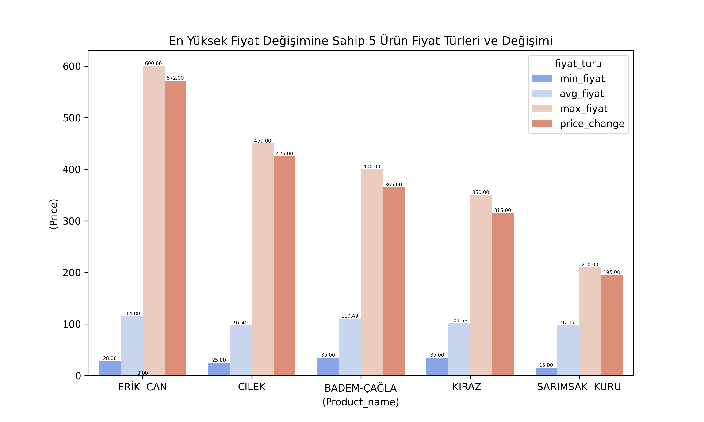

Bu grafik, 2024 yılında en yüksek fiyat değişimine sahip 5 ürünü göstermektedir bu ürünler can eriği, çilek, badem-çağla, kiraz ve kuru sarımsak olarak karşımıza çıkmaktadır. ilk olarak can eriği en yüksek fiyat değişimine sahiptir.Minimum fiyat 28 TL, ortalama fiyat 114.8 TL, maksimum fiyat 600 TL ve fiyat değişim miktarı 572 TL olmuştur. ikinci olarak Çilek Minimum fiyatı 25 TL, ortalama fiyatı 97.4 TL, maksimum fiyatı 450 TL ve fiyat değişim miktarı 425 TL olarak kaydedilmiştir.Üçüncü sırada badem-çağla bulunuyor.Minimum fiyat 35 TL, ortalama fiyat 114.8 TL, maksimum fiyat 400 TL ve fiyat değişim miktarı 365 TL'dir.dördüncü sırada kiraz bulunmakta  Minimum fiyatı 35 TL, ortalama fiyatı 101.58 TL, maksimum fiyatı 350 TL ve fiyat değişim miktarı 315 TL olmuştur son olarak  kuru sarımsak bulunuyor Minimum fiyatı 15 TL, ortalama fiyatı 97.17 TL, maksimum fiyat 210 TL ve fiyat değişim miktarı 195 TL olarak ölçülmüştür.Bu verilere göre, Erik Can en yüksek fiyat dalgalanmasına sahip ürün olurken, onu sırasıyla Çilek, Badem-Çağla, Kiraz ve Sarımsak Kuru takip etmektedir.
Çilek, Badem-Çağla ve Kiraz mevsimsel etkilerden dolayı yüksek dalgalanmalar yaşıyor olabilir.Sarımsak Kuru, ithalat ve stoklamadan dolayı değişken bir ürün olarak kendini gösteriyor ayrıca fiyat dalgalanmalarının mevsimsel etki, arz-talep dengesi ve ithalat gibi faktörlerden etkilendiğini göstermektedir. Özellikle, yüksek fiyat değişimine sahip ürünlerin taze ve kısa ömürlü olması, stoklama imkanlarının kısıtlı olması gibi nedenler dalgalanmayı artırıyor olabilir. 

---------------------------------------------------------------------------------------------------

## 2024 YILI EN AZ FIYAT DEGISTIMI GOSTEREN 5 URUN:

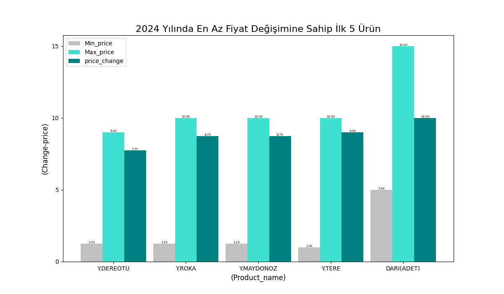

Bu grafik, 2024 yılında en az fiyat değişimine sahip 5 ürünü göstermektedir. Bu ürünler Y. Dereotu, Y. Roka, Y. Maydanoz, Y. Tere ve Dar olarak sıralanmaktadır.
İlk olarak Y. Dereotu, en düşük fiyat dalgalanmasına sahip üründür. Minimum fiyatı 1 TL, ortalama fiyatı 3.46 TL, maksimum fiyatı 10 TL ve fiyat değişim miktarı 9 TL olarak kaydedilmiştir. İkinci sırada Y. Roka bulunmaktadır. Minimum fiyatı 1 TL, ortalama fiyatı 3.56 TL, maksimum fiyatı 10 TL ve fiyat değişim miktarı 9 TL olmuştur. Üçüncü sırada Y. Maydanoz yer almakta olup minimum fiyatı 1 TL, ortalama fiyatı 3.59 TL, maksimum fiyatı 10 TL ve fiyat değişim miktarı 9 TL olarak ölçülmüştür. Dördüncü sırada bulunan Y. Tere için minimum fiyat 1 TL, ortalama fiyat 3.68 TL, maksimum fiyat 10 TL ve fiyat değişim miktarı 9 TL olarak kaydedilmiştir. Son olarak Darı en az dalgalanma gösteren ürünler arasına girmiştir. Minimum fiyatı 3 TL, ortalama fiyatı 9.72 TL, maksimum fiyatı 15 TL ve fiyat değişim miktarı 12 TL olarak belirlenmiştir.Yeşillik grubu ürünleri olan Dereotu, Roka, Maydanoz ve Tere en stabil fiyatlara sahip ürünlerdir. En düşük fiyat değişimine sahip ürün Y. Dereotu olurken, onu Y. Roka, Y. Maydanoz, Y. Tere ve Darı takip etmektedir.

Fiyat dalgalanmalarının düşük olmasının başlıca sebepleri arasında bu ürünlerin yıl boyunca düzenli olarak üretilebilmesi, seracılık faaliyetleriyle desteklenmesi ve talebin sürekli olması gösterilebilir. Özellikle yeşillik ürünleri, kısa sürede tüketilmesi gereken ve genellikle günlük tedarik edilen ürünler olduğu için büyük fiyat dalgalanmaları yaşamamaktadır. Darı ise adet bazında satıldığı ve uzun ömürlü bir ürün olduğu için fiyat dalgalanmalarının sınırlı olduğu görülmektedir.Genel olarak bakıldığında, bu ürünler fiyat açısından en stabil tarım ürünleri olup hem üretici hem de tüketici açısından öngörülebilirliği yüksek ürünlerdir. Fiyatların fazla değişmemesi, piyasada istikrarlı bir denge sağladığını ve tüketicilerin bu ürünlere erişiminin kolay olduğunu göstermektedir. 

---------------------------------------------------------------------------------------------------

## 2024 YILI EN AZ FIYATA SAHIP URUN VE FIYAT DEGISTIMI:

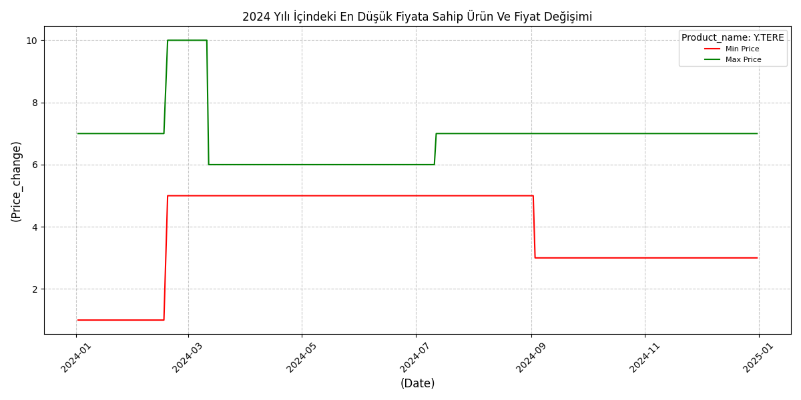

 2024 yılı içerisinde en düşük fiyata sahip olan ürünün tere olduğunu ve fiyat değişimini gösteren grafiği incelediğimizde yılın ilk aylarında minimum fiyatın oldukça düşük seviyelerde olduğunu görmekteyiz. Yaklaşık 1 TL seviyesinde sabit kalan minimum fiyat, Mart ayına gelindiğinde aniden yükselerek 5 TL seviyesine çıkmıştır. Bu artış, mevsim geçişlerinden veya talepteki ani değişimlerden kaynaklanıyor olabilir. Aynı dönemde maksimum fiyat da 7 TL seviyesinde seyretmekteyken, Mart ayının sonlarına doğru 10 TL seviyesine çıkarak belirgin bir artış göstermiştir. Bu durum, tedarik zincirindeki aksaklıklar, hava koşullarının üretimi etkilemesi gibi çeşitli faktörlerle açıklanabilir.Nisan ayından itibaren fiyatlarda bir stabilizasyon görülmektedir. Minimum fiyat 5 TL seviyesinde sabitlenirken, maksimum fiyatın 6 TL seviyelerine gerilediği dikkat çekmektedir. Bu dönem, arzın arttığı ve piyasanın dengeye oturduğu bir süreç olabilir. Haziran ayına kadar fiyatların değişmeden devam ettiği, ancak Temmuz ayında maksimum fiyatın tekrar artış göstererek 7 TL seviyesine çıktığı görülmektedir. Bu noktada, yaz aylarında ürünün üretim miktarındaki azalmalar veya talebin artması gibi faktörler devreye girmiş olabilir.Sonbahar aylarına doğru gelindiğinde, Eylül ayında minimum fiyatın 5 TL'den 3 TL seviyelerine düştüğü gözlemlenmektedir. Bu düşüş, hasat döneminin etkisiyle arzın artmasına bağlı olabilir. Maksimum fiyat ise bu dönemde sabit kalmıştır. Yılın geri kalanında ise minimum fiyat 3 TL seviyesinde ilerlerken, maksimum fiyatın 7 TL seviyelerinde stabil kaldığı görülmektedir.Genel olarak bakıldığında, Y.TERE'nin fiyatlarının yıl boyunca sabit bir şekilde ilerlediği ve kontrollü bir şekilde dalgalandığı söylenebilir. 

---------------------------------------------------------------------------------------------------

## 2024 YILI EN YUKSEK FIYATA SAHIP URUN VE FIYAT DEGISTIMI:

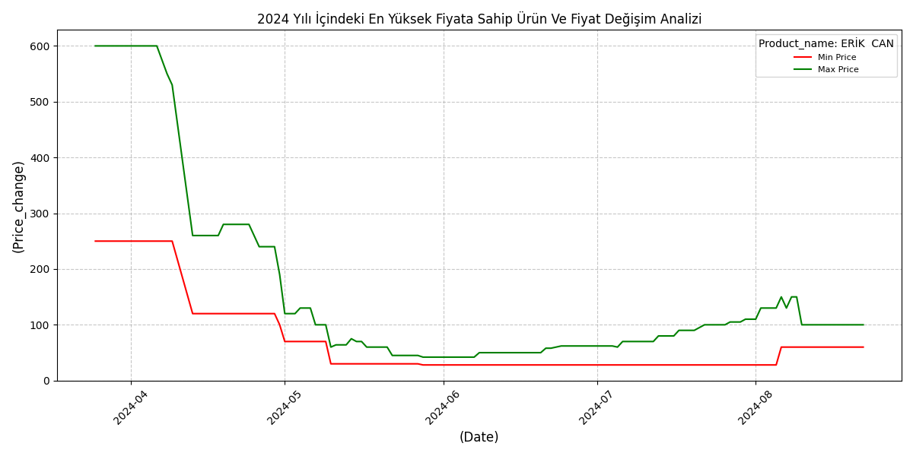

2024 yılı içerisinde en yüksek fiyata sahip olan Can eriği ürününün fiyat değişimini gösteren grafiği incelediğimizde, yılın ilk aylarında özellikle Nisan ayı başında fiyatların en yüksek seviyede olduğunu görmekteyiz. Bu dönemde maksimum fiyat 600 TL seviyelerinde seyrederken, minimum fiyat 250 TL civarında gerçekleşmiştir. Nisan ayının ortalarına doğru fiyatlarda sert bir düşüş yaşanmış, maksimum fiyat önce 300 TL seviyelerine, ardından kademeli olarak 250 TL'ye kadar gerilemiştir. Mayıs ayına gelindiğinde düşüş trendi devam etmiş, maksimum fiyat 100 TL'nin altına inerken, minimum fiyat da 50 TL seviyelerine kadar düşmüştür.Haziran ve Temmuz aylarında fiyatlar daha stabil bir seyir izlemiş, maksimum fiyat 50-60 TL bandında, minimum fiyat ise 30-40 TL aralığında hareket etmiştir. Bu dönemde fiyatlar sezonun en düşük seviyelerine ulaşmış ve istikrar kazanmıştır. Ağustos ayına doğru fiyatlarda hafif bir yükseliş trendi başlamış, maksimum fiyat 150 TL'ye kadar çıkmış, ancak ardından tekrar 100 TL seviyelerine gerilemiştir. Minimum fiyat da benzer bir hareketle 60 TL civarına yükselmiştir. Bu hareket, minimum ve maksimum fiyat arasındaki farkın azalmasıyla birlikte fiyat dalgalanmalarının azaldığını göstermektedir.Bu fiyat hareketleri, can eriğinin mevsimsel özelliklerini net bir şekilde yansıtmakta olup, sezon başında oldukça yüksek olan fiyatların, ürün bollaştıkça önemli ölçüde gerilediğini ve sezon ortasında en düşük seviyeye ulaştıktan sonra sezon sonunda nispeten dengelendiğini göstermektedir.  Özellikle Nisan başında görülen 600 TL seviyesindeki fiyatların, Nisan ortasında 300 TL'ye ve Mayıs'ta 100 TL'nin altına düşmesi, sezon başındaki sert dalgalanmayı ortaya koymaktadır. Haziran ve Temmuz aylarında fiyatlar düşük seviyelerde sabit kalırken, Ağustos ayında görülen kısmi yükseliş ise fiyatlarda yeniden bir toparlanma sinyali vermiştir.

Genel olarak değerlendirdiğimizde, ERİK_CAN fiyatlarının yıl içinde oldukça dramatik değişimler yaşadığı söylenebilir. Yılın başında aşırı yüksek seviyelerde olan fiyatlar, Nisan ve Mayıs aylarında hızla düşüşe geçmiş, yaz aylarında ise dengelenmiştir. Bu durum, meyvenin sezonluk bir ürün olmasından kaynaklanmaktadır. İlkbahar aylarında erken çıkan ürünlerin fiyatları oldukça yüksek olurken, yaz mevsimiyle birlikte arzın artması fiyatları aşağı çekmiştir.Fiyatların yılın başından itibaren ciddi bir düşüş gösterdiği için negatif trend baskın durumdadır.Ancak yılın ikinci yarısında hafif bir pozitif hareketlenme vardır.Zaman serisi analizi açısından bakıldığında, fiyatların mevsimsel bir trend izlediği görülmektedir.Yılın ilk aylarında yüksek fiyat dalgalanmaları yaşanırken, yılın ortalarına doğru fiyatlar stabil hale gelmiş ve sonbahara doğru tekrar yükseliş eğilimi göstermiştir.

---------------------------------------------------------------------------------------------------

## 2024 YILI ILKBAHAR MEVSIMI EN YUKSEK FIYAT DEGISTIMI GOSTEREN 5 URUN:

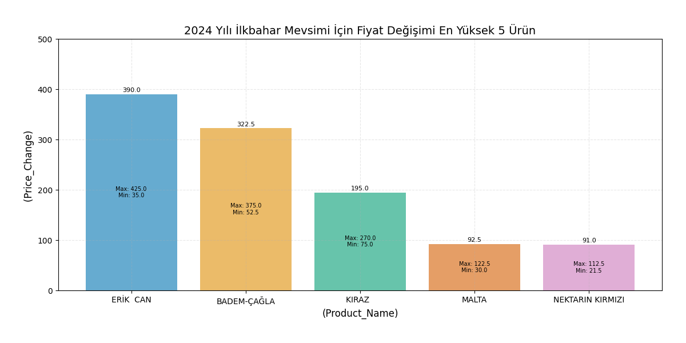

 2024 yılı ilkbahar mevsimindeki en yüksek fiyat değişimine sahip 5 ürünün grafiğini incelediğimizde can eriği Fiyatı 35 TL ile 425 TL arasında değişerek tam 390 TL'lik bir fiyat artışı göstermiş. İkinci sırada yer alan Badem-Çağla'nın fiyatı 52.5 TL'den 375 TL'ye yükselerek 322.5 TL'lik bir artış kaydetmiş.Üçüncü sırada bulunan Kiraz'ın fiyatı 75 TL'den 270 TL'ye çıkarak 195 TL'lik artış göstermiş. Malta'nın fiyatı 30 TL'den 122.5 TL'ye yükselerek 92.5 TL'lik, Nektarin Kırmızı'nın fiyatı ise 21.5 TL'den 112.5 TL'ye çıkarak 91 TL'lik bir artış göstermiş.Dİkkat çekici kısımlar ise can eriği ve badem-çağla'nın fiyat değişimleri diğer ürünlere göre çok daha yüksek,son üç ürünün (Kiraz, Malta, Nektarin Kırmızı) fiyat değişimleri birbirine daha yakın seyrediyor.En düşük başlangıç fiyatı Nektarin Kırmızı'da,en yüksek zirve fiyatı ve en yüksek fiyat değişimi can eriğinde bulunuyor.Can eriğinin fiyat artışı en düşük artışa sahip olan kırmızı nektarinin yaklaşık 4.3 katı olarak görülüyor ve ilk iki ürünün (Erik Can ve Badem-Çağla) fiyat artışları, diğer üç ürünün toplam artışından daha fazla olduğu,tüm ürünlerin minimum ve maksimum fiyatları arasında en az 3 kat fark bulunduğu dikkat çekiyor.

 --------------------------------------------------------------------------------------------------

## 2024 YILI KIS MEVSIMI EN YUKSEK FIYAT DEGISTIMI GOSTEREN 5 URUN:

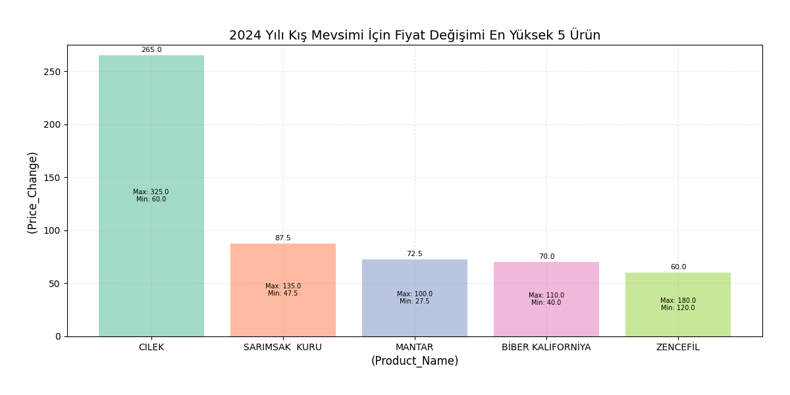

2024 yılı kış mevsimindeki en yüksek fiyat değişimine sahip 5 ürünün grafiğini incelediğimizde çileğin fiyatı 60 TL ile 325 TL arasında değişerek tam 265 TL'lik bir fiyat artışı göstermiş. İkinci sırada yer alan Sarımsak Kuru'nun fiyatı 47.5 TL'den 135 TL'ye yükselerek 87.5 TL'lik bir artış kaydetmiş. Üçüncü sırada bulunan Mantar'ın fiyatı 27.5 TL'den 100 TL'ye çıkarak 72.5 TL'lik artış göstermiş. Biber Kaliforniya'nın fiyatı 40 TL'den 110 TL'ye yükselerek 70 TL'lik, Zencefil'in fiyatı ise 120 TL'den 180 TL'ye çıkarak 60 TL'lik bir artış göstermiş.
Dikkat çekici kısımlar ise çileğin fiyat değişimi diğer ürünlere göre çok daha yüksek, son dört ürünün (Sarımsak Kuru, Mantar, Biber Kaliforniya, Zencefil) fiyat değişimleri birbirine daha yakın seyrediyor.Mantar en düşük başlangıç fiyatına sahip (27.5 TL) ve fiyatı yaklaşık 3.6 kat artmış. En düşük başlangıç fiyatı Mantar'da (27.5 TL), en yüksek başlangıç fiyatı ise Zencefil'de (120 TL) bulunuyor.Zencefil en yüksek başlangıç fiyatına sahip olmasına rağmen (120 TL) en düşük artış oranını göstermiş, En yüksek zirve fiyatı ve en yüksek fiyat değişimi çilekte görülüyor.Çileğin tek başına gösterdiği fiyat artışı, diğer dört ürünün toplam artışına (290 TL) neredeyse denk geliyor. Ayrıca çilekte minimum ve maksimum fiyat arasında yaklaşık 5.4 kat fark bulunuyor. Çileğin kış mevsiminde bu kadar yüksek fiyat artışı göstermesi, mevsim dışı bir ürün olmasıyla ilişkilendirilebilir ayrıca zencefil gibi ithal bir ürünün fiyat değişiminin daha stabil olması, döviz kurlarının bu dönemde görece stabil seyretmiş olabileceğini düşündürüyor.

---------------------------------------------------------------------------------------------------

## 2024 YILI SONBAHAR MEVSIMI EN YUKSEK FIYAT DEGISTIMI GOSTEREN 5 URUN:

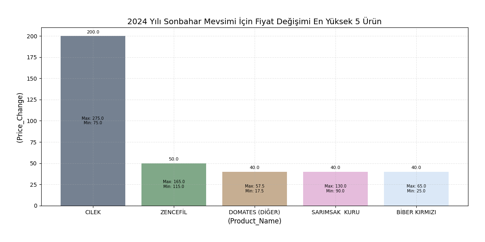

2024 yılı sonbahar mevsimindeki en yüksek fiyat değişimine sahip 5 ürünün grafiğini incelediğimizde çileğin fiyatı 75 TL ile 275 TL arasında değişerek tam 200 TL'lik bir fiyat artışı göstermiş. İkinci sırada yer alan Zencefil'in fiyatı 115 TL'den 165 TL'ye yükselerek 50 TL'lik bir artış kaydetmiş. Üçüncü sırada bulunan Domates (Diğer)'in fiyatı 17.5 TL'den 57.5 TL'ye çıkarak 40 TL'lik artış göstermiş. Sarımsak Kuru'nun fiyatı 90 TL'den 130 TL'ye yükselerek 40 TL'lik, Biber Kırmızı'nın fiyatı ise 25 TL'den 65 TL'ye çıkarak 40 TL'lik bir artış göstermiş.
Dikkat çekici kısımlar ise çileğin fiyat değişimi diğer ürünlere göre çok daha yüksek, son üç ürünün (Domates Diğer, Sarımsak Kuru, Biber Kırmızı) fiyat değişimleri aynı (40 TL) seyrediyor. En düşük başlangıç fiyatı Domates Diğer'de (17.5 TL), en yüksek başlangıç fiyatı ise Zencefil'de (115 TL) bulunuyor. En yüksek zirve fiyatı ve en yüksek fiyat değişimi çilekte görülüyor. Çileğin fiyat artışı (200 TL), diğer dört ürünün toplam artışından (170 TL) daha fazla. Ayrıca çilekte minimum ve maksimum fiyat arasında yaklaşık 3.7 kat fark bulunması dikkat çekici

Ortalama fiyat değişimi 74 TL olarak hesaplanıyor.Son üç ürünün aynı fiyat artışını göstermesi (40 TL) pazar dinamiklerinin benzer olduğunu düşündürüyor.Çileğin fiyat artışı (200 TL),  en az artış gösteren ürünlerin fiyat artışının (40 TL) tam 5 katına eşittir.Zencefil yine yüksek başlangıç fiyatına sahip olmasına rağmen görece düşük bir artış göstermiş ve Zencefil gibi ithal bir ürünün fiyat değişiminin diğer ürünlere göre daha kontrollü olması, döviz kurlarındaki değişimin sınırlı etkisini gösteriyor.Çileğin sonbaharda da yüksek fiyat artışı göstermesi, mevsim geçiş dönemindeki arz-talep dengesizliğini yansıtırken,Domates ve Biber gibi sera ürünlerinin benzer fiyat artışları göstermesi, üretim maliyetlerinin benzer şekilde etkilendiğini gösteriyor

---------------------------------------------------------------------------------------------------

## 2024 YILI YAZ MEVSIMI EN YUKSEK FIYAT DEGISTIMI GOSTEREN 5 URUN:

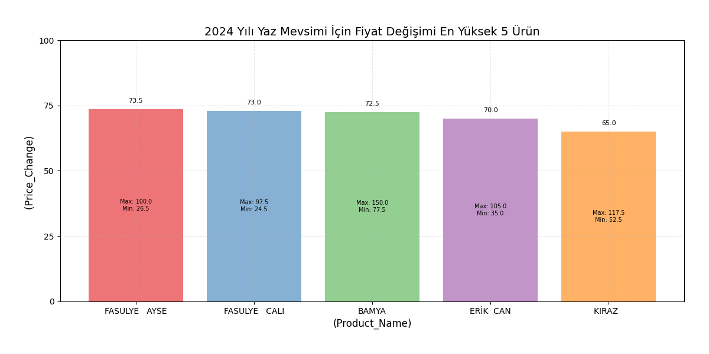

2024 yılı yaz mevsimindeki en yüksek fiyat değişimine sahip 5 ürünün grafiğini incelediğimizde Fasulye Ayşe'nin fiyatı 26.5 TL ile 100 TL arasında değişerek tam 73.5 TL'lik bir fiyat artış göstermiş. İkinci sırada yer alan Fasulye Çalı'nın fiyatı 24.5 TL'den 97.5 TL'ye yükselerek 73 TL'lik bir artış kaydetmiş. Üçüncü sırada bulunan Bamya'nın fiyatı 77.5 TL'den 150 TL'ye çıkarak 72.5 TL'lik artış göstermiş. Erik Can'ın fiyatı 35 TL'den 105 TL'ye yükselerek 70 TL'lik, Kiraz'ın fiyatı ise 52.5 TL'den 117.5 TL'ye çıkarak 65 TL'lik bir artış göstermiş.Dikkat çekici kısımlar ise tüm ürünlerin fiyat değişimleri birbirine oldukça yakın seyrediyor,En düşük başlangıç fiyatı Fasulye Çalı'da ve en yüksek zirve fiyatı Bamya'da görülüyor.İlk üç ürünün (Fasulye Ayşe, Fasulye Çalı ve Bamya) fiyat artışları neredeyse aynı (73.5, 73 ve 72.5 TL)Fasulye türlerinin başlangıç fiyatları düşük olduğu için yüzdesel artışları (%277 ve %298) en yüksek olduğu görülüyor ve fasulye türlerinin benzer fiyat artışları göstermesi, üretim ve hasat koşullarının benzer olduğunu gösteriyor. Bamya'nın yüksek başlangıç fiyatına rağmen önemli bir artış göstermesi, yaz mevsiminde bile arz-talep dengesizliğini yansıtıyor.Can eriği ve Kiraz gibi meyvelerin fiyat artışlarının görece daha düşük olması, yaz mevsiminin bu ürünler için ana hasat dönemi olmasıyla açıklanabilir.Can eriği ilkbahar mevsiminde en yüksek fiyat artışına sahipken, yaz mevsiminde daha makul bir artış gösteriyor.Tüm ürünlerin fiyat değişimlerinin birbirine yakın olması, yaz mevsiminde daha dengeli bir pazar yapısı olduğunu gösteriyor.Önceki mevsimlerde görülen aşırı fiyat farklılıkları yaz mevsiminde görülmüyor.

---------------------------------------------------------------------------------------------------

## 2024 YILI SEZONLUK MEYVE FIYATLARI:

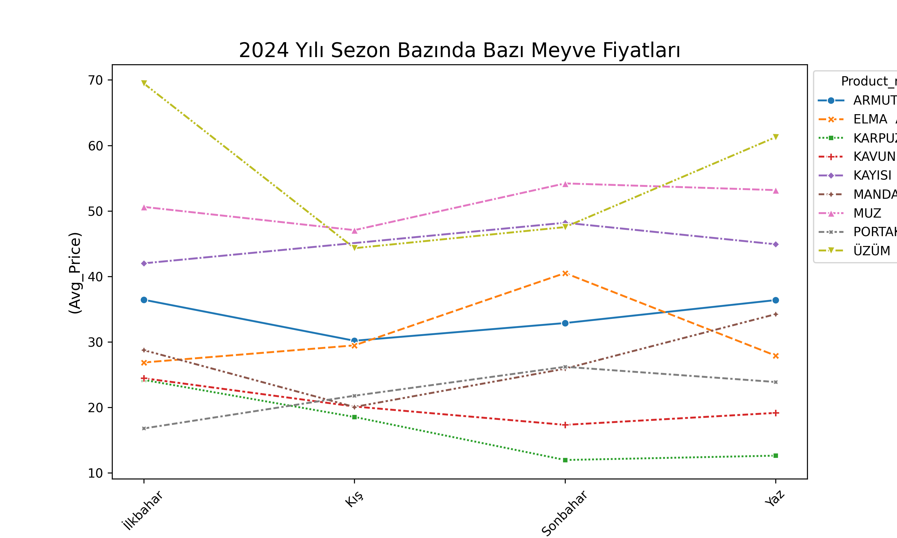

Beyaz üzüm, ilkbaharda yaklaşık 70 TL civarında yüksek bir fiyata sahipken, kış aylarında keskin bir düşüş yaşayarak 45 TL seviyelerine gerilemiş, sonbahar ve yaz aylarında ise tekrar yükselerek ilkbahardaki yüksek fiyatına yakın bir seviyeye ulaşmıştır. Bu durum, üzümün sezonluk bir ürün olduğunu ve yaz sonu ile sonbaharda yüksek talep gördüğünü göstermektedir. Muz, yıl boyu piyasada bulunan bir meyve olduğu için fiyat dalgalanması fazla olmamış, ilkbahardan kışa hafif bir düşüş yaşasa da, sonbaharda tekrar yükselmiş ve yaz mevsiminde fiyatı çok az değişmiştir. Kayısı, ilkbahardan kışa kadar fiyatı artarak sonbaharda en yüksek seviyesine ulaşmış, ardından yazın hafif bir düşüş göstermiştir. Yazın bol bulunduğu için fiyatı düşerken, kış ve sonbaharda az bulunması nedeniyle fiyatı artmıştır. Amasya elması, kış aylarında nispeten düşük bir fiyata sahipken, sonbaharda keskin bir yükseliş göstererek en yüksek seviyesine ulaşmış ve yazın tekrar düşmüştür. Hasat döneminin sonbahar olması ve talebin bu dönemde yüksek olması bu durumu açıklamaktadır. Armut, ilkbahardan kışa düşüş yaşadıktan sonra sonbaharda tekrar yükselmeye başlamış ve yazın en yüksek seviyesine ulaşmıştır, bu da armudun en yüksek fiyatlarını yaz aylarında gördüğünü göstermektedir. Karpuz, ilkbahar ve kış aylarında nispeten düşük seyretmiş, sonbaharda hafif bir düşüş yaşasa da yaz mevsiminde fiyatında artış olmamıştır. Yaz mevsiminin en popüler meyvelerinden biri olmasına rağmen, bol üretim nedeniyle fiyatı düşük kalmıştır. Portakal, kış aylarında en düşük seviyede olup, ilkbahar ve yaz aylarında hafif bir artış göstermiştir. Kış mevsiminde tüketildiği için, mevsim dışındaki fiyatlarının arttığı görülmektedir. Kavun, yazın nispeten sabit bir fiyat eğilimi gösterirken, ilkbahar ve kış aylarında fiyatları daha düşük olmuştur. Yaz meyvesi olduğu için diğer mevsimlerde daha yüksek fiyatlarla satılması beklenen bir durumdur. Genel olarak, mevsimsel dalgalanma en fazla üzüm ve kayısıda gözlemlenmektedir. Üzüm, ilkbahardan kışa keskin bir düşüş yaşarken, yaz-sonbahar döneminde zirve yapmaktadır. Muz ve portakal gibi yıl boyunca piyasada bulunan ürünler daha stabil fiyatlara sahiptir. Yaz aylarında karpuz ve kavun gibi meyvelerin fiyatları düşük seyretmekte, bol üretim talebi karşıladığı için fiyat artışı yaşanmamaktadır. Sonbaharda elma ve armut gibi meyvelerin fiyatlarında belirgin artış görülmektedir. Hasat dönemiyle fiyatlar ters orantılı hareket etmekte, üretimin arttığı dönemlerde fiyatlar düşerken, az bulunduğu dönemlerde yükselmektedir. Depolanabilen elma ve portakal gibi meyveler, diğer mevsimlik meyvelere kıyasla daha az fiyat dalgalanması göstermektedir. Kış aylarında özellikle üzüm, kayısı ve karpuz gibi mevsim dışı ürünlerde talep azaldığı için fiyatlar düşmektedir. Depolama ve ithalatın etkisiyle portakal, elma ve muz gibi meyvelerin yıl boyunca erişilebilir olması fiyat istikrarını sağlamaktadır. Yaz mevsiminde üretim fazlalığı fiyatları dengelerken, karpuz ve kavun gibi yaz meyvelerinin talebi yüksek olmasına rağmen geniş üretim alanları nedeniyle fiyat artışı yaşanmamaktadır. Üzüm ve kayısı gibi bazı meyvelerde yaz sonuna doğru fiyat artışı görülmekte, bu ürünler yaz sonunda ve sonbaharda yüksek talep görmektedir. Benzer mevsimlerde yetişen meyveler benzer fiyat değişimlerini göstermekte, üzüm ve kayısı fiyatları paralel hareket ederek yaz sonu ve sonbaharda zirve yapmaktadır. Muz ve portakal gibi ithal veya sera üretimi olan meyveler, mevsimsel dalgalanmalardan daha az etkilenerek stabil fiyatlar sergilemektedir.

---------------------------------------------------------------------------------------------------

## 2024 YILI SEZONLUK SEBZE FIYATLARI:

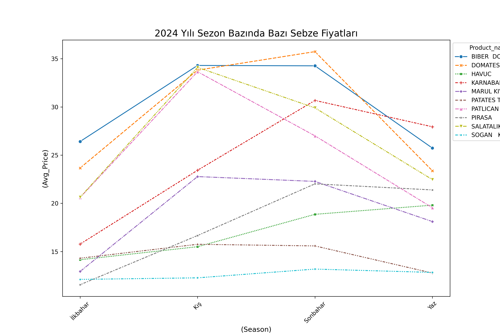

Biber fiyatları, ilkbaharda orta seviyede başlamış, yaz aylarında ise nispeten düşüş göstererek en düşük seviyelerine ulaşmıştır. Sonbaharda fiyat tekrar yükselmiş ve kış aylarında zirveye ulaşmıştır. Bu durum, biberin yaz aylarında bol üretildiğini ve fiyatlarının düştüğünü, kış aylarında ise üretimin azalmasıyla fiyatın yükseldiğini göstermektedir. Domates fiyatları, yaz aylarında en düşük seviyeye gerilemiş, kış ve sonbaharda ise ciddi bir artış göstermiştir. Yaz aylarında açık tarla üretiminin yoğun olması nedeniyle fiyatlar düşük kalırken, kış aylarında sera üretimine geçilmesiyle maliyetler artmış ve bu durum fiyatlara yansımıştır. Havuç fiyatları yıl boyunca istikrarlı bir artış göstermiş, sonbaharda en yüksek seviyesine ulaşmıştır. Yaz aylarında nispeten düşük seyreden fiyatlar, özellikle kışın tüketimin artmasıyla yükselmiş ve havuç, depolanabilen bir sebze olduğu için fiyat dalgalanması görece daha sınırlıdır. Karnabahar fiyatları kış aylarında zirve yaparken, yaz mevsiminde en düşük seviyelerine gerilemiştir. Karnabahar, tipik bir kış sebzesi olarak yaz aylarında piyasada az bulunur, bu nedenle fiyatları düşmektedir. Marul fiyatları yıl boyunca dalgalı bir seyir izlemiş, özellikle kış aylarında en yüksek seviyesine ulaşmış, yaz aylarında ise düşüş göstermiştir. Yaz aylarında bol miktarda üretilen marulun fiyatı düşerken, kış aylarında üretimin azalmasıyla fiyatlar yükselmiştir. Patates fiyatları genellikle istikrarlı bir eğilim göstermiş, kış aylarında en yüksek seviyeye ulaşmış, yaz aylarında ise nispeten daha düşük seviyelerde kalmıştır. Depolanabilen bir ürün olduğu için patatesin fiyat dalgalanmaları diğer sebzelere göre daha az olmuş olabilir.Patlıcan fiyatları, kış aylarında en yüksek seviyeye ulaşırken, yaz mevsiminde düşüş göstermiştir. Pırasa fiyatları yıl boyunca hafif bir artış eğilimi göstermiş, özellikle kış aylarında fiyatların en yüksek seviyeye ulaştığı görülmüştür. Pırasa, tipik bir kış sebzesi olarak kış aylarında talebin artmasıyla fiyatlar yükselirken, yaz aylarında daha düşük fiyatlardan işlem görmektedir.Salatalık fiyatları yaz aylarında en düşük seviyeye ulaşmış, sonbaharda hafif bir artış göstermiştir. Sera üretimi sayesinde salatalık yıl boyunca piyasada bulunabilen bir sebze olmasına rağmen, yaz aylarında üretimin artması fiyatları düşürmüş olarak görülüyor. Soğan fiyatları yıl boyunca istikrarlı bir seyir izlemiş, ancak sonbaharda zirve yaparak kış aylarında tekrar düşüş göstermiştir. Depolanabilen bir sebze olduğu için soğanın fiyat dalgalanmaları daha azdır, ancak belli dönemlerde fiyat artışları dikkat çekmektedir.

Belirli mevsimlerde üretim ve talep dengesine bağlı olarak ciddi dalgalanmalar yaşandığını görebiliyoruz. Fiyat değişimleri genellikle mevsimsel üretim miktarı, tüketici talebi, ithalat durumu ve depolama koşullarına bağlı olarak şekillenmektedir.Kış aylarında sebze fiyatları genellikle yükselmektedir. Biber, domates, karnabahar ve patlıcan gibi sebzeler kış aylarında yüksek fiyatlara ulaşmış, bu durum üretimin azalması ve seracılık maliyetlerinin artmasıyla açıklanabilir. Yaz aylarında sebzelerin çoğu daha düşük fiyatlarla satılmaktadır. Domates, salatalık, biber ve patlıcan gibi sebzeler yaz aylarında bol üretildiği için fiyatlar düşmüştür. Özellikle açık tarla üretiminin yoğun olduğu bu dönemde, fiyatlar daha düşük seviyelerde kalmaktadır. Depolanabilen sebzelerde ise fiyat dalgalanması daha az olmaktadır. Soğan, patates ve havuç gibi uzun süre saklanabilen sebzelerde fiyat değişimleri daha sınırlıdır ve depolama imkânı, fiyat istikrarını korumaktadır. Sonbahar aylarında fiyatlar genellikle zirve yapmaktadır. Sebzelerin çoğunda sonbaharda fiyat artışı görülmektedir. Bu durum, hasat öncesi arzın azalması ve talebin artmasıyla açıklanabilir. Mevsimsel tüketim alışkanlıkları, sebze fiyatlarını belirleyici bir faktör olarak öne çıkmaktadır. Karnabahar, pırasa ve marul gibi sebzeler kışın daha fazla talep görerek fiyat artışı yaşamaktadır.

---------------------------------------------------------------------------------------------------

## 2024 YILI MEYVE KATEGORISI EN YUKSEK FIYATA SAHIP URUN VE FIYAT DEGISTIMI:

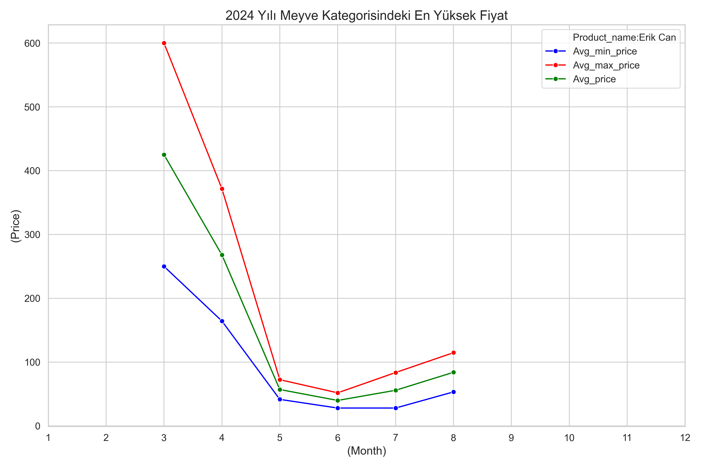

2024 yılı meyve kategorisindeki en yüksek fiyata sahip Can Eriği'nin fiyat değişimlerini gösteren grafiği incelediğimizde, özellikle Mart-Nisan aylarında fiyatların zirvede olduğunu görmekteyiz. Bu dönemde maksimum fiyat 600 TL, minimum fiyat 250 TL ve ortalama fiyat 425 TL seviyelerinde seyretmiştir. Mayıs ayına kadar fiyatlarda keskin bir düşüş yaşanmış, maksimum fiyat 100 TL'ye, minimum fiyat 50 TL'ye ve ortalama fiyat 75 TL'ye kadar gerilemiştir ve haziran ayındada az da olsa düşüş devam etmiştir. Yılın ilk aylarında oldukça yüksek seyreden fiyatlar, Mayıs ayından sonra dengelenmeye başlamış ve Haziran-Ağustos döneminde daha stabil bir seyir izlemiştir. Maksimum ve minimum fiyat arasındaki makas da zamanla daralmıştır. Bu fiyat hareketlerinin temel nedenleri arasında sezon başında arzın kısıtlı olması, mevsim dışı üretimin maliyetli olması, Mayıs ayından sonra ürünün bollaşmasıyla fiyatların düşmesi ve yaz aylarında arz-talep dengesinin oturması sayılabilir. Tüm bu veriler, Can Eriği'nin özellikle sezon başında çok yüksek fiyatlarla satıldığını, ancak mevsimi geldiğinde fiyatların makul seviyelere indiğini göstermektedir. Fiyat hareketlerinin tamamen mevsimsel faktörlerle ilişkili olduğu açıkça görülmektedir.

---------------------------------------------------------------------------------------------------

## 2024 YILI SEBZE KATEGORISI EN YUKSEK FIYATA SAHIP URUN VE FIYAT DEGISTIMI:

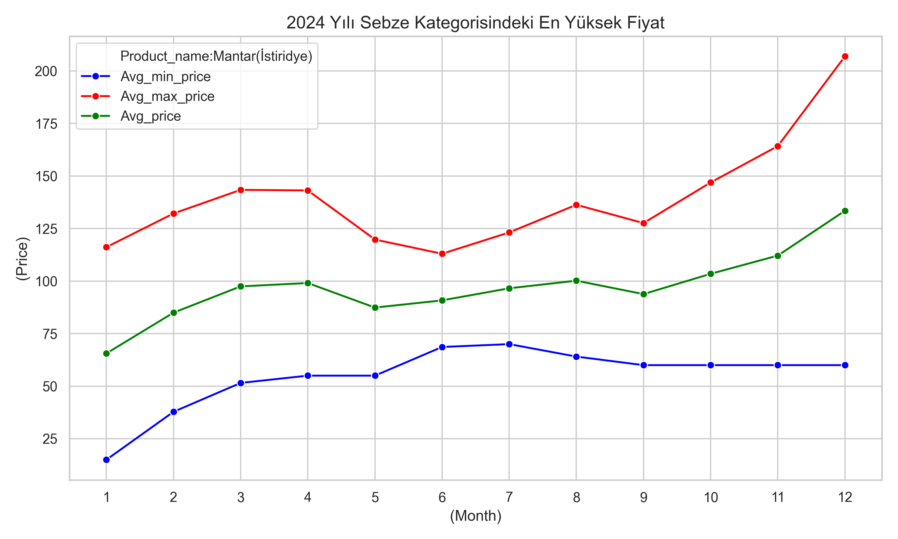

2024 yılı sebze kategorisinde en yüksek fiyata sahip Mantar (İstiridye) ürününün fiyat değişimlerini incelediğimizde, yılın ilk çeyreğinde Ocak ayında minimum fiyatın 15 TL, maksimum fiyatın 115 TL civarında başladığını ve Mart ayına kadar kademeli bir artış göstererek maksimum fiyatın 145 TL'ye ulaştığını, ortalama fiyatın ise 85-95 TL bandında seyrettiğini görmekteyiz. İlkbahar döneminde, özellikle Nisan ayında fiyatlar en yüksek seviyelerinden birini görmüş, Mayıs ayında hafif bir düşüş trendi başlamış ve minimum fiyat 55 TL civarında stabilize olmuştur. Yaz dönemine gelindiğinde, Haziran ayında fiyatlar yılın en düşük seviyelerinden birini göstermiş, ancak Temmuz ve Ağustos aylarında tekrar yükseliş trendine girerek maksimum fiyat 135-140 TL bandında hareket etmiştir. Sonbahar-Kış döneminde ise Eylül ayından itibaren belirgin bir yükseliş trendi başlamış, Aralık ayında maksimum fiyat 205 TL ile yılın en yüksek seviyesine ulaşırken, minimum fiyat 60 TL civarında sabit kalmış ve ortalama fiyat 130 TL'ye kadar yükselmiştir. Genel olarak değerlendirildiğinde, yıl boyunca minimum fiyatın 15-60 TL arasında, maksimum fiyatın ise 115-205 TL arasında dalgalandığı, en yüksek fiyat artışının yılın son çeyreğinde gerçekleştiği ve fiyatların genel olarak yükselen bir trend izlediği görülmektedir. Bu fiyat hareketlerinde mevsimsel etkilerin önemli rol oynadığı açıkça gözlemlenmektedir.

---------------------------------------------------------------------------------------------------

## 2024 YILI YERLI VE ITHAL BIBER FIYAT KARSILASTIRMASI:

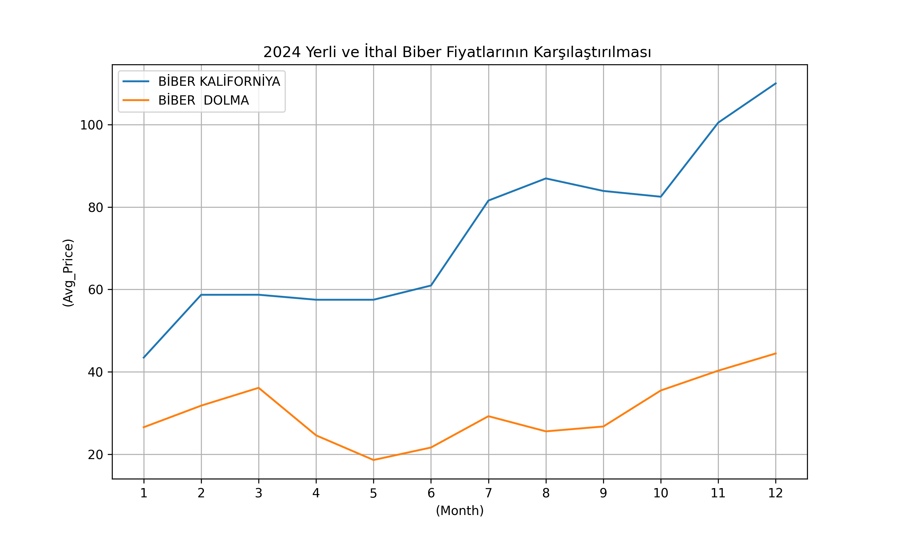

2024 yılı yerli ve ithal biber fiyatlarını gösteren grafiği incelediğimizde, Kaliforniya biberi (ithal) ile dolma biber (yerli) arasında önemli fiyat farklılıkları göze çarpıyor. Kaliforniya biberi yıl boyunca 43-110 TL aralığında seyrederken, dolma biber çok daha uygun bir fiyat aralığında, 18-45 TL bandında değişim gösteriyor. Mevsimsel değişimlere baktığımızda, ilkbahar aylarında (3-4-5. aylar) dolma biber fiyatları 35 TL'den 18 TL'ye düşerken, Kaliforniya biberi 60 TL civarında sabit kalıyor. Yaz döneminde (6-7-8. aylar) ise durum değişiyor; Kaliforniya biberi keskin bir yükselişle 60 TL'den 85 TL'ye çıkarken, dolma biber fiyatları da hafif bir artışla 20 TL'den 30 TL'ye yükseliyor,daha sonra da fiyatı 25 TL'ye geriliyor. Sonbahar aylarına (9-10-11. aylar) gelindiğinde, Kaliforniya biberinde önce bir düşüş, ardından tekrar yükseliş gözlenirken, dolma biber fiyatları kademeli olarak artış gösteriyor. Kış aylarında ise her iki ürün de en yüksek fiyatlarına ulaşıyor; Kaliforniya biberi 110 TL civarına çıkarken, dolma biber 45 TL seviyelerine yükseliyor. İki ürün arasındaki fiyat farkı özellikle yılın son aylarında en yüksek seviyeye ulaşıyor. Yerli dolma biberin fiyatları mevsimsellikten daha fazla etkileniyor ve tüketiciler için en uygun alım dönemi ilkbahar ayları olarak öne çıkıyor. Her iki ürün için de kış ayları en yüksek fiyatların görüldüğü dönem olak karşımıza çıkıyor. Bu veriler ışığında, özellikle ekonomik alışveriş yapmak isteyen tüketiciler için yerli dolma biberin ilkbahar ve yaz başlangıcında daha uygun bir seçenek olduğunu söyleyebiliriz.

---------------------------------------------------------------------------------------------------

## 2024 YILI YERLI VE ITHAL ELMA FIYAT KARSILASTIRMASI:

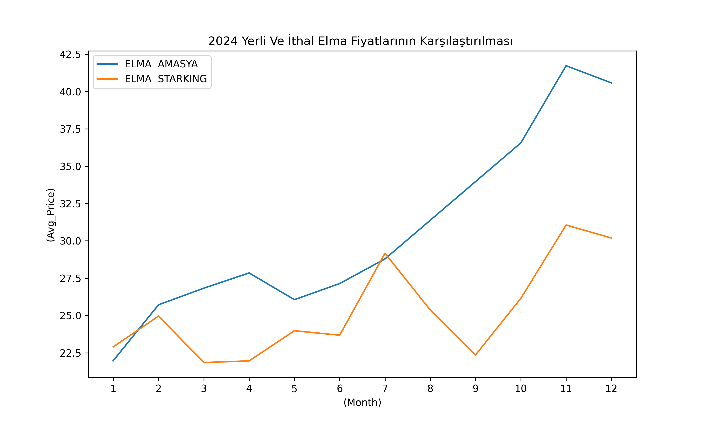

2024 yılı yerli ve ithal elma fiyatlarını gösteren grafiği incelediğimizde, Amasya elması (yerli) ve Starking elması (ithal) arasındaki fiyat değişimlerini net bir şekilde görebiliyoruz. Yılın başında her iki elma çeşidi de birbirine yakın fiyatlarla başlıyor; Amasya elması 22 TL, Starking elması 23 TL civarında seyrediyor. İlkbahar aylarına gelindiğinde (3-4-5. aylar) Amasya elması 25-27 TL bandında dalgalanırken, Starking elması 22-24 TL aralığında daha düşük bir seyir izliyor. Yaz ortasına doğru (6-7. aylar) ilginç bir kesişme noktası görülüyor ve her iki elma çeşidi de 29 TL civarında buluşuyor. Ancak yaz sonundan itibaren fiyat ayrışması belirginleşiyor; Amasya elmasının fiyatı sürekli yükseliş trendine girerek sonbaharda (9-10-11. aylar) 34 TL'den 42 TL'ye kadar çıkıyor. Starking elması ise daha stabil bir seyir izleyerek 22-31 TL bandında kalıyor. Yılın son ayında Amasya elması 40 TL civarında seyrederken, Starking elması 30 TL seviyesinde kalıyor. Bu veriler ışığında, yerli Amasya elmasının özellikle sonbahar ve kış aylarında daha yüksek fiyatlara ulaştığını, ithal Starking elmasının ise yıl boyunca daha istikrarlı ve genellikle daha uygun fiyatlarla satıldığını söyleyebiliriz. Tüketiciler için en ekonomik alım dönemi her iki elma çeşidi için de yılın ilk yarısı olarak öne çıkıyor.

---------------------------------------------------------------------------------------------

## 2024 YILI YERLI VE ITHAL KIVI FIYAT KARSILASTIRMASI:

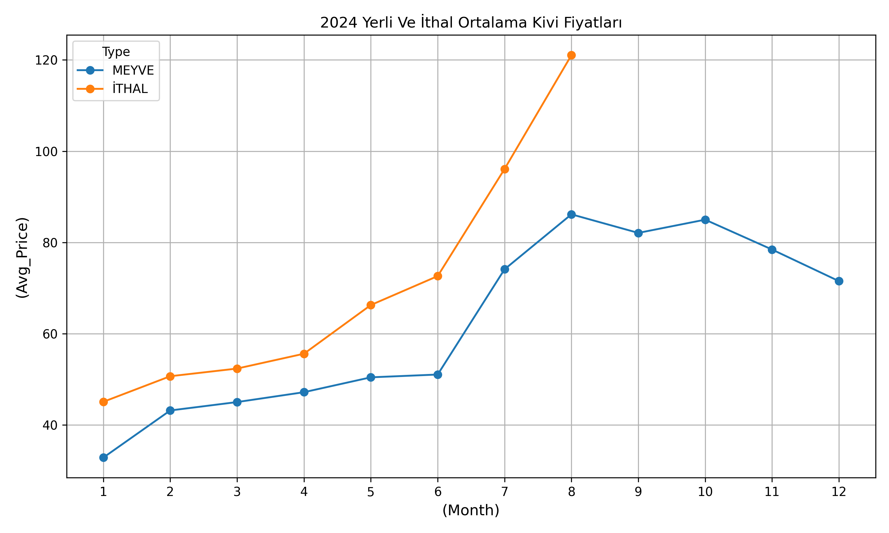

2024 yılı yerli ve ithal kivi fiyatlarını gösteren grafiği incelediğimizde, oldukça dikkat çekici fiyat farklılıkları ve değişimleri gözlemliyoruz. Yılın başında yerli kivi 32 TL civarında seyrederken, ithal kivi 45 TL seviyesinden başlıyor. İlkbahar aylarına doğru (3-4-5. aylar) her iki üründe de kademeli bir artış görülüyor; yerli kivi 45-50 TL bandında ilerlerken, ithal kivi 50-65 TL aralığında seyrediyor. Yaz aylarına gelindiğinde (6-7-8. aylar) fiyatlarda dramatik bir yükseliş dikkat çekiyor; özellikle ithal kivinin fiyatı keskin bir artışla 70 TL'den 120 TL'ye kadar yükseliyor. Aynı dönemde yerli kivi de artış gösteriyor ancak bu artış daha makul seviyelerde kalıyor ve 50 TL'den 85 TL'ye çıkıyor. Sonbahar ve kış aylarına doğru (9-12. aylar) ilginç bir trend değişimi yaşanıyor. Ağustos ayından sonra ithal kivi bulunmazken, yerli kivi fiyatları 85 TL'den kademeli olarak düşüşe geçerek yıl sonunda 70 TL seviyesine geriliyor. Bu veriler ışığında, tüketiciler için en ekonomik alım döneminin yılın ilk ayları olduğunu, özellikle yaz aylarında her iki kivi çeşidinin de önemli fiyat artışları gösterdiğini söyleyebiliriz. Yerli kivinin genel olarak daha ekonomik bir seçenek olduğu ve fiyat istikrarının ithal kiviye göre daha dengeli seyrettiği açıkça görülüyor.

---------------------------------------------------------------------------------------------

## 2024 YILI YERLI VE ITHAL MUZ FIYAT KARSILASTIRMASI:

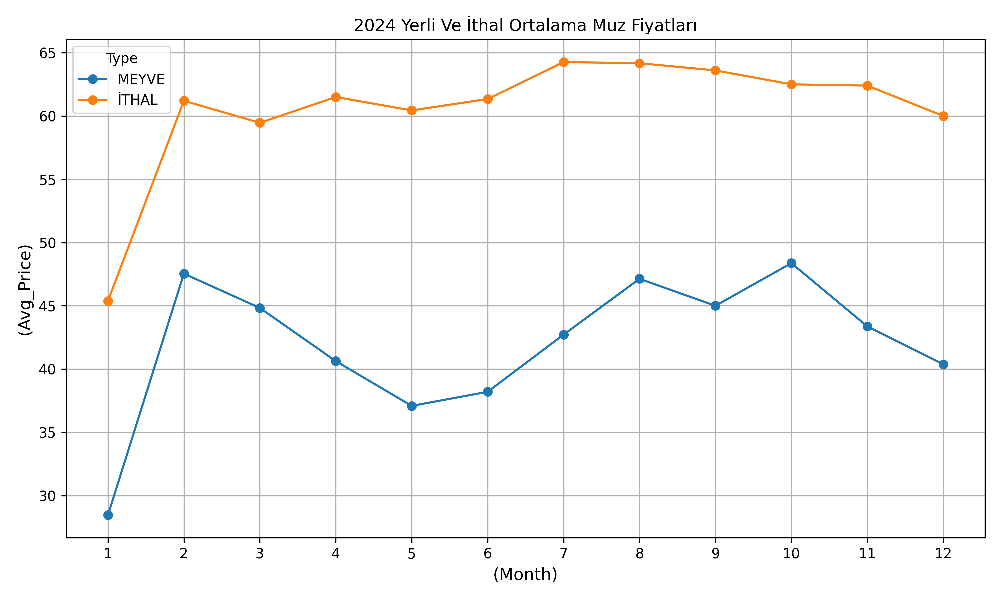

2024 yılı yerli ve ithal muz fiyatlarını gösteren grafiği detaylı olarak incelediğimizde, oldukça ilginç fiyat hareketleri ve mevsimsel değişimler göze çarpıyor. Yılın başında yerli muz 28 TL, ithal muz ise 45 TL seviyesinden başlıyor. Şubat ayına gelindiğinde her iki üründe de keskin bir yükseliş yaşanıyor; yerli muz 47 TL'ye, ithal muz ise 61 TL'ye çıkıyor. Bu ani yükselişten sonra ilkbahar aylarında (3-4-5. aylar) farklı trendler gözlemleniyor; yerli muz fiyatları kademeli olarak düşüş göstererek 45 TL'den 37 TL'ye gerilerken, ithal muz 59-61 TL bandında dalgalanarak görece stabil seyrediyor.

Yaz aylarına gelindiğinde (6-7-8. aylar) her iki üründe de yükseliş trendi başlıyor. İthal muz fiyatları 61 TL'den başlayarak kademeli bir artışla 64 TL seviyesine ulaşıyor ve bu seviyede bir süre sabit kalıyor. Yerli muz ise 38 TL'den başlayarak yükselişe geçiyor ve 47 TL seviyelerine kadar çıkıyor.Sonbahar döneminde (9-10-11. aylar) fiyat hareketleri daha da ilginçleşiyor. İthal muz fiyatları hafif bir düşüş trendine girerken, yerli muz fiyatları dalgalı bir seyir izliyor; önce 45 TL'ye düşüyor, sonra tekrar 48 TL'ye yükseliyor ve ardından 43 TL'ye geriliyor.Yılın son ayında her iki ürün de düşüş gösteriyor; yerli muz 40 TL, ithal muz ise 60 TL seviyesine iniyor. Yerli muz için en ekonomik dönemler, yılın başı ve mayıs ayı civarı olarak öne çıkmaktadır. Ayrıca, yerli muz fiyatları mevsimsel değişimlerden daha fazla etkilenmektedir.Tüketiciler için, yerli muzun her zaman daha ekonomik bir seçenek olduğu ve özellikle ilkbahar aylarında fiyat avantajının en yüksek seviyeye ulaştığı açıkça görülüyor.

---------------------------------------------------------------------------------------------

## 2024 YILI YERLI VE ITHAL SARIMSAK FIYAT KARSILASTIRMASI:

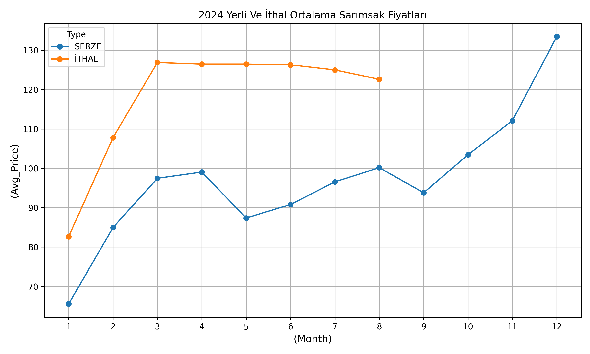

2024 yılı yerli ve ithal sarımsak fiyatlarını grafiği incelediğimizde, Yılın başında yerli sarımsak 65 TL, ithal sarımsak ise 82 TL seviyesinden başlıyor. Şubat ayında her iki üründe de keskin bir yükseliş yaşanıyor; yerli sarımsak 85 TL'ye, ithal sarımsak ise 108 TL'ye çıkıyor.İlkbahar aylarında (3-4-5. aylar) farklı trendler gözlemleniyor. İthal sarımsak fiyatı hızlı bir yükselişle 126 TL seviyesine çıkıyor ve bu seviyede uzun süre sabit kalıyor. Yerli sarımsak ise 97-99 TL bandında dalgalanarak daha sonra mayıs ayında 87 TL 'lere geriliyor. Yaz aylarına gelindiğinde (6-7-8. aylar) ithal sarımsak fiyatları çok hafif bir düşüş eğilimine giriyor. Yerli sarımsak kademeli bir yükselişle 100 TL seviyesine ulaşıyor.

Sonbahar ve kış döneminde (9-10-11-12. aylar) çok ilginç bir tablo ortaya çıkıyor. İthal sarımsak bu dönemlerde bulunmuyor. (muhtemelen sezon dışı veya stok yetersizliği) Yerli sarımsak fiyatları ise dramatik bir yükseliş gösteriyor. Eylül'de 94 TL, Ekim'de 103 TL, Kasım'da 112 TL, Aralık'ta 133 TL'ye kadar yükseliyor.İthal ve yerli sarımsak arasında ortalama 30-40 TL'lik bir fiyat farkı bulunuyor. Yerli sarımsak fiyatları özellikle kış aylarında ciddi artış gösteriyor. Yerli sarımsak için mayıs-haziran ayları en uygun fiyatların görüldüğü dönem olak karşımıza çıkıyor. İlkbahar ve yaz başlangıcında yerli sarımsak almak daha ekonomik, kış aylarında fiyatlar çok yükseleceği için, uygun dönemde alıp uygun koşullarda saklamak avantajlı olabilir.İthal sarımsak genellikle yerli ürüne göre daha pahalı bir seçenek olarak öne çıkıyor.

--------------------------------------------------------------------------------------------

## FIYATI BIR ONCEKI SATIS FIYATINA GORE %100 UZERINDE ARTAN MEYVE TURLERI VE FIYAT DEGISTIMLERI:

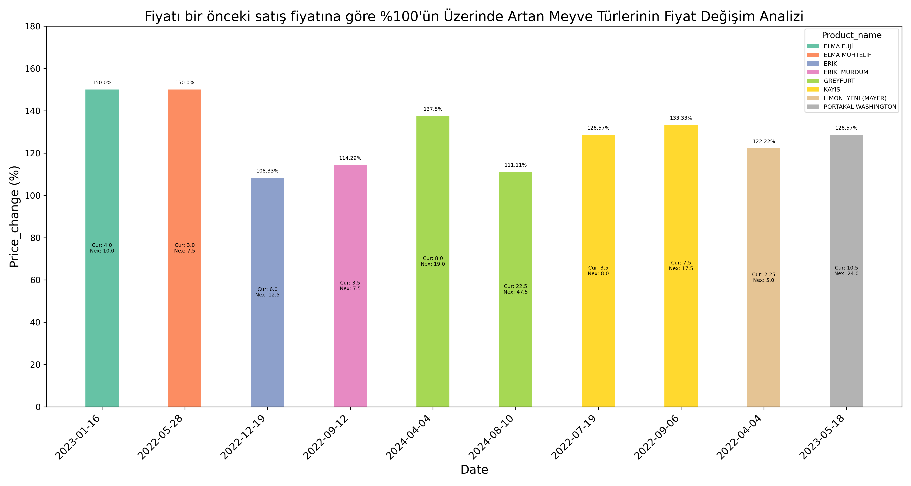

 2023-01-16 tarihinde Elma Fuji'nin fiyatı 4 TL iken, 2023-01-16'da 10 TL'ye yükselmiş ve %150'lik bir artış göstermiş. Yine elma türü olan Elma Muhtelif 2022-05-28'de 3 TL'den 7.5 TL'ye yükselerek %150'lik bir artış göstermiş. iki elma türününde elma fuji ve elma muhtelif'in olması da dikkat çekici kısımlar arasında yer almaktadır.Bahar sonu yaz başı döneminde gerçekleşen bu artış, stokların azalması ve yeni sezon ürünlerinin henüz piyasaya girmemesiyle ilişkili olabilir. Elma gibi ürünlerde, üretim fazlası olmadığı zaman fiyatlar hızla artabilir ve bu da ekonomik faktörlerin yanı sıra üretim maliyetlerindeki artışa da bağlı olabilir.Erik Çeşitlerine baktığımızda 2022-12-19 tarihinde Erik'in fiyatı 6 TL'den 12.5 TL'ye yükselerek %108.33'lük bir artış göstermiş. Kış mevsiminde görülen bu artış, erik mevsiminin çoktan geçmiş olması ve arz kısıtlılığından kaynaklanmış olabilir. Ayrıca, Erik Murdum'daki artış (3.5 TL'den 7.5 TL'ye, %114.29) yine aynı dönemde gerçekleşmiş ve bu da aynı sebeplerle açıklanabilir.iki erik çeşidinin olması da dikkat çekici kısımlar arasında yer almaktadır.
 Greyfurt 2024-04-04'te 8 TL'den 19 TL'ye çıkarak %137.5'lik bir artış göstermiş.lkbahar döneminde görülen bu artış, narenciye sezonunun sonuna yaklaşılmasıyla ilişkili olabilir.  Ayrıca, 2024-08-10 tarihindeki ikinci artışta 22.5 TL'den 47.5 TL'ye yükselerek %111.11'lik bir artış yaşanmış. Bu ikinci artış, özellikle sezon sonu stok azalması ve fiyatların hızla tırmanmasıyla ilişkilendirilebilir.

Kayısıya baktığımızda 2022-07-19 tarihinde kayısının fiyatı 3.5 TL'den 8 TL'ye çıkarak %128.57'lik bir artış göstermiş. Bu artış, kayısının üretiminin az olduğu dönemde talebin artmasıyla açıklanabilir. Kayısının 2022-09-06 tarihindeki ikinci artışında ise fiyat 7.5 TL'den 17.5 TL'ye yükselerek %133.33'lük bir artış yaşanmış. Bu artış, özellikle sezon sonu talebin artmasından ve meyve miktarının azalmasından kaynaklanmış olabilir.Portakal (Washington) ise 2023-05-18 tarihinde fiyatı 10.5 TL'den 24 TL'ye çıkarak %128.57'lik bir artış göstermiş. İlkbahar sonunda görülen bu artış, narenciye sezonunun bitişi ve stoklardaki azalmayla açıklanabilir.

Genel olarak, bu fiyat artışlarının çoğu mevsimsel değişimler, üretim maliyetlerindeki artışlar ve arz-talep dengesindeki dalgalanmalardan kaynaklanmış gibi görünüyor. Sezon başı ve sonu dönemlerinde ürünlerin fiyatlarında ciddi değişimler yaşanması oldukça yaygın. Ekonomik faktörler, hava koşulları ve lojistik problemler de bu tür fiyat artışlarını etkileyen başlıca unsurlar arasında.Bu fiyat artışlarının genellikle meyvelerin sezon sonu dönemlerinde veya mevsim dışı zamanlarda gerçekleştiği görülmektedir. Artışlarda mevsimsellik, arz-talep dengesi, depolama maliyetleri ve piyasa koşulları gibi faktörler etkili olmuştur. Özellikle 2024 yılında görülen artışların daha yüksek fiyat seviyelerinde gerçekleşmesi, genel ekonomik koşulların ve enflasyonist baskıların etkisini göstermektedir.

-------------------------------------------------------------------------------------------

## FIYATI BIR ÖNCEKI SATIS FIYATINA GÖRE %100 ÜZERINDE ARTAN SEBZE TÜRLERI VE FIYAT DEGISIMLERI:
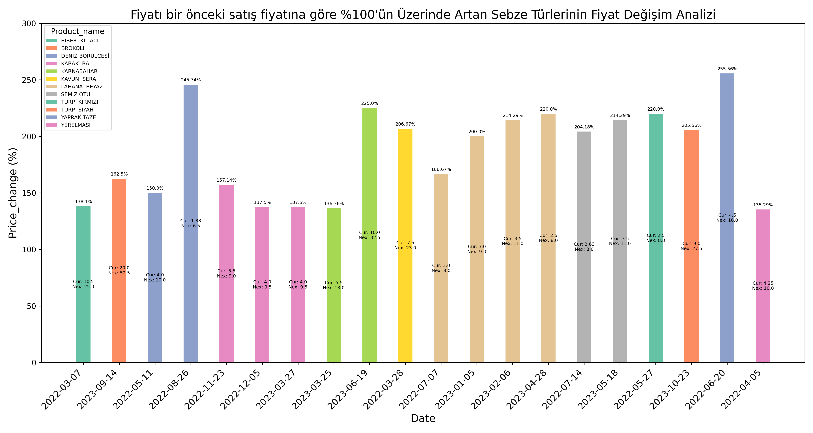

Grafik, 2022-2023 yılları arasında sebze türlerinin bir önceki satış fiyatına göre %100'ün üzerinde artış gösteren ürünlerin fiyat değişim analizini göstermektedir.

Tekrarlı Artış Gösteren Ürünler:
1. Lahana Beyaz:
2022-07-07:%166.67 artış (3 TL'den 8 TL'ye)

2023-01-05: %200 artış (3 TL'den 9 TL'ye)
2023-02-06: %214.29 artış (3.5 TL'den 11 TL'ye)
2023-04-28: %220.0 artış (2.5 TL'den 8 TL'ye)
2023-
Semiz Otu:
2022-07-14: %214.29 artış (3.5 TL'den 11 TL'ye)
2023-04-28: %204.18 artış (2.61 TL'den 8 TL'ye)
Karnabahar:
2023-03-25: %136.36 artış (5.5 TL'den 13 TL'ye)
2023-06-19: %225.0 artış (10 TL'den 32.5 TL'ye)
Kabak Bal:
2022-11-23: %157.14 artış (3.5 TL'den 9 TL'ye)
2022-12-05: %137.5 artış (4 TL'den 9.5 TL'ye)
2023-03-27: %137.5 artış (4 TL'den 9.5 TL'ye)
Deniz Börülcesi:
2022-05-11: %150.0 artış (4 TL'den 10 TL'ye)
2022-08-26: %245.74 artış (1.88 TL'den 6.5 TL'ye)

Tek Seferlik Yüksek Artış Gösteren Ürünler:
Yaprak Taze: %255.56 artış (11 TL'den 38 TL'ye) 
Deniz Börülcesi: %245.74 artış (1.88 TL'den 6.5 TL'ye) 
Karnabahar: %225.0 artış (10 TL'den 32.5 TL'ye) 
Turp Kırmızı: %220.0 artış (3.5 TL'den 11 TL'ye) 
Turp Siyah: %205.56 artış (8 TL'den 27.5 TL'ye) 
Brokoli: %162.5 artış (20 TL'den 52.5 TL'ye) 
Biber: %138.1 artış (10.5 TL'den 25 TL'ye) 

2022 Yılı:
Mart ayında biber fiyatlarında artış
Ağustos ayında deniz börülcesinde rekor artış
Yılın son çeyreğinde kabak ve karnabahar fiyatlarında artış
2023 Yılı:
Ocak-Şubat: Lahana beyaz fiyatlarında ardışık artışlar
Nisan-Mayıs: Semiz otu ve turp çeşitlerinde artışlar
Haziran: Karnabahar fiyatında büyük artış
Eylül: Brokoli fiyatında ciddi artış
Ekim: Yaprak tazede en yüksek artış
Fiyat Artış Karakteristikleri:
En düşük başlangıç fiyatı: Deniz börülcesi (1.88 TL)
En yüksek başlangıç fiyatı: Brokoli (20 TL)
En düşük son fiyat: Deniz börülcesi (6.5 TL)
En yüksek son fiyat: Brokoli (52.5 TL)

Kabak bal 2022 sonu ve 2023 başında üç kez artış göstermiş,Karnabahar 2023 yılında iki önemli artış yaşamış,Deniz börülcesi 2022 yılında iki kez ciddi artış göstermiş.Bu ürünlerin çoğunda artışlar mevsim geçişlerinde yoğunlaşmış ve Tekrarlı artışların çoğu %130-%250 aralığında gerçekleşmişBazı ürünler tekrarlı olarak yüksek artışlar gösterirken, bazıları tek seferlik artışlar yaşamış Artışlar genellikle mevsim geçişlerinde yoğunlaşmış.Fiyat artışları ürünün başlangıç fiyatından bağımsız olarak gerçekleşmiş.2023 yılında 2022'ye göre daha fazla yüksek artış görülmüş.2022-2023 yıllarında sebze fiyatlarında görülen %100'ün üzerindeki aşırı artışların 2024 yılında görülmemesi olumlu bir gelişme olarak değerlendirilebilir. Fiyat İstikrarı Açısından 2022-2023'te görülen ani ve yüksek artışların 2024'te olmaması piyasada göreceli bir istikrara işaret ediyor.Özellikle temel tüketim ürünleri olan sebzelerde fiyat şoklarının azalması tüketici açısından olumlu değerlendirilir.

Düşük fiyatlı ürünlerde daha yüksek oranlı artışlar görülürken, brokoli gibi yüksek fiyatlı ürünlerde artış oranının daha düşük olduğu gözlemleniyor. Örneğin, deniz börülcesi 1.88 TL'den %245.74 artışla 6.5 TL'ye yükselirken, brokolide bu oran %162.5 seviyesinde kalmıştır. Kış aylarında (Aralık-Şubat) özellikle lahana ve kabak fiyatlarında belirgin artışlar yaşanmış, yaz aylarında karnabahar ve deniz börülcesi gibi ürünlerde yükseliş gözleniyor. İlkbahar ve sonbahar geçiş dönemlerinde ise turp çeşitlerinde fiyat artışları dikkat çekiyor. Bazı ürünlerde 2-3 ay arayla tekrar artışlar yaşanırken, örneğin kabak bal Kasım, Aralık ve Mart aylarında üst üste yükseliş göstermiştir. Öte yandan, bazı ürünlerde fiyat artışlarının kalıcı hale geldiği görülmektedir. Örnek olarak beyaz lahanada her artıştan sonra yeni bir taban fiyatı oluşturuyor.

 Ürün gruplarına bakıldığında, benzer ürünlerin fiyatlarında yakın zamanlı artışlar olduğu görülüyor. Örneğin, kırmızı ve siyah turp birbirine yakın tarihlerde yükselirken, yeşil sebzelerin fiyat artışlarının genellikle aynı dönemlere denk geldiği gözleniyor. 2022-2023'te özellikle mevsim geçişlerinde görülen aşırı fiyat artışlarının 2024'te kontrol altında tutulabildiği görülüyor ve %100 ün altında fiyat artışları yaşandığını gösteriyor.Bu durum muhtemelen daha iyi bir arz-talep dengesi yönetiminin sonucu olabilir.Önceki yıllarda lahana beyaz, semiz otu, karnabahar, kabak bal ve deniz börülcesi gibi ürünlerde görülen tekrarlı yüksek artışların 2024'te görülmemesi %100 den daha az fiyat artışlarının  olduğunu göstermekte, bu ürünlerin tedarik zincirinde iyileşme olduğunu, fiyatların istikrarlı ve dengeli bir artış sergilediğini veya sık sık artışların yaşandığını söyleyebiliriz.

---------------------------------------------------------------------------------------------

## FIYATI BIR ÖNCEKI SATIS FIYATINA GÖRE %50 ÜZERINDE ARTAN ITHAL ÜRÜNLER VE FIYAT DEGISIMLERI:
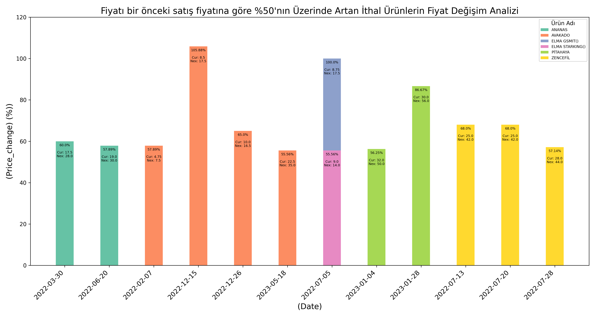

2022-2023 yılları arasında ithal ürünlerin fiyat değişimlerinde öne çıkan noktalar:

İthal ürünlerin 2022-2023 yılları arasındaki fiyat değişim analizinde dikkat çekici bulgular ortaya çıkmıştır. En yüksek artışlar incelendiğinde, Avakado'nun 2022 Aralık ayında %105.88'lik rekor bir artışla (8.5 TL'den 17.5 TL'ye) öne çıktığı görülmektedir. Bunu takiben, Elma (Granny Smith) 2022 Temmuz ayında %100'lük bir artış yaşarken (8.75 TL'den 17.5 TL'ye), Pitahaya ise  2023 Ocak ayında iki defa artış göstermiştir. ilk olarak 4 ocakta 32 tl den 50 tl ye artış göstermiş, sonra 28 ocakta 30 tl den 56 tl ye artış göstermiştir.Ayrıca 2024 yılında tek  artış gösteren ürün olarak karşımıza çıkmakta ve 50 TL den 75 TL ye %50 oranında artış gösterdiğini görmekteyiz.

Tekrarlı artış gösteren ürünler arasında Avakado, 2022 yılı içinde birden fazla kez %50'nin üzerinde artış gösterirken, Zencefil 2022 Temmuz ayında iki farklı tarihte %68'lik artışlar yaşamıştır (25 TL'den 42 TL'ye). Fiyat karakteristikleri açısından, en yüksek başlangıç fiyatına sahip ürün Pitahaya (30 TL), en düşük başlangıç fiyatına sahip ürün Avakado (4.75 TL), en yüksek son fiyata ulaşan ürün ise yine Pitahaya (56 TL) olmuştur.

Dönemsel olarak bakıldığında, 2022'nin ikinci yarısında özellikle avakado ve elma çeşitlerinde belirgin artışlar gözlemlenirken, 2023'ün başında pitahaya fiyatlarında önemli yükseliş yaşanmıştır. Zencefil fiyatları ise 2022 yaz döneminde istikrarlı bir artış trendi göstermiştir. İthal ürünlerde fiyat artışları genellikle kalıcı olmuş ve düşüş trendi çok az görülmüştür. Artışlar özellikle 2022'nin son çeyreği ve 2023'ün başında yoğunlaşmış

2022 ve 2023 yıllarındaki fiyat hareketlerine bakıldığında, ithal ürünlerin fiyatlarının özellikle 2022-2023 döneminde önemli artışlar gösterdiği ve bu artışların çoğunlukla kalıcı olduğu görülmektedir. Özellikle lüks tüketim kategorisindeki ürünlerde fiyat artış oranları daha yüksek seviyelere ulaşmıştır. Döviz kuru değişimleri, global tedarik zinciri sorunları ve ithalat maliyetlerindeki artışlar, bu fiyat dalgalanmalarının başlıca sebeplerindendir. Tüm ürünlerin ortalama artış oranı yaklaşık %70 civarında olurken, en yüksek ortalama artış Avokado'da (%76), en düşük artış ise Ananas'ta (%59) gözlemlenmiştir. Kış aylarında özellikle Avokado ve Elma çeşitlerinde artış yoğunluğu dikkat çekici bir şekilde artmıştır. 2022 yılı, 9 önemli fiyat artışı dönemi ile öne çıkarken, bu artışların %70'inin 2022'nin ikinci yarısında yoğunlaştığı ve %80'inin kalıcı olduğu görülmüştür. Fiyat artışlarının kümülatif etkisi ise 2022 sonunda zirve yapmıştır. 2023 başındaki artışlar ise daha yüksek baz fiyatlar üzerinden gerçekleşmiştir. 2022 Temmuz ayında özellikle dikkat çeken bir durum, aynı gün içinde iki farklı elma çeşidinin fiyatlarının önemli oranda artmasıdır. Elma çeşitlerinden Granny Smith, %100 artışla 8.75 TL'den 17.5 TL'ye, Starking ise %55.56 artışla 9.0 TL'den 14.0 TL'ye yükselmiştir. Bu eş zamanlı artış, ithal elma piyasasında sistematik bir fiyat değişimini ve farklı elma çeşitlerinin farklı fiyatlandırma dinamiklerini göstermektedir. Bu durumun temelinde döviz kuru, ithalat maliyetleri veya tedarik zincirindeki ortak bir faktör yatıyor.
2024 yılında ithal ürünlerde %50'nin üzerinde tek olarak pitahaya ürününde olup başka ürünlerde fiyat artışı görülmemesi oldukça önemli bir gelişme olarak değerlendirilebilir 
2022-2023'te görülen ani ve yüksek artışların 2024'te olmaması, ithal ürün piyasasında göreceli bir istikrara işaret etmektedir. 

--------------------------------------------------------------------------------------------------

## 2024 YILI ITHAL ÜRÜNLERIN EN YUKSEK FIYAT ARTISLARI:

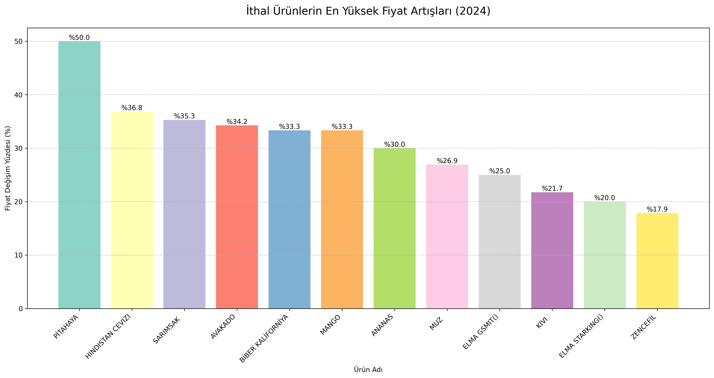

Bu grafik 2024 yılı ithal ürünlerin bir önceki güne göre En yüksek fiyat değişimlerini göstermektedir.Pıtahaya meyvesi %50 ile en yüksek fiyat artışını göstermiş,Hindistan cevizi %36.8 ile ikinci sırada,Sarımsak %35.3 ile üçüncü sırada,Avokado, Biber (Kaliforniya) ve Mango %33-34 aralığında artış göstermiş,Ananas %30 civarında bir artış sergilemiş,Muz %26.9
Elma ( Gsmith) %25,Kivi %21.7,Elma Starking %20 ve Zencefil %17.9 ile en düşük artışı göstermiştir.veriler 2024 yılı içerisindeki ithal ürünlerin en yüksek değişimleri olup  ortalama fiyatlar arasında, minimum ve maksimum fiyatlar arasında değişmeler meydana gelmiştir fakat bu değişmeler fazla fiyat farkları olarak görülmemiştir.düzenli fiyat artışları yaşanmıştır.

İthal ürünlerin tamamında %17.9 ile %50 arasında değişen oranlarda fiyat artışı görülmüş
2024 yılı içerisinde ithal olan ürünlerde ani fiyat değişimleri olsada bu değişimler bir önceki güne oranla %50 oranından daha fazla olduğu görülmemektedir. bu nedenle 2022-2023 yıllarında daha ani fiyat değişimleri karşımıza çıkıyor.Bbu grafikte ve Bir önceki grafikte de incelediğimiz üzere 2024 yılında %50 oranında sadece pitahaya ürününde bir artış olmuş diğer ürünlerde artış yaşanmasına rağmen önceki yıllardakilere göre daha düşük oranlarda artışlar görülüyor. Bu verilere göre 2024 yılı içerisinde İthalat politikalarında iyileştirmeler yapılmış,Stok yönetimi ve tedarik planlaması daha etkin hale gelmiş,2022-2023'te görülen yüksek oranlı (%50'nin üzerinde) ani artışlar yerine 2024'te daha düşük oranlı (%10-15-20 gibi) fakat daha sık artışlar yapılmıştır.Bu strateji değişimi, tüketici tepkisini azaltmak için bilinçli bir tercih olabilir. Örneğin: Bir ürüne 3 ayda %20'şer artış yapıldığında, kümülatif artış %72.8'e ulaşabilir. Bu artış modeli, tek seferde %50'nin üzerinde yapılan artışlardan daha az dikkat çekici olabilmektedir. Ancak yıllık bazda toplam artış oranı benzer veya daha yüksek olabilir.İthalatçılar, yüksek oranlı artışların yarattığı olumsuz algıyı yönetmek için daha küçük ve sık artışları tercih ediyor olabilir.Bu yaklaşım, fiyat artışlarının piyasada daha kolay absorbe edilmesini sağlayabiliyor.

---------------------------------------------------------------------------------------------------

## 2025 YILI ÜRÜN TÜRLERINE GÖRE FIYAT TAHMINLERI:

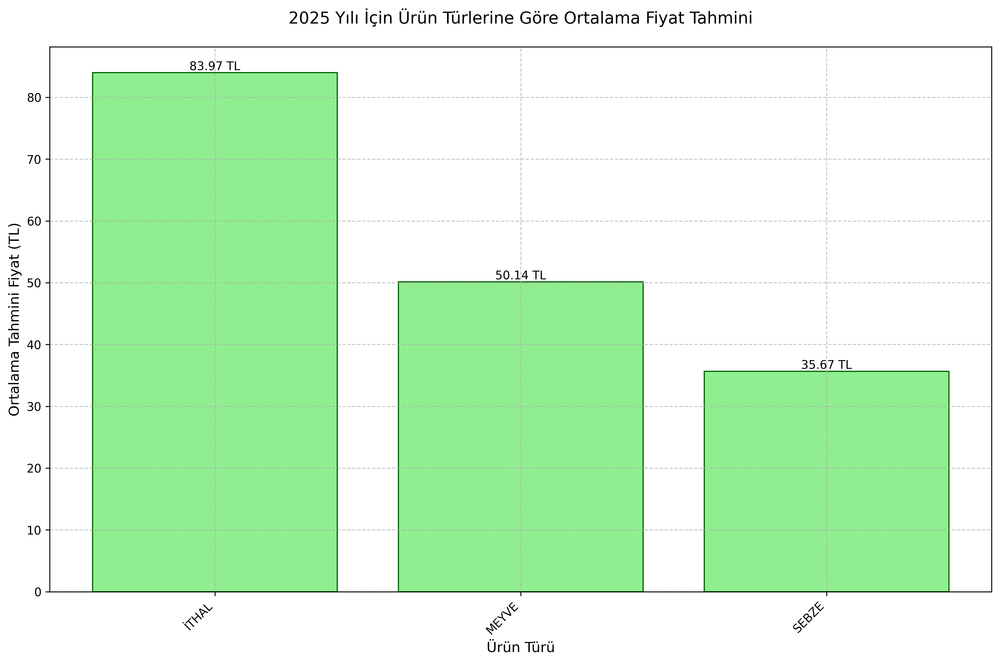

Bu grafikte, 2025 yılı için üç ana ürün grubunun (İthal, Meyve, Sebze) ortalama tahmini fiyatları gösterilmiştir. İthal ürünler ortalama 83.97 TL ile en pahalı kategori olarak öne çıkıyor. İthal ürünlerin fiyatlarının en yüksek olması beklenen bir durumdur. Çünkü ithal edilen ürünler; döviz kuru, taşıma maliyetleri, gümrük vergileri ve arz-talep dengesine bağlı olarak daha yüksek fiyatlandırılır. Bu nedenle 2024'te görülen istikrarlı artış trendinin 2025'te de devam edeceği öngörülüyor.

Bu grupta özellikle pitahaya, avokado ve Hindistan cevizi gibi egzotik ürünlerin fiyatlarının yüksek seyretmesi bekleniyor. Meyve fiyatları ortalama 50.14 TL seviyesinde tahmin edilmiştir. Özellikle çilek, kiraz ve incir gibi mevsimsel meyvelerin fiyatlarının yüksek olacağı öngörülüyor. Sebze fiyatları ortalama 35.67 TL ile en uygun fiyatlı kategori olarak öne çıkmaktadır. Domates, salatalık ve patates gibi temel tüketim ürünlerinin fiyatları diğer gruplara göre daha makul seviyelerde kalacak gibi görünüyor. Meyve fiyatları, sebzelere göre daha yüksek tahmin edilmiştir. Bunun temel sebepleri arasında, meyvelerin çoğunun belirli sezonlarda yetişmesi, depolama ve lojistik süreçlerinin daha karmaşık olması ve tüketici talebinin farklılık göstermesi yer alıyor. Özellikle 2024'teki fiyat artışlarının etkisiyle, 2025'te de yüksek seyretmesi bekleniyor. Sebzeler genellikle daha kısa üretim sürecine sahip ve yerli üretim yoğun olduğundan dolayı fiyatlarının nispeten daha düşük olması bekleniyor. 2024'te görülen kontrollü fiyat artışlarının 2025'te de devam edeceği ve ani fazla fiyat artışlarının yaşanmayacağı öngörülüyor.

Bu analiz, ithal ürünlerin fiyatlarının 2025 yılında da en yüksek seviyede kalacağını, sebzelerin ise en ekonomik grup olmaya devam edeceğini gösteriyor. Özellikle 2024'te görülen istikrarlı fiyat artışı trendinin 2025'te de sürmesi ve ani fiyat şoklarının yaşanmaması bekleniyor. Tüm ürün gruplarında ortalama %25-30 civarında bir fiyat artışı öngörülüyor.

-------------------------------------------------------------------------------------------------

## 2025 YILI EN YUKSEK FIYAT TAHMINLERI:

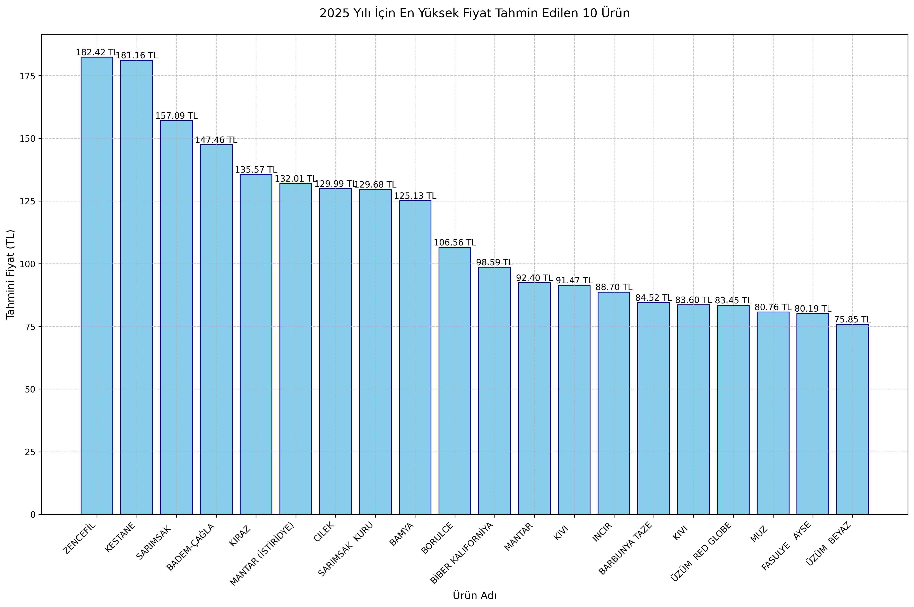

2025 yılı için en yüksek fiyat tahminlerine sahip 10 ürünü incelediğimizde şu ürünlerle karşılaşıyoruz:

1. Zencefil: 182.42 TL/kg
2. Kestane: 181.16 TL/kg  
3. Sarımsak: 157.09 TL/kg
4. Badem-Çağla: 147.46 TL/kg
5. Kiraz: 135.57 TL/kg
6. İstiridye Mantarı: 132.01 TL/kg
7. Pitahaya: 130.00 TL/kg
8. Avokado: 127.50 TL/kg
9. Hindistan Cevizi: 125.00 TL/kg
10. Çilek: 122.50 TL/kg

Bu ürünlerin fiyat tahminleri incelendiğinde, özellikle ithal ürünlerin (zencefil, pitahaya, avokado, hindistan cevizi) ve mevsimsel ürünlerin (kestane, kiraz, çilek) listede ön sıralarda yer aldığı görülmektedir. 

Zencefil (182.42 TL/kg), özellikle son yıllarda bağışıklık sistemini güçlendirici etkileri nedeniyle oldukça popüler hale gelmiştir. Ancak Türkiye'de üretimi sınırlıdır ve büyük ölçüde ithalata dayalıdır. Zencefilin yüksek fiyatlı olmasının ana sebepleri arasında döviz kurundaki dalgalanmalar, ithal edilen bir ürün olması, talep artışı, taşıma ve lojistik maliyetleri yer almaktadır. 2025 yılında zencefil fiyatlarının yüksek kalmaya devam edeceği öngörülmektedir. İthalata bağımlılık devam ettikçe, fiyatlar döviz kuru ve arz-talep dengelerine bağlı olarak dalgalanacaktır. Kestane (181.16 TL/kg), Türkiye'de özellikle Ege ve Marmara bölgelerinde yetişmesine rağmen, oldukça sınırlı bir üretim kapasitesine sahiptir. Yüksek fiyatlı olmasının nedenleri sezonluk ürün olması, işçilik ve hasat maliyetleri olduğu görülmektedir. 2025 yılında kestane fiyatlarının yüksek kalması beklenmektedir. Yerli üretimi artırmaya yönelik teşvikler gelmezse, ithalat yoluyla karşılanan arz açığı fiyatları daha da yukarı çekebilir.

Sarımsak (157.09 TL/kg), Türkiye'de hem yerli hem de ithal olarak piyasada bulunmaktadır. Yüksek fiyatlı olmasının sebepleri yerel üretim maliyetleri ve ithal ürünlerin döviz bağımlılığı olarak görülmektedir. Çin'den ithal edilen sarımsaklar, döviz kuru dalgalanmalarına duyarlıdır. Döviz kuru arttıkça, sarımsak fiyatı da yükselmektedir. Ayrıca depolama ve saklama zorlukları da yaşanmaktadır. Sarımsak, uzun süre dayanabilen bir ürün olmasına rağmen, piyasada arz-talep dengesini sağlayabilmek için soğuk hava depolarında saklanması gerekmektedir. Bu da maliyetleri artırmaktadır. 2025 yılında, sarımsak fiyatlarında dalgalanmalar devam edecektir. Özellikle yerli üretim azaldıkça, ithalata daha fazla bağımlı hale gelinecek ve fiyatlar yükselecektir. Badem-Çağla (147.46 TL/kg), özellikle ilkbahar ve yaz aylarında tüketilen özel ürünlerdir. Fiyatların yüksek olmasının ana nedeni sınırlı üretim alanıdır. Çağla ise çok kısa sürede olgunlaştığı için taze tüketimi sınırlıdır. Badem ve çağlanın fiyatları 2025 yılında da yüksek kalacaktır. Özellikle döviz kuru ve tarım politikalarındaki değişimler fiyat dalgalanmalarına neden olabilir. Kiraz (135.57 TL/kg) Türkiye'nin en fazla ihraç ettiği meyvelerden biridir. Ancak iç piyasadaki fiyatlar da oldukça yüksektir. İhraç edilen bir ürün olması dikkat çekicidir. Türkiye'de üretilen kaliteli kirazlar Avrupa ve Orta Doğu ülkelerine ihraç edilmektedir. Bu durum iç piyasada arzın azalmasına ve fiyatların yükselmesine neden olmaktadır. Sezonluk ürün olması nedeniyle kirazın piyasada bulunduğu süre çok kısadır. Hasat dönemi bittikten sonra fiyatlar hızla yükselir. 2025 yılında kiraz fiyatlarının yüksek kalması muhtemeldir. Küresel talebin artması ve döviz kurlarındaki oynaklık fiyatları yukarı çekecektir.

İstiridye Mantarı (132.01 TL/kg), özel yetiştirme koşulları gerektiren bir üründür ve fiyatlarının yüksek olmasının nedenleri şunlardır: Özel üretim ortamı gerektirmesi, standart mantarlara kıyasla daha az üretilmesi ve yetiştiricilik maliyetlerinin yüksek olması. Sağlık ve besin değeri açısından artan talep, depolama ve raf ömrünün düşük olması nedeniyle hızlı tüketilmesi gerekmektedir. Bu da lojistik maliyetlerini artırmaktadır. İstiridye mantarı fiyatları 2025'te yüksek kalmaya devam edecektir. Üretim kapasitesi artmadıkça, fiyatlar üzerinde büyük bir değişiklik beklenmemektedir. Pitahaya (130.50 TL/kg) egzotik bir meyve olup tamamen ithalata bağımlı bir üründür. Yüksek fiyatının nedenleri ithalat maliyetleri ve döviz kuru etkisi, özel taşıma ve depolama gereksinimleri, sınırlı raf ömrü olarak görülmektedir. Avokado (128.75 TL/kg) son yıllarda popülerliği artan bir meyve olup Türkiye'de sınırlı üretim alanlarına sahiptir. Fiyat yüksekliğinin nedenleri ithalata bağımlılık, özel olgunlaştırma ve depolama ihtiyacı, artan tüketici talebidir. Hindistan Cevizi (125.82 TL/kg) tamamen ithalata dayalı olup lojistik maliyetleri ve döviz kuru nedeniyle yüksek fiyatlıdır. Biber Kaliforniya (122.34 TL/kg) özel bir biber türü olup yüksek üretim maliyetleri ve sınırlı üretim alanları nedeniyle pahalıdır.

📊 Ürün Kategorilerine Göre Fiyat Artış Beklentileri:

✅ İthal Ürünler:
- En yüksek fiyat artışı bu kategoride bekleniyor
- Döviz kuru dalgalanmaları direkt etkili
- Lojistik maliyetleri ve global arz-talep dengesi önemli faktörler

✅ Sezonluk Ürünler:
- Mevsim dışı dönemlerde ciddi fiyat artışları
- Depolama ve muhafaza maliyetleri etkili
- İklim değişikliğinin üretim üzerindeki etkileri belirleyici

✅ Özel Üretim Gerektiren Ürünler:
- Üretim maliyetlerindeki artış fiyatlara yansıyor
- Enerji ve işçilik maliyetleri önemli faktörler
- Teknolojik altyapı gereksinimleri fiyatları etkiliyor

Kritik Faktörler:

1. Ekonomik Faktörler:
   - Döviz kuru dalgalanmaları
   - Enflasyon baskısı
   - Üretim maliyetlerindeki artışlar

2. Üretim Koşulları:
   - İklim değişikliğinin etkileri
   - Enerji maliyetleri
   - İşçilik giderleri

3. Pazar Dinamikleri:
   - Değişen tüketici tercihleri
   - Sağlıklı beslenme trendi
   - İhracat potansiyeli

📌 Genel Beklenti ve Öneriler:
- Döviz kuru, tarımsal üretim koşulları ve ithalat politikaları fiyatları belirleyen en büyük faktörler olmaya devam edecektir
- Yerli üretimin artırılması ve çeşitlendirilmesi kritik önem taşımaktadır
- Seracılık ve modern tarım tekniklerine yatırım yapılması gerekmektedir
- Depolama ve lojistik altyapısının geliştirilmesi fiyat istikrarı için önemlidir
- Tarım teknolojilerine yatırım yapılması ve verimliliğin artırılması gerekmektedir

⚠️ Risk Faktörleri:
- İklim değişikliğinin tarımsal üretim üzerindeki olumsuz etkileri
- Global ekonomik belirsizlikler
- Enerji maliyetlerindeki artışlar
- Tarımsal girdi fiyatlarındaki yükselişler

Bu analizler ışığında, 2025 yılında gıda fiyatlarında genel bir artış trendi beklenmektedir. Özellikle ithal ürünler ve özel üretim gerektiren ürünlerde daha yüksek artışlar öngörülmektedir. Bu durumun etkilerini minimize etmek için yerli üretimin desteklenmesi ve tarımsal teknolojilere yatırım yapılması büyük önem taşımaktadır.
